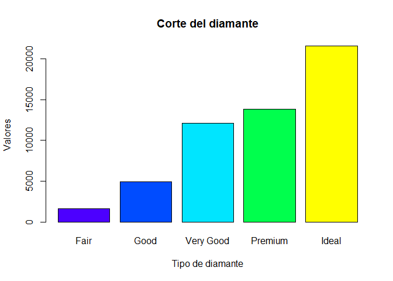
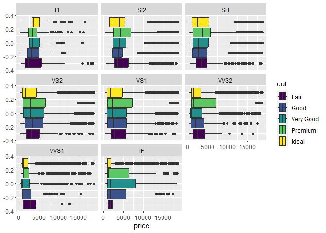
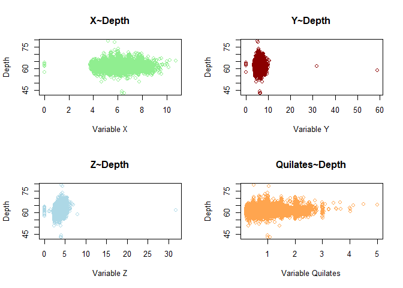
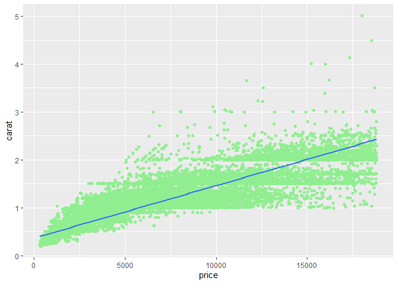
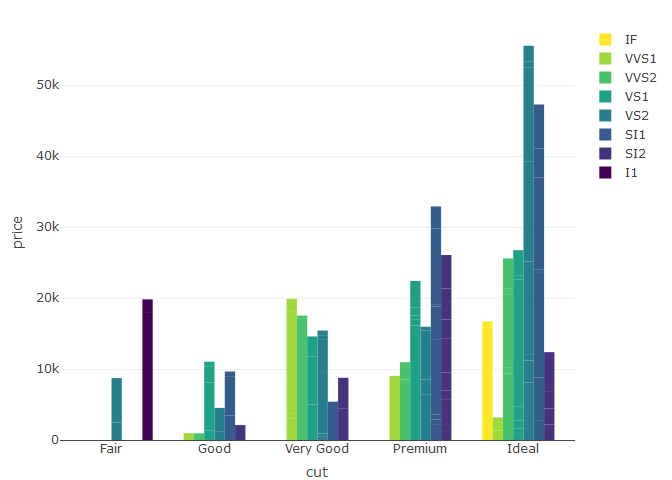
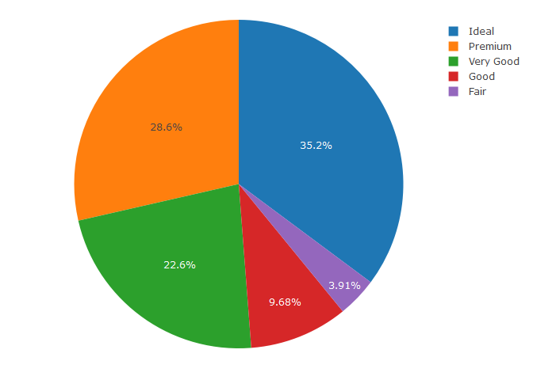

Mediante el dataset **`diamonds`** del paquete **ggplot2** se realizarán
las siguientes gráficas y transformaciones:

-   (Gráficos básicos R) - Hacer un gráfico de barras con la cantidad de
    diamantes que hay para cada valor de la variable **cut**.
-   (Ggplot2) - Realiza un histograma del **precio** que muestre la
    frecuencia acumulada de la variable **cut**.
-   (Ggplot2) - Realiza un diagrama boxplot sobre el **precio** en
    función de la variable **cut**, obtén un diagrama diferente por cada
    variable **clarity**
-   (Gráficos básicos de R) - Realiza una gráfica múltiple de 4
    visualizaciones, en donde para cada visualización se realice un
    diagrama de dispersión en el que se tomen los valores: **x**, **y**,
    **z** y **carat** contra **depth**.
-   (Ggplot2) - Realiza un diagrama de dispersión con recta de ajuste
    del **price** sobre **carat**.
-   (Plotly) - Toma una muestra de 100 observaciones y, realiza un
    diagrama de barras de la variable **cut** contra **price**, en
    función de **clarity**
-   (Plotly) - Realiza un diagrama de sectores de la variable **cut**
    con los valores de **carat**

## SOLUCIÓN

``` r
library(ggplot2)
library(plotly)
```

    ## 
    ## Attaching package: 'plotly'

    ## The following object is masked from 'package:ggplot2':
    ## 
    ##     last_plot

    ## The following object is masked from 'package:stats':
    ## 
    ##     filter

    ## The following object is masked from 'package:graphics':
    ## 
    ##     layout

``` r
head(diamonds)
```

    ## # A tibble: 6 × 10
    ##   carat cut       color clarity depth table price     x     y     z
    ##   <dbl> <ord>     <ord> <ord>   <dbl> <dbl> <int> <dbl> <dbl> <dbl>
    ## 1  0.23 Ideal     E     SI2      61.5    55   326  3.95  3.98  2.43
    ## 2  0.21 Premium   E     SI1      59.8    61   326  3.89  3.84  2.31
    ## 3  0.23 Good      E     VS1      56.9    65   327  4.05  4.07  2.31
    ## 4  0.29 Premium   I     VS2      62.4    58   334  4.2   4.23  2.63
    ## 5  0.31 Good      J     SI2      63.3    58   335  4.34  4.35  2.75
    ## 6  0.24 Very Good J     VVS2     62.8    57   336  3.94  3.96  2.48

``` r
str(diamonds)
```

    ## tibble [53,940 × 10] (S3: tbl_df/tbl/data.frame)
    ##  $ carat  : num [1:53940] 0.23 0.21 0.23 0.29 0.31 0.24 0.24 0.26 0.22 0.23 ...
    ##  $ cut    : Ord.factor w/ 5 levels "Fair"<"Good"<..: 5 4 2 4 2 3 3 3 1 3 ...
    ##  $ color  : Ord.factor w/ 7 levels "D"<"E"<"F"<"G"<..: 2 2 2 6 7 7 6 5 2 5 ...
    ##  $ clarity: Ord.factor w/ 8 levels "I1"<"SI2"<"SI1"<..: 2 3 5 4 2 6 7 3 4 5 ...
    ##  $ depth  : num [1:53940] 61.5 59.8 56.9 62.4 63.3 62.8 62.3 61.9 65.1 59.4 ...
    ##  $ table  : num [1:53940] 55 61 65 58 58 57 57 55 61 61 ...
    ##  $ price  : int [1:53940] 326 326 327 334 335 336 336 337 337 338 ...
    ##  $ x      : num [1:53940] 3.95 3.89 4.05 4.2 4.34 3.94 3.95 4.07 3.87 4 ...
    ##  $ y      : num [1:53940] 3.98 3.84 4.07 4.23 4.35 3.96 3.98 4.11 3.78 4.05 ...
    ##  $ z      : num [1:53940] 2.43 2.31 2.31 2.63 2.75 2.48 2.47 2.53 2.49 2.39 ...

``` r
summary(diamonds)
```

    ##      carat               cut        color        clarity          depth      
    ##  Min.   :0.2000   Fair     : 1610   D: 6775   SI1    :13065   Min.   :43.00  
    ##  1st Qu.:0.4000   Good     : 4906   E: 9797   VS2    :12258   1st Qu.:61.00  
    ##  Median :0.7000   Very Good:12082   F: 9542   SI2    : 9194   Median :61.80  
    ##  Mean   :0.7979   Premium  :13791   G:11292   VS1    : 8171   Mean   :61.75  
    ##  3rd Qu.:1.0400   Ideal    :21551   H: 8304   VVS2   : 5066   3rd Qu.:62.50  
    ##  Max.   :5.0100                     I: 5422   VVS1   : 3655   Max.   :79.00  
    ##                                     J: 2808   (Other): 2531                  
    ##      table           price             x                y         
    ##  Min.   :43.00   Min.   :  326   Min.   : 0.000   Min.   : 0.000  
    ##  1st Qu.:56.00   1st Qu.:  950   1st Qu.: 4.710   1st Qu.: 4.720  
    ##  Median :57.00   Median : 2401   Median : 5.700   Median : 5.710  
    ##  Mean   :57.46   Mean   : 3933   Mean   : 5.731   Mean   : 5.735  
    ##  3rd Qu.:59.00   3rd Qu.: 5324   3rd Qu.: 6.540   3rd Qu.: 6.540  
    ##  Max.   :95.00   Max.   :18823   Max.   :10.740   Max.   :58.900  
    ##                                                                   
    ##        z         
    ##  Min.   : 0.000  
    ##  1st Qu.: 2.910  
    ##  Median : 3.530  
    ##  Mean   : 3.539  
    ##  3rd Qu.: 4.040  
    ##  Max.   :31.800  
    ## 

-   (Gráficos básicos R) - Hacer un gráfico de barras con la cantidad de
    diamantes que hay para cada valor de la variable **cut**.

``` r
plot(diamonds$cut,
     ylab = "Valores",
     xlab = "Tipo de diamante",
     main = "Corte del diamante",
     col = topo.colors(length(unique(diamonds$cut)))
     )
```


\* (Ggplot2) - Realiza un histograma del **precio** que muestre la
frecuencia acumulada de la variable **cut**.

``` r
ggplot(diamonds) + 
  geom_histogram(mapping = aes(price, fill=cut))
```

    ## `stat_bin()` using `bins = 30`. Pick better value with `binwidth`.


\* (Ggplot2) - Realiza un diagrama boxplot sobre el **precio** en
función de la variable **cut**, obtén un diagrama diferente por cada
variable **clarity**

``` r
ggplot(diamonds) + geom_boxplot(mapping = aes(price, fill=cut)) + facet_wrap(~clarity)
```


\* (Gráficos básicos de R) - Realiza una gráfica múltiple de 4
visualizaciones, en donde para cada visualización se realice un diagrama
de dispersión en el que se tomen los valores: **x**, **y**, **z** y
**carat** contra **depth**.

``` r
par(mfrow = c(2,2))

#Fila 1, columna 1
plot(diamonds$x, diamonds$depth,
     xlab = "Variable X",
     ylab = "Depth",
     main = "X~Depth",
     col ="lightgreen"
     )

#Fila 2, columna 1
plot(diamonds$y, diamonds$depth,
     xlab = "Variable Y",
     ylab = "Depth",
     main = "Y~Depth",
     col ="darkred"
     )
#Fila 1, columna 2
plot(diamonds$z, diamonds$depth,
     xlab = "Variable Z",
     ylab = "Depth",
     main = "Z~Depth",
     col ="lightblue"
     )
#Fila 2, columna 2
plot(diamonds$carat, diamonds$depth,
     xlab = "Variable Quilates",
     ylab = "Depth",
     main = "Quilates~Depth",
     col ="tan1"
     )
```


\* (Ggplot2) - Realiza un diagrama de dispersión con recta de ajuste del
**price** sobre **carat**.

``` r
ggplot(diamonds) + 
  geom_point(mapping = aes(price, carat), color="lightgreen") + geom_smooth(aes(price,carat), method = lm)
```

    ## `geom_smooth()` using formula = 'y ~ x'


\* (Plotly) - Toma una muestra de 100 observaciones y, realiza un
diagrama de barras de la variable **cut** contra **price**, en función
de **clarity**

``` r
library(dplyr)
```

    ## 
    ## Attaching package: 'dplyr'

    ## The following objects are masked from 'package:stats':
    ## 
    ##     filter, lag

    ## The following objects are masked from 'package:base':
    ## 
    ##     intersect, setdiff, setequal, union

``` r
fig.bar <- plot_ly(
  data = sample_n(diamonds,100),
  x = ~cut,
  y = ~price,
  type = "bar",
  color = ~clarity
)
fig.bar
```


\* (Plotly) - Realiza un diagrama de sectores de la variable **cut** con
los valores de **carat**

``` r
fig.sec <- plot_ly(
  data = diamonds,
  labels = ~cut,
  values = ~carat,
  type = "pie"
)

fig.sec
```


