Basado en el libro *The Grammar of Graphics*
<https://www.amazon.com/Grammar-Graphics-Statistics-Computing/dp/0387245448/ref=as_li_ss_tl?ie=UTF8&qid=1477928463&sr=8-1&keywords=the+grammar+of+graphics&linkCode=sl1&tag=ggplot2-20&linkId=f0130e557161b83fbe97ba0e9175c431>,
**Ggplot2** es una librería de visualización de datos que trabaja a
nivel de capa, es decir, nos permite ir añadiendo nuevos elementos
estéticos a nuestra visualización de datos.

Este paquete está disponible en dos formatos, desde **tidyverse** o
directamente descargando **ggplot2**, para explicar las bondades de esta
librería, se utilizará esta segunda opción.

``` r
# install.packages("ggplot2")

library(ggplot2)
```

Por regla general, comenzaremos pasando nuestro dataset a la función
**`ggplot`**, las variables que intenvendrán en la gráfica a través del
argumento **aes**. Posteriormente, iremos añadiendo capas.

No obstante, además de toda la parametrización que permite ggplot,
podemos crear gráficas de forma muy simple con la función **`qplot`**
que creará gráficas rápidas, *quick plots*.

Para comenzar nuestro trabajo en ggplot2, una vez se ha importado la
librería, tomaremos el dataset **`midwest`** que viene pre-cargado en
dicha librería.

``` r
summary(midwest)
```

    ##       PID          county             state                area        
    ##  Min.   : 561   Length:437         Length:437         Min.   :0.00500  
    ##  1st Qu.: 670   Class :character   Class :character   1st Qu.:0.02400  
    ##  Median :1221   Mode  :character   Mode  :character   Median :0.03000  
    ##  Mean   :1437                                         Mean   :0.03317  
    ##  3rd Qu.:2059                                         3rd Qu.:0.03800  
    ##  Max.   :3052                                         Max.   :0.11000  
    ##     poptotal         popdensity          popwhite          popblack      
    ##  Min.   :   1701   Min.   :   85.05   Min.   :    416   Min.   :      0  
    ##  1st Qu.:  18840   1st Qu.:  622.41   1st Qu.:  18630   1st Qu.:     29  
    ##  Median :  35324   Median : 1156.21   Median :  34471   Median :    201  
    ##  Mean   :  96130   Mean   : 3097.74   Mean   :  81840   Mean   :  11024  
    ##  3rd Qu.:  75651   3rd Qu.: 2330.00   3rd Qu.:  72968   3rd Qu.:   1291  
    ##  Max.   :5105067   Max.   :88018.40   Max.   :3204947   Max.   :1317147  
    ##  popamerindian        popasian         popother        percwhite    
    ##  Min.   :    4.0   Min.   :     0   Min.   :     0   Min.   :10.69  
    ##  1st Qu.:   44.0   1st Qu.:    35   1st Qu.:    20   1st Qu.:94.89  
    ##  Median :   94.0   Median :   102   Median :    66   Median :98.03  
    ##  Mean   :  343.1   Mean   :  1310   Mean   :  1613   Mean   :95.56  
    ##  3rd Qu.:  288.0   3rd Qu.:   401   3rd Qu.:   345   3rd Qu.:99.07  
    ##  Max.   :10289.0   Max.   :188565   Max.   :384119   Max.   :99.82  
    ##    percblack       percamerindan        percasian        percother      
    ##  Min.   : 0.0000   Min.   : 0.05623   Min.   :0.0000   Min.   :0.00000  
    ##  1st Qu.: 0.1157   1st Qu.: 0.15793   1st Qu.:0.1737   1st Qu.:0.09102  
    ##  Median : 0.5390   Median : 0.21502   Median :0.2972   Median :0.17844  
    ##  Mean   : 2.6763   Mean   : 0.79894   Mean   :0.4872   Mean   :0.47906  
    ##  3rd Qu.: 2.6014   3rd Qu.: 0.38362   3rd Qu.:0.5212   3rd Qu.:0.48050  
    ##  Max.   :40.2100   Max.   :89.17738   Max.   :5.0705   Max.   :7.52427  
    ##    popadults          perchsd        percollege        percprof      
    ##  Min.   :   1287   Min.   :46.91   Min.   : 7.336   Min.   : 0.5203  
    ##  1st Qu.:  12271   1st Qu.:71.33   1st Qu.:14.114   1st Qu.: 2.9980  
    ##  Median :  22188   Median :74.25   Median :16.798   Median : 3.8142  
    ##  Mean   :  60973   Mean   :73.97   Mean   :18.273   Mean   : 4.4473  
    ##  3rd Qu.:  47541   3rd Qu.:77.20   3rd Qu.:20.550   3rd Qu.: 4.9493  
    ##  Max.   :3291995   Max.   :88.90   Max.   :48.079   Max.   :20.7913  
    ##  poppovertyknown   percpovertyknown percbelowpoverty percchildbelowpovert
    ##  Min.   :   1696   Min.   :80.90    Min.   : 2.180   Min.   : 1.919      
    ##  1st Qu.:  18364   1st Qu.:96.89    1st Qu.: 9.199   1st Qu.:11.624      
    ##  Median :  33788   Median :98.17    Median :11.822   Median :15.270      
    ##  Mean   :  93642   Mean   :97.11    Mean   :12.511   Mean   :16.447      
    ##  3rd Qu.:  72840   3rd Qu.:98.60    3rd Qu.:15.133   3rd Qu.:20.352      
    ##  Max.   :5023523   Max.   :99.86    Max.   :48.691   Max.   :64.308      
    ##  percadultpoverty percelderlypoverty    inmetro         category        
    ##  Min.   : 1.938   Min.   : 3.547     Min.   :0.0000   Length:437        
    ##  1st Qu.: 7.668   1st Qu.: 8.912     1st Qu.:0.0000   Class :character  
    ##  Median :10.008   Median :10.869     Median :0.0000   Mode  :character  
    ##  Mean   :10.919   Mean   :11.389     Mean   :0.3432                     
    ##  3rd Qu.:13.182   3rd Qu.:13.412     3rd Qu.:1.0000                     
    ##  Max.   :43.312   Max.   :31.162     Max.   :1.0000

``` r
str(midwest)
```

    ## tibble [437 × 28] (S3: tbl_df/tbl/data.frame)
    ##  $ PID                 : int [1:437] 561 562 563 564 565 566 567 568 569 570 ...
    ##  $ county              : chr [1:437] "ADAMS" "ALEXANDER" "BOND" "BOONE" ...
    ##  $ state               : chr [1:437] "IL" "IL" "IL" "IL" ...
    ##  $ area                : num [1:437] 0.052 0.014 0.022 0.017 0.018 0.05 0.017 0.027 0.024 0.058 ...
    ##  $ poptotal            : int [1:437] 66090 10626 14991 30806 5836 35688 5322 16805 13437 173025 ...
    ##  $ popdensity          : num [1:437] 1271 759 681 1812 324 ...
    ##  $ popwhite            : int [1:437] 63917 7054 14477 29344 5264 35157 5298 16519 13384 146506 ...
    ##  $ popblack            : int [1:437] 1702 3496 429 127 547 50 1 111 16 16559 ...
    ##  $ popamerindian       : int [1:437] 98 19 35 46 14 65 8 30 8 331 ...
    ##  $ popasian            : int [1:437] 249 48 16 150 5 195 15 61 23 8033 ...
    ##  $ popother            : int [1:437] 124 9 34 1139 6 221 0 84 6 1596 ...
    ##  $ percwhite           : num [1:437] 96.7 66.4 96.6 95.3 90.2 ...
    ##  $ percblack           : num [1:437] 2.575 32.9 2.862 0.412 9.373 ...
    ##  $ percamerindan       : num [1:437] 0.148 0.179 0.233 0.149 0.24 ...
    ##  $ percasian           : num [1:437] 0.3768 0.4517 0.1067 0.4869 0.0857 ...
    ##  $ percother           : num [1:437] 0.1876 0.0847 0.2268 3.6973 0.1028 ...
    ##  $ popadults           : int [1:437] 43298 6724 9669 19272 3979 23444 3583 11323 8825 95971 ...
    ##  $ perchsd             : num [1:437] 75.1 59.7 69.3 75.5 68.9 ...
    ##  $ percollege          : num [1:437] 19.6 11.2 17 17.3 14.5 ...
    ##  $ percprof            : num [1:437] 4.36 2.87 4.49 4.2 3.37 ...
    ##  $ poppovertyknown     : int [1:437] 63628 10529 14235 30337 4815 35107 5241 16455 13081 154934 ...
    ##  $ percpovertyknown    : num [1:437] 96.3 99.1 95 98.5 82.5 ...
    ##  $ percbelowpoverty    : num [1:437] 13.15 32.24 12.07 7.21 13.52 ...
    ##  $ percchildbelowpovert: num [1:437] 18 45.8 14 11.2 13 ...
    ##  $ percadultpoverty    : num [1:437] 11.01 27.39 10.85 5.54 11.14 ...
    ##  $ percelderlypoverty  : num [1:437] 12.44 25.23 12.7 6.22 19.2 ...
    ##  $ inmetro             : int [1:437] 0 0 0 1 0 0 0 0 0 1 ...
    ##  $ category            : chr [1:437] "AAR" "LHR" "AAR" "ALU" ...

``` r
head(midwest)
```

    ## # A tibble: 6 × 28
    ##     PID county    state  area poptotal popdens…¹ popwh…² popbl…³ popam…⁴ popas…⁵
    ##   <int> <chr>     <chr> <dbl>    <int>     <dbl>   <int>   <int>   <int>   <int>
    ## 1   561 ADAMS     IL    0.052    66090     1271.   63917    1702      98     249
    ## 2   562 ALEXANDER IL    0.014    10626      759     7054    3496      19      48
    ## 3   563 BOND      IL    0.022    14991      681.   14477     429      35      16
    ## 4   564 BOONE     IL    0.017    30806     1812.   29344     127      46     150
    ## 5   565 BROWN     IL    0.018     5836      324.    5264     547      14       5
    ## 6   566 BUREAU    IL    0.05     35688      714.   35157      50      65     195
    ## # … with 18 more variables: popother <int>, percwhite <dbl>, percblack <dbl>,
    ## #   percamerindan <dbl>, percasian <dbl>, percother <dbl>, popadults <int>,
    ## #   perchsd <dbl>, percollege <dbl>, percprof <dbl>, poppovertyknown <int>,
    ## #   percpovertyknown <dbl>, percbelowpoverty <dbl>, percchildbelowpovert <dbl>,
    ## #   percadultpoverty <dbl>, percelderlypoverty <dbl>, inmetro <int>,
    ## #   category <chr>, and abbreviated variable names ¹​popdensity, ²​popwhite,
    ## #   ³​popblack, ⁴​popamerindian, ⁵​popasian

Ordenamos los datos.

``` r
library(tidyr)
library(dplyr)
```

    ## 
    ## Attaching package: 'dplyr'

    ## The following objects are masked from 'package:stats':
    ## 
    ##     filter, lag

    ## The following objects are masked from 'package:base':
    ## 
    ##     intersect, setdiff, setequal, union

``` r
df <- gather(midwest, "pop_category", "population", c(5:11, 17, 21))
df <- gather(df, "per_category", "pervalue", 5:17)

# La gran mayoría de estas variables podrían dejarse como as.character sin problema.
df <- df %>% transmute(
  PID = as.factor(PID),
  county = as.factor(county),
  state = as.factor(state),
  area = area,
  inmetro = inmetro,
  category = as.factor(category),
  pop_category = as.factor(pop_category),
  population = population,
  per_category = as.factor(per_category),
  pervalue = pervalue
)
summary(df)
```

    ##       PID             county      state           area            inmetro      
    ##  561    :  117   CRAWFORD:  585   IL:11934   Min.   :0.00500   Min.   :0.0000  
    ##  562    :  117   JACKSON :  585   IN:10764   1st Qu.:0.02400   1st Qu.:0.0000  
    ##  563    :  117   MONROE  :  585   MI: 9711   Median :0.03000   Median :0.0000  
    ##  564    :  117   ADAMS   :  468   OH:10296   Mean   :0.03317   Mean   :0.3432  
    ##  565    :  117   BROWN   :  468   WI: 8424   3rd Qu.:0.03800   3rd Qu.:1.0000  
    ##  566    :  117   CLARK   :  468              Max.   :0.11000   Max.   :1.0000  
    ##  (Other):50427   (Other) :47970                                                
    ##     category            pop_category     population     
    ##  AAR    :22581   popadults    : 5681   Min.   :      0  
    ##  AAU    : 9009   popamerindian: 5681   1st Qu.:    137  
    ##  LAR    : 3510   popasian     : 5681   Median :   2987  
    ##  LHR    : 3276   popblack     : 5681   Mean   :  38886  
    ##  HLU    : 3042   popdensity   : 5681   3rd Qu.:  28005  
    ##  ALU    : 2340   popother     : 5681   Max.   :5105067  
    ##  (Other): 7371   (Other)      :17043                    
    ##                per_category      pervalue      
    ##  percadultpoverty    : 3933   Min.   : 0.0000  
    ##  percamerindan       : 3933   1st Qu.: 0.9214  
    ##  percasian           : 3933   Median :10.5538  
    ##  percbelowpoverty    : 3933   Mean   :26.5432  
    ##  percblack           : 3933   3rd Qu.:25.8500  
    ##  percchildbelowpovert: 3933   Max.   :99.8604  
    ##  (Other)             :27531

``` r
colnames(df)
```

    ##  [1] "PID"          "county"       "state"        "area"         "inmetro"     
    ##  [6] "category"     "pop_category" "population"   "per_category" "pervalue"

Como primera gráfica tomaremos un diagrama de dispersión, la capa
encargada de esta función es **`geom_point`**.

``` r
ggplot(data = df) +
  geom_point(mapping = aes(x = pervalue, y = population))
```

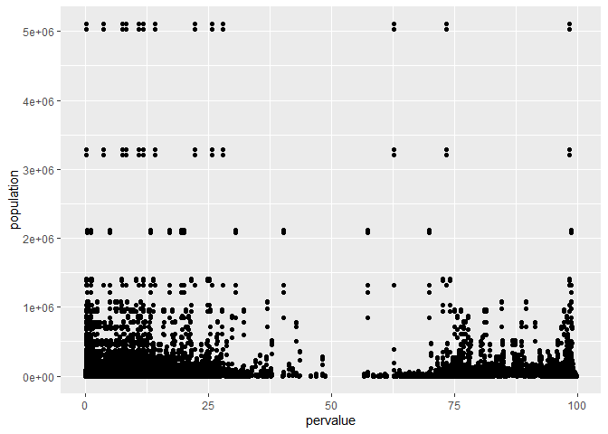

Ante la primera gráfica es importante destacar los componentes más
importantes de una capa:

-   **mapping**: Se definen los componentes estéticos **aes**
    *aesthetics*.
-   **data**: Dataframe de origen.
-   **geom\_**: Capas de interacción gráfica.

Lo siguiente que puede realizarse sobre la gráfica anterior es agregar
color a la nube de puntos, para ello, utilizamos el parámetro **color**.

``` r
ggplot(data = df) +
  geom_point(mapping = aes(x = pervalue, y = population, color = state))
```

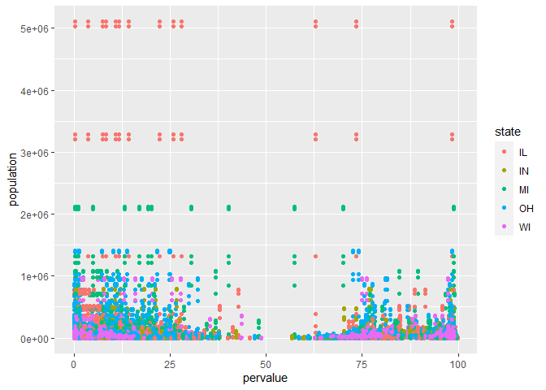

También podemos utilizar un color cualquiera que no pertenezca a las
variables, por lo tanto, utilizamos el parámetro **color** fuera de
**aes**

``` r
ggplot(data = df) +
  geom_point(mapping = aes(x = pervalue, y = population), color = "dodgerblue4")
```


Si en lugar de mostrar el color por país, queremos mostrar el tamaño de
punto en función del país, utilizamos el parámetro **size**.

``` r
ggplot(data = df) +
  geom_point(mapping = aes(x = pervalue, y = population, size = state))
```

    ## Warning: Using size for a discrete variable is not advised.

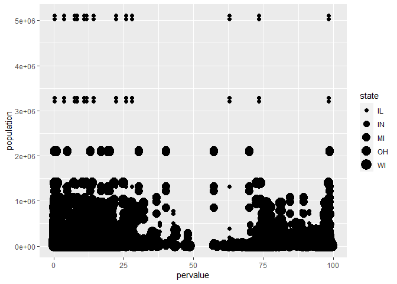

Existen otros parámetros que modifican la forma y el color de nuestra
gráfica como son: **aplha** y **shape**

``` r
ggplot(data = df) +
  geom_point(mapping = aes(x = pervalue, y = population, alpha = state))
```

    ## Warning: Using alpha for a discrete variable is not advised.

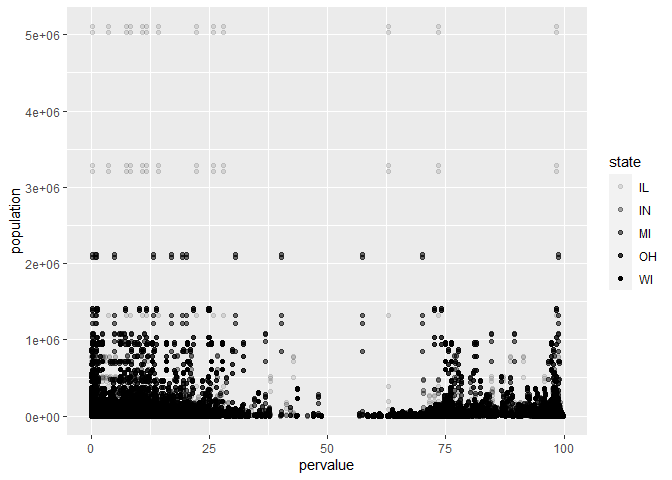

``` r
ggplot(data = df) +
  geom_point(mapping = aes(x = pervalue, y = population, shape = state))
```

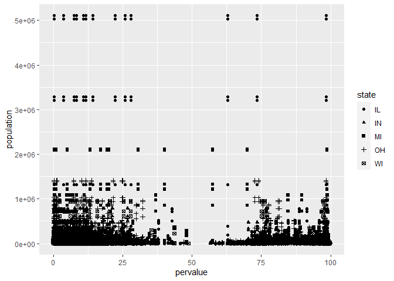

La anterior gráfica, debido a la densidad de los puntos no es muy
reveladora, por lo tanto, podemos hacer uso las funciones de dplyr para
obtener una muestra más reducida.

``` r
ggplot(data = sample_frac(df, 0.001)) +
  geom_point(mapping = aes(x = pervalue, y = population, shape = state))
```

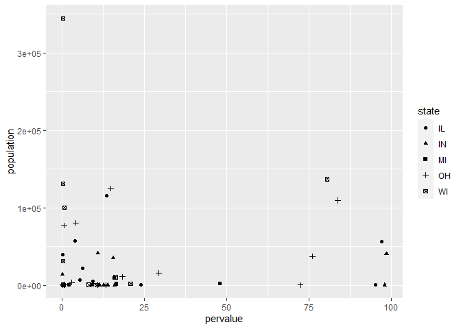

## Ejemplos de gráficas

Probamos con diferentes tipos de gráfica.

**Gráfico de barras**. Importante en este ejmplo destacar el uso de fill
dentro de **aes** y **color** como parámetro mapping.

``` r
ggplot(df) + 
  geom_bar(mapping = aes(state, fill = state), color = "black")
```

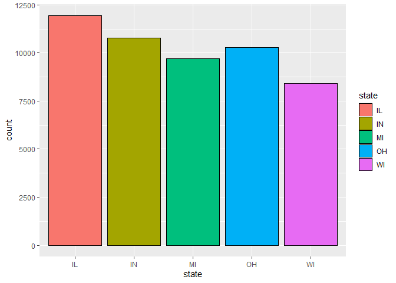

**Boxplot**. Podemos destacar los outliers con el parámetro
**outlier.colour**, en cualquier gráfico si lo necesitamos podemos
voltear los ejes con **`coord_flip`**

``` r
ggplot(df) + 
  geom_boxplot(mapping = aes(x = pervalue, fill = state), outlier.colour = "red") + coord_flip()
```

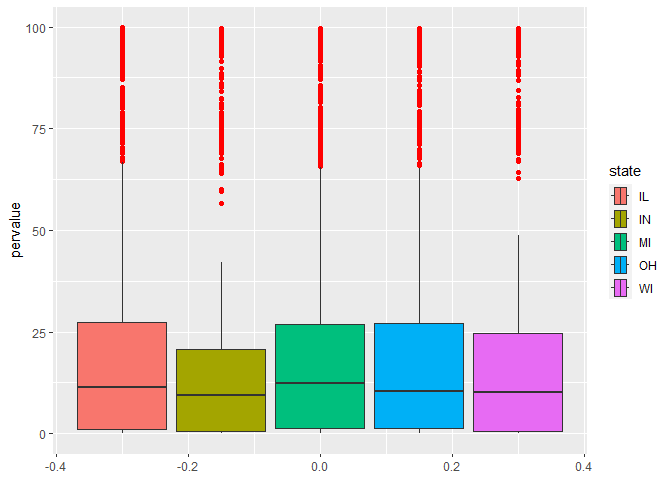

**Diagrama de densidad**. En algunas gráficas el parámetro *color*, no
estará disponible, pero sí **colour**, observamos también el uso de
**alpha** que aumenta o disminuye la transparencia del interior de la
gráfica.

``` r
ggplot(df) +
  geom_density(mapping = aes(area), colour = "darkblue", fill = "darkblue", alpha = 0.4)
```

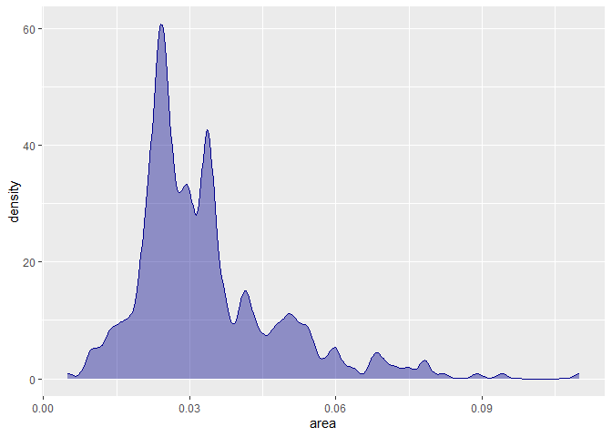

``` r
ggplot(df) +
  geom_density(mapping = aes(area, fill=state), colour = "darkblue", alpha = 0.4)
```

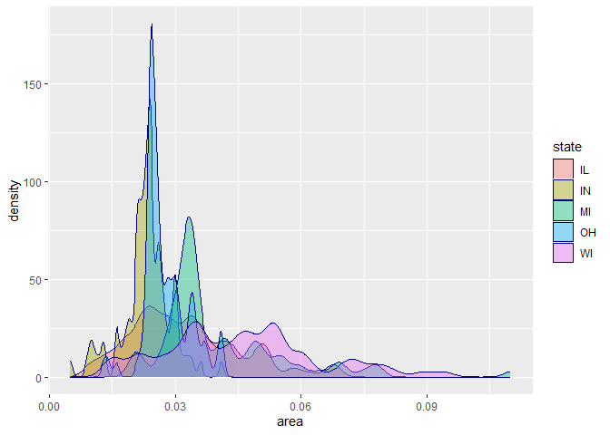

**Histograma**

``` r
ggplot(df) +
  geom_histogram(mapping = aes(area), color = "red", fill = "lightblue", alpha = 0.6)
```

    ## `stat_bin()` using `bins = 30`. Pick better value with `binwidth`.

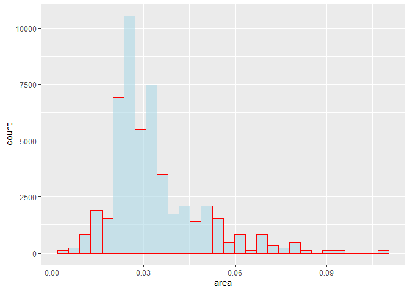

Si pasamos una variable categórica como relleno, mostrará la frecuencia
acumulada para cada barra del histograma.

``` r
ggplot(df) +
  geom_histogram(mapping = aes(area, fill = state), color = "red" )
```

    ## `stat_bin()` using `bins = 30`. Pick better value with `binwidth`.

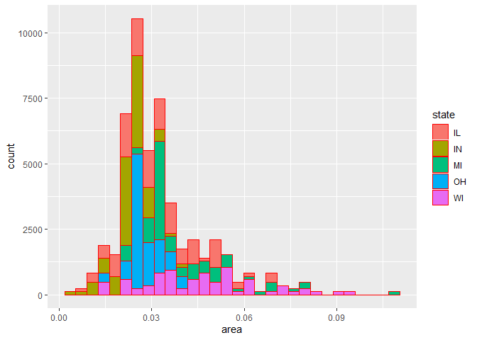

Con el parámetro **binwidth** podemos definir la anchura de cada barra.

``` r
ggplot(df) +
  geom_histogram(mapping = aes(area), color = "blue", binwidth = 0.02)
```

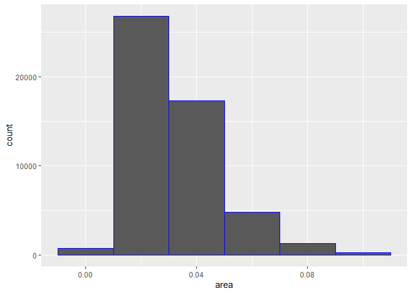

Con el parámetro **bins** forzamos a un número fijo de barras verticales
a mostrar.

``` r
ggplot(df) +
  geom_histogram(mapping = aes(area), color = "blue", bins=100)
```

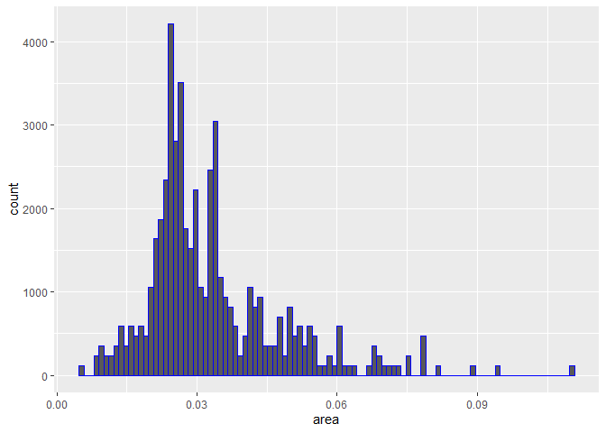

Podemos combinar un histograma con un diagrama de densidad, en estos
casos, habrá una reestricción especial y es que en el histograma,
tendremos que utilizar el tipo especial **y=..density..**

``` r
ggplot(df, aes(area)) +
  geom_histogram(aes(y=..density..), color = "blue", bins=100) +
  geom_density(colour = "darkblue", fill = "pink", alpha = 0.4)
```

    ## Warning: The dot-dot notation (`..density..`) was deprecated in ggplot2 3.4.0.
    ## ℹ Please use `after_stat(density)` instead.

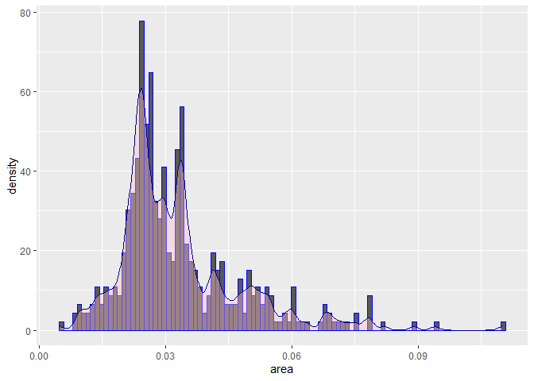

Si queremos que los valores de relleno, no se agrupen en forma de
frecuencia acumulada, utilizaremos el parámetro **dodge** con el valor
identity.

``` r
ggplot(df) +
  geom_histogram(mapping = aes(area, fill=state), color = "blue", position = "dodge")
```

    ## `stat_bin()` using `bins = 30`. Pick better value with `binwidth`.

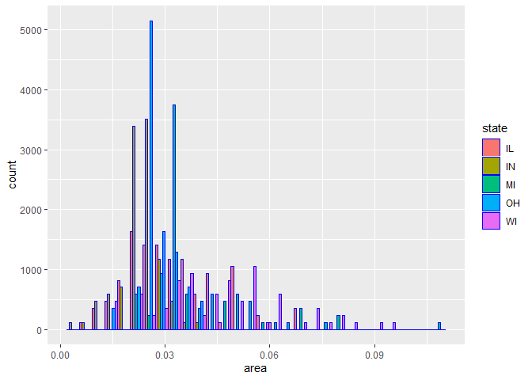

``` r
ggplot(df) +
  geom_histogram(mapping = aes(inmetro, fill=state), color = "blue", position = "dodge")
```

    ## `stat_bin()` using `bins = 30`. Pick better value with `binwidth`.

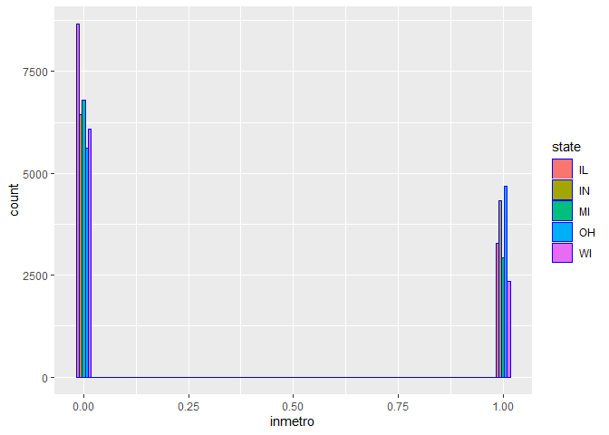

También podemos mostrar que los elementos se super pongan la posición
identity

``` r
ggplot(df) +
  geom_histogram(mapping = aes(area, fill=state), color = "blue", position = "identity")
```

    ## `stat_bin()` using `bins = 30`. Pick better value with `binwidth`.

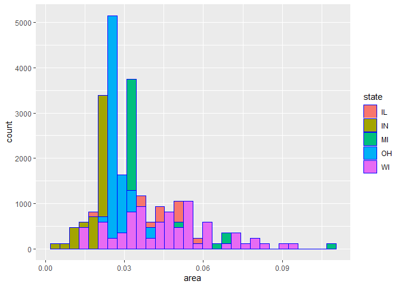

``` r
ggplot(df) +
  geom_freqpoly(mapping = aes(area, colour=state)) # fill no funciona
```

    ## `stat_bin()` using `bins = 30`. Pick better value with `binwidth`.

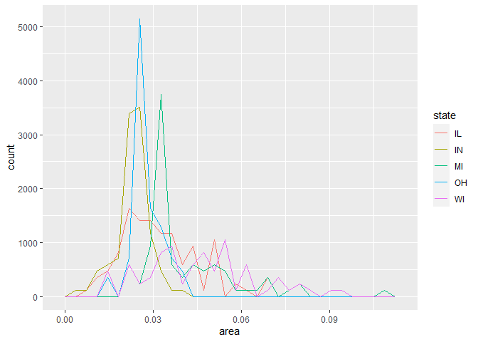

**Añadiendo smooth** a una gráfica.

``` r
ggplot(df) +
  geom_point(mapping = aes(population, area)) + geom_smooth(aes(population, area))
```

    ## `geom_smooth()` using method = 'gam' and formula = 'y ~ s(x, bs = "cs")'

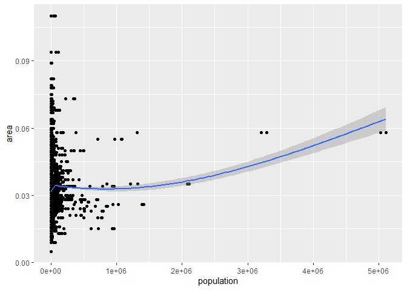

## Elementos de texto.

Principalmente, distinguiremos las siguientes capas para añadir texto
sobre una gráfica:

-   **`ggtitle`**
-   **`xlab`**
-   **`ylab`**

``` r
ggplot(df) +
  geom_point(mapping = aes(population, area)) + geom_smooth(aes(population, area)) + 
  ggtitle("Población ~ área") + 
  xlab("Población") +
  ylab("Área")
```

    ## `geom_smooth()` using method = 'gam' and formula = 'y ~ s(x, bs = "cs")'

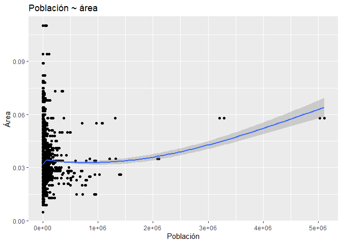

## Facetting

Podemos descomponer una gráfica en tantas gráficas como valores tenga
una variable, esto es muy recomendable, cuando tenemos variables
categóricas, ya que podemos explicar una variable a través de una
categoría.

``` r
ggplot(df, mapping = aes(area)) +
  geom_bar(aes(fill=state)) +
  facet_wrap( ~ state)
```

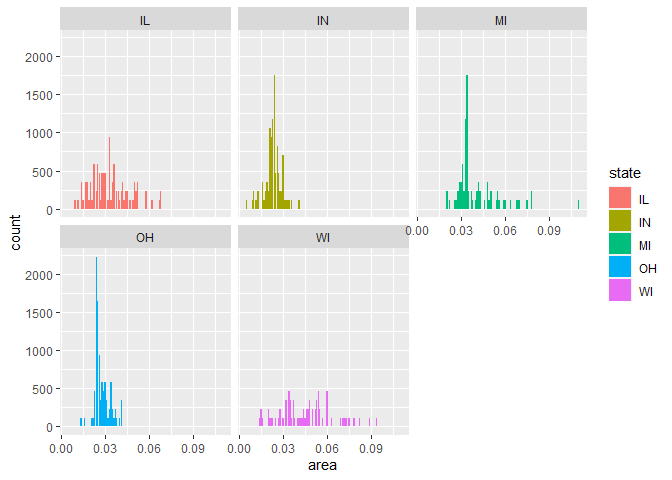
