Con total seguridad, en casi cualquier proyecto de ciencia de datos,
será necesario mostrar resultados o, simplemente dar voz a los datos a
través de **visualización de datos**, en R, existen por defecto
funciones por defecto preparadas para realizar gráficas sin necesidad
(por el momento) de instalar librerías de visualización de datos.

Dentro de las diferentes funciones de R dedicadas a obtener gráficos
existen tres grupos principales:

-   Funciones de **alto nivel**: Funciones básicas que crean un gráfico,
    añaden color, añaden elementos textuales en los ejes x e y.
-   Funciones de **bajo nivel**: Aquellas que necesitan de un gráfico
    creado previamente, son las que nos permiten añadir líneas, puntos,
    etc.
-   Funciones **interactivas**: Aquellas que nos permiten interactuar
    con el gráfico, mostrando información de forma emergente sobre las
    diferentes observaciones del gráfico, realizando zoom, etc.

La función más básica para realizar gráficas en R es **`plot`**, que
produce un gráfico diferente en función del tipo de dato, pudiendo
encontrarnos los siguientes gráficos en función del tipo de variable:

-   **Vector**: Gráfico de los elementos sobre su índice (por lo general
    de puntos).

``` r
c <- c(1, 5, 8, 9, 10, 3, 5)

plot(c)
```

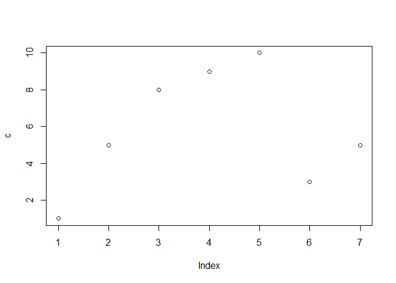

-   **Factor**: Gráfico de barras.

``` r
fact <- factor(c("BUENO", "MALO", "MALO", "BUENO", "BUENO", "BUENO", "BUENO"))

plot(fact)
```

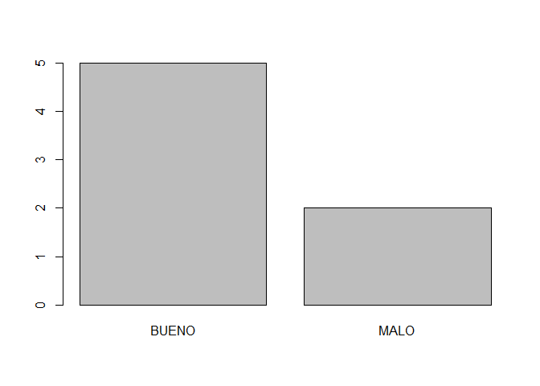

-   **Matriz**: Diagrama de dispersión de la segunda columna sobre la
    primera (a no ser, que se especifique otro orden).

``` r
my.mat <- matrix(1:30, nrow = 10, ncol = 3)

plot(my.mat)
```

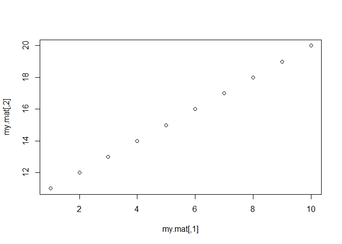
Para especificar un nuevo orden, utilizaremos dos parámetros en la
función plot.

``` r
plot(my.mat[, 2], my.mat[, 3])
```

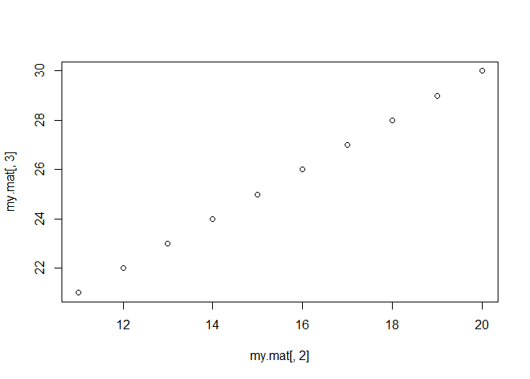

-   **Dataframe**: Matriz gráfica de visualización entre pares (diagrama
    pairs).

``` r
plot(iris)
```


En el caso de que la función **plot** tome más de un elemento producirá
los siguientes tipos de gráficas, en función del tipo de dato.

-   Vectores numéricos: Nube de puntos de y sobre x.

``` r
v.1 <- 1:100
v.2 <- v.1^2

plot(v.1, v.2)
```

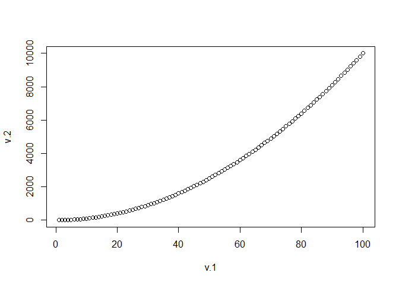

-   Si x es factor e y es un vector numérico: Diagrama de caja y bigotes
    para cada nivel de la variable factor.

``` r
x <- fact
y <- c(50, 21, 35, 48, 6, 75, 63)

plot(x, y)
```

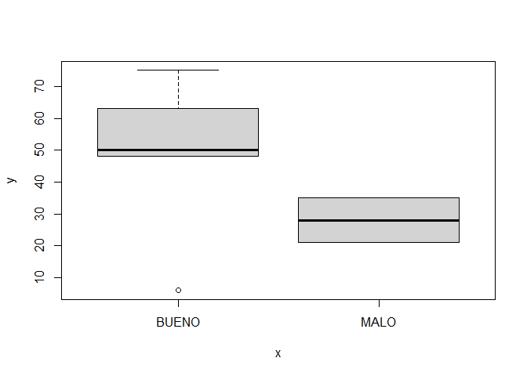

-   Si ambas variables son factor: Diagrama de barras de x con
    distribución acumulada para cada nivel de y.

``` r
new.fact <- factor(c("UNO", "DOS", "UNO", "DOS", "DOS", "DOS", "UNO"))

plot(new.fact, fact)
```

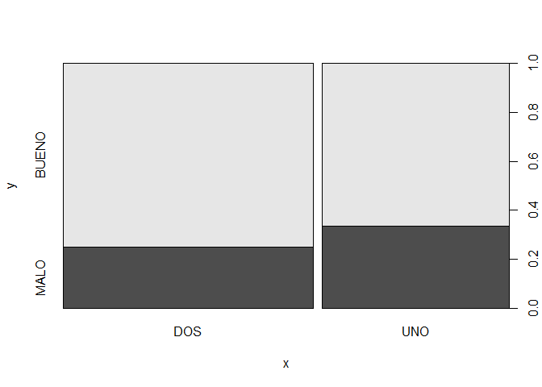

## Elementos básicos de una visualización en R

A lo largo de esta sección, se irán mostrando los diferentes elementos
que podemos agregar y modificar en una visualización.

Se trabajará con dos vectores para ir agregando elementos al gráfico.

``` r
vec.1 <- sample(1:1000, 100, replace = T)
vec.2 <- sample(1:1000, 100, replace = T)
```

Primero, mostramos la gráfica básica entre ambos, su *scatter plot*

``` r
plot(vec.1, vec.2)
```

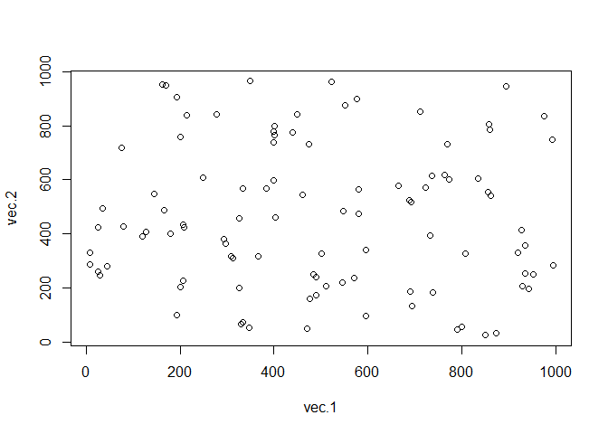

Para añadir elementos textuales podemos utilizar los siguientes
parámetros:

-   **`ylab`**: Texto en eje Y.
-   **`xlab`**: Texto en eje X.
-   **`main`**: Título de la gráfica.

``` r
plot(vec.1, vec.2, 
     ylab = "Vector 2", 
     xlab = "Vector 1", 
     main = "Scatter plot X ~ Y")
```


Si es necesario, puede aumentarse el tamaño de la fuente de los ejes
mediante el parámetro **`cex.lab`**. Del mismo modo, podemos cambiar el
tamaño de fuente del título con **`cex.main`**. Además, puede cambiarse
el color de cualquier elemento de texto con los parámetros:
**`col.lab`** y **`col.main`**

``` r
plot(vec.1, vec.2, 
     ylab = "Vector 2", 
     xlab = "Vector 1", 
     main = "Scatter plot X ~ Y", 
     cex.lab = 1.5,
     cex.main = 3,
     col.lab = "red", 
     col.main = "blue")
```

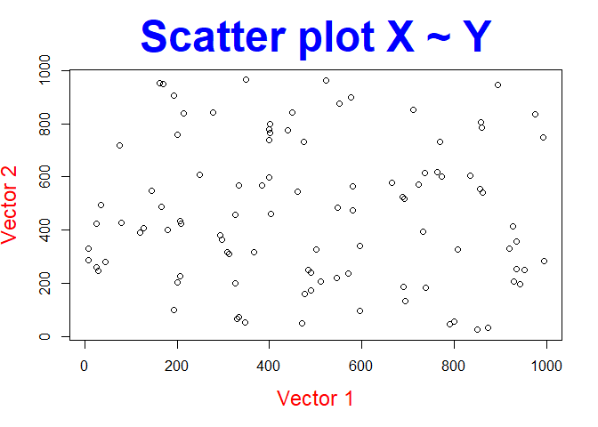

Salvo necesidad específica de aumentar los textos de una gráfica, por
ejemplo, para que puedan distinguirse con facilidad para una
presentación, lo habitual es trabajar con estos parámetros por defecto.

Para mejorar la legibilidad del gráfico, a veces, puede resultar
interesante, modificar la posición del texto de los valores de los ejes,
esto, se consigue modificando el valor del parámetro **`las`** que puede
tomar valores de 0 a 3:

1.  Siempre paralelo al eje (por defecto).
2.  Mostrar horizontal.
3.  Mostrar perpendicular al eje.
4.  Mostrar vertical.

``` r
plot(vec.1, vec.2, 
     ylab = "Vector 2", 
     xlab = "Vector 1", 
     main = "Scatter plot X ~ Y", 
     las = 1)
```


``` r
plot(vec.1, vec.2, 
     ylab = "Vector 2", 
     xlab = "Vector 1", 
     main = "Scatter plot X ~ Y", 
     las = 2)
```

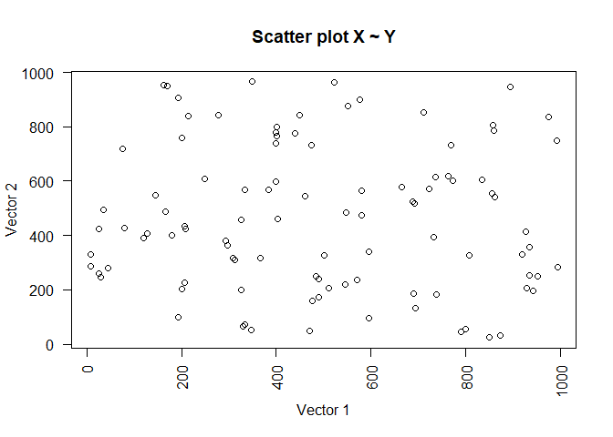

``` r
plot(vec.1, vec.2, 
     ylab = "Vector 2", 
     xlab = "Vector 1", 
     main = "Scatter plot X ~ Y", 
     las = 3)
```

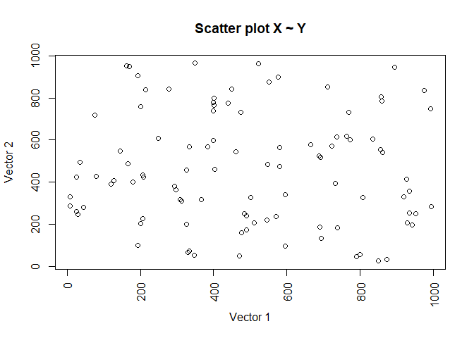

Aunque por defecto, la función **plot** muestre un diagrama de
dispoersión, es posible cambiar el tipo de gráfico con el parámetro
**`type`**, los tipos posibles son:

-   **p**: Representación con puntos.

``` r
plot(vec.1, vec.2, 
     ylab = "Vector 2", 
     xlab = "Vector 1", 
     main = "Scatter plot X ~ Y", 
     las = 1,
     type = 'p')
```

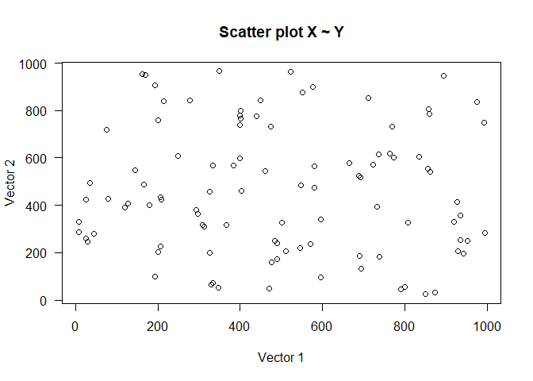

-   **l**: Representación con líneas.

``` r
plot(vec.1, vec.2, 
     ylab = "Vector 2", 
     xlab = "Vector 1", 
     main = "Scatter plot X ~ Y", 
     las = 1,
     type = 'l')
```


-   **b**: Puntos y líneas.

``` r
plot(vec.1, vec.2, 
     ylab = "Vector 2", 
     xlab = "Vector 1", 
     main = "Scatter plot X ~ Y", 
     las = 1,
     type = 'b')
```

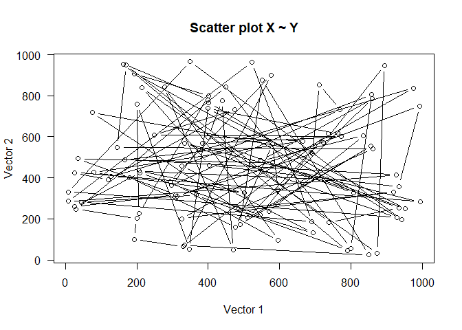

-   **c**: Sólo las líneas sin el punto de unión.

``` r
plot(vec.1, vec.2, 
     ylab = "Vector 2", 
     xlab = "Vector 1", 
     main = "Scatter plot X ~ Y", 
     las = 1,
     type = 'c')
```

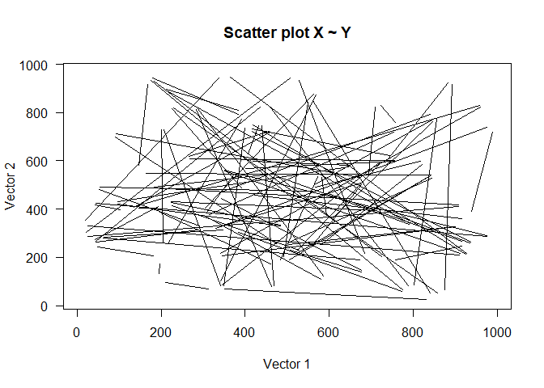

-   **o**: Se representan las líneas por encima de los puntos.

``` r
plot(vec.1, vec.2, 
     ylab = "Vector 2", 
     xlab = "Vector 1", 
     main = "Scatter plot X ~ Y", 
     las = 1,
     type = 'o')
```


-   **h**: Representación con histograma.

``` r
plot(vec.1, vec.2, 
     ylab = "Vector 2", 
     xlab = "Vector 1", 
     main = "Scatter plot X ~ Y", 
     las = 1,
     type = 'h')
```

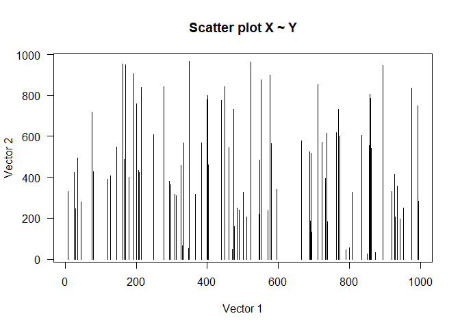

-   **s**: Mostrar la gráfica de forma escalonada (*steps*).

``` r
plot(vec.1, vec.2, 
     ylab = "Vector 2", 
     xlab = "Vector 1", 
     main = "Scatter plot X ~ Y", 
     las = 1,
     type = 's')
```

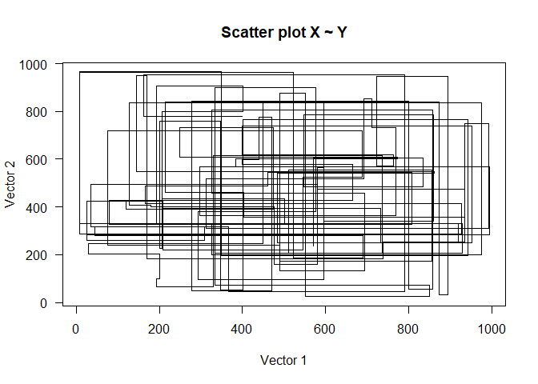

Mediante el parámetro **`col`** se añade color a la gráfica. Pueden
observarse algunos de los múltiples colores que soporta R en el
siguiente enlace:
<http://www.stat.columbia.edu/~tzheng/files/Rcolor.pdf>

``` r
v.1 <- 1:100
v.2 <- v.1^2

plot(v.1, v.2, 
     xlab = "Lineal", 
     ylab = "Cuadrática", 
     main = "Representación cuadrática",
     col = 'blue')
```

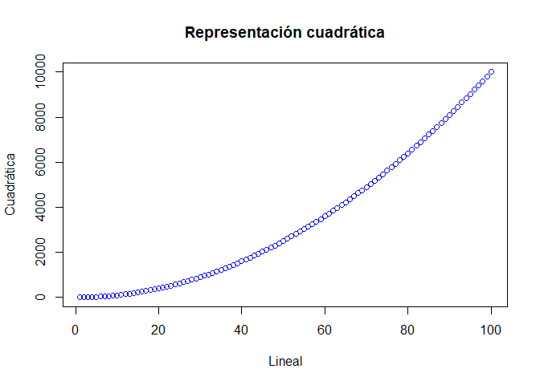

Cuando el gráfico es de dispersión, a través del parámetro **`cex`** se
puede aumentar el tamaño del punto y, con **`lwd`** se puede aumentar el
tamaño de la línea, además con **`lty`** se puede cambiar el tipo de
línea a los siguientes valores (0=blank, 1=solid (default), 2=dashed,
3=dotted, 4=dotdash, 5=longdash, 6=twodash).

``` r
plot(v.1, v.2, 
     xlab = "Lineal", 
     ylab = "Cuadrática", 
     main = "Representación cuadrática",
     col = 'blue',
     cex = 1)
```


``` r
plot(v.1, v.2, 
     xlab = "Lineal", 
     ylab = "Cuadrática", 
     main = "Representación cuadrática",
     col = 'red',
     cex = 5)
```

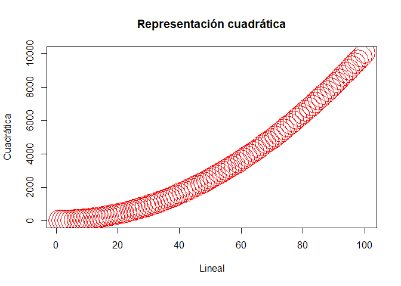

``` r
plot(v.1, v.2, 
     xlab = "Lineal", 
     ylab = "Cuadrática", 
     main = "Representación cuadrática",
     col = 'blue',
     type = "l",
     lwd = 7)
```

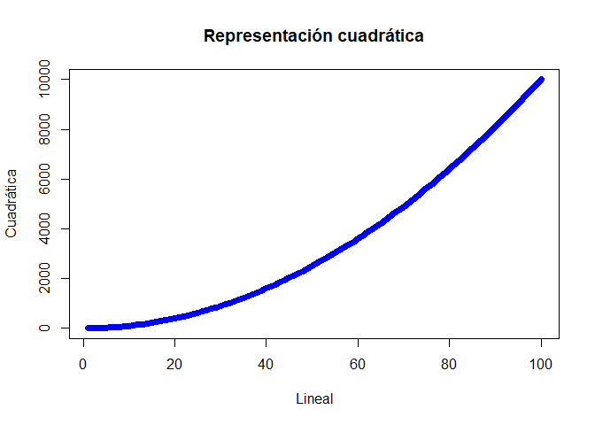

``` r
plot(v.1, v.2, 
     xlab = "Lineal", 
     ylab = "Cuadrática", 
     main = "Representación cuadrática",
     col = 'green',
     type = "l",
     lwd = 3,
     lty = 3)
```

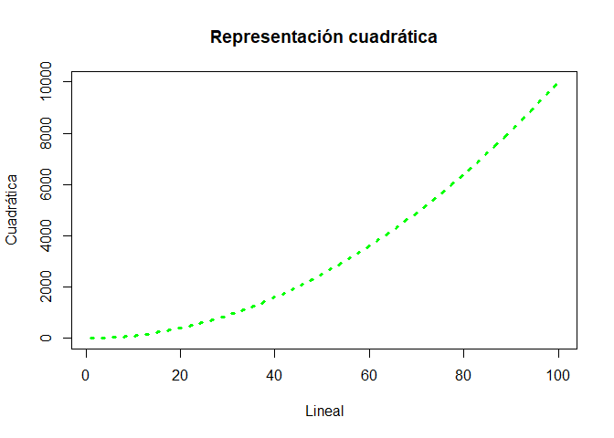

Fuera de la función **plot**, para añadir una leyenda a la
visualización, se utiliza la función **`legend`**, en donde tendremos
que añadir los siguientes parámetros importantes:

-   **legend**: Valor que tendrá cada valor que se muestre en la
    leyenda.
-   **title**: Título de la leyenda.
-   **Posición**: Puediendo distinguir las siguientes posiciones:
    “bottomright”, “bottom”, “bottomleft”, “left”, “topleft”, “top”,
    “topright”, “right” y “center”.

``` r
plot(v.1, v.2, 
     xlab = "Lineal", 
     ylab = "Cuadrática", 
     main = "Representación cuadrática",
     col = 'darkgreen',
     type = "l",
     lwd = 3,
     lty = 3)

legend("topleft", legend = c("Cuadrática ~ Lineal"),
       col = c("darkgreen"),
       lty=c(3),
       lwd = 3,
       title = "Leyenda")
```

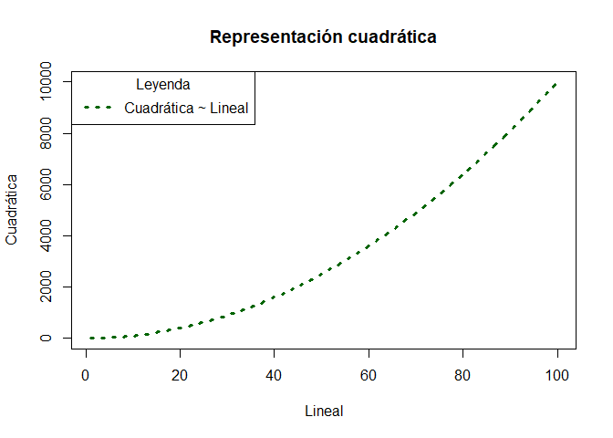

Antes de comenzar a diseñar diferentes tipos de gráficos se explicará la
función que nos permite crear varios tipos de visualización, dentro del
mismo espacio gráfico.

Para este propósito nos encontramos con la función **`par`** que recibe
uno de los dos siguientes parámetros:

-   **mfrow**: Distribuir los gráficos de filas a columnas.
-   **mfcol**: Distribuir los gráficos de columnas a filas.

``` r
par(mfrow=c(2,2))

# Fila 1, columna 1
plot(v.1, v.2, 
     xlab = "Lineal", 
     ylab = "Cuadrática", 
     main = "Representación cuadrática",
     col = 'darkgreen',
     type = "l",
     lwd = 3,
     lty = 3)

# Fila 2, columna 1
plot(fact)

# Fila 1, columna 2
plot(x, y)

# Fila 2, columna 2
plot(x, y)
```

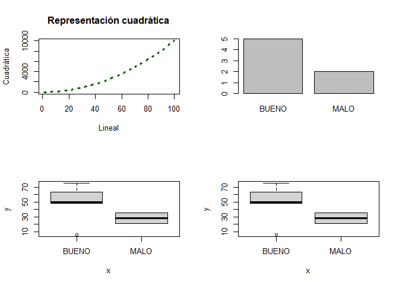

R, también dispone de funciones para poder guardar nuestras gráficas, a
través de los siguientes formatos **jpeg**, **png** o **pdf**. Es muy
importante que, una vez generada la gráfica, cerremos el espacio gráfico
con la función **`dev.off`**

``` r
pdf("Lineal_y_cuadrática.pdf")

plot(v.1, v.2, 
   xlab = "Lineal", 
   ylab = "Cuadrática", 
   main = "Representación cuadrática",
   col = 'darkgreen',
   type = "l",
   lwd = 3,
   lty = 3)

legend("topleft", legend = c("Cuadrática ~ Lineal"),
       col = c("darkgreen"),
       lty=c(3),
       lwd = 3,
       title = "Leyenda")

dev.off()
```

    ## png 
    ##   2

## Tipos de gráficos en R.

En esta sección se realizarán algunos de los principales tipos de
gráficos que podemos realizar en R.

-   **Histograma**

``` r
normal.values <-rnorm(1000,0,1) # Ver otras formas de la distribución normal https://stat.ethz.ch/R-manual/R-devel/library/stats/html/Normal.html

hist(normal.values, 
     ylab = "Frecuencia", 
     xlab = "Valores",
     main = "Histograma", 
     col = "grey", 
     border = "blue")
```

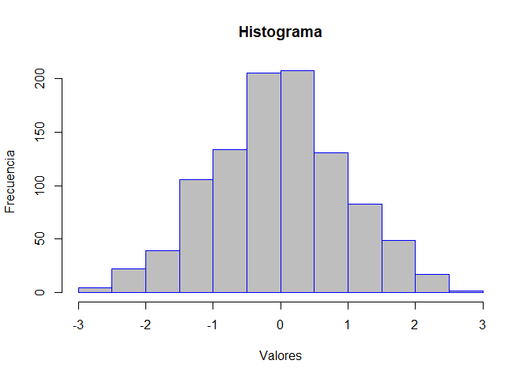

-   **Boxplot** - *Diagrama de caja y bigotes*

``` r
boxplot(normal.values, 
        border = "darkgreen", 
        col = "darkseagreen", 
        main = "Boxplot", 
        las = 1,
        outcol="darkred")
```

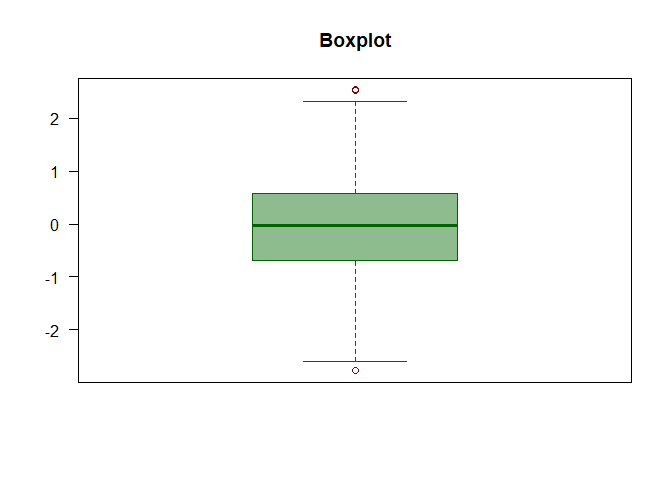

-   **Diagrama de barras**

``` r
barplot(normal.values, border = rainbow(length(normal.values)))
```

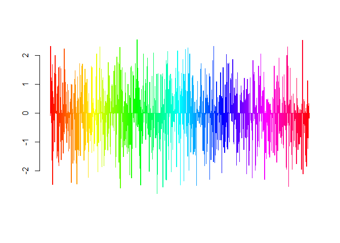

Como se puede observar, en esta visualización, se ha utilizado un
gradiente de color, podemos encontrar los siguientes:

-   **rainbow**
-   **heat.colors**
-   **terrain.colors**
-   **topo.colors**
-   **cm.colors**

Mostramos un ejemplo diferente de gráfico de barras.

``` r
v <- c(100, 32, 87, 57, 110)

barplot(v, main = "Diagrama de barras", xlab="Componentes", ylab="Valor", col = c("blue", "red", "green", "yellow", "tomato"))
```

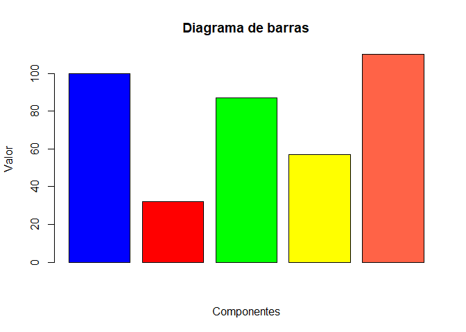

## Añadiendo elementos de bajo nivel.

En esta sección atenderemos especial atención a las siguientes funciones
que se sobreponen en un gráfico existente:

-   **`abline`**: Puede ser de dos tipos **v** vertical en el punto x, u
    **h** horizontal en el punto y.
-   **`points`**: Dibuja puntos en las coordenadas x e y
-   **`lines`**: Pinta líneas en las coordenadas x e y

``` r
hist(normal.values, 
     ylab = "Frecuencia", 
     xlab = "Valores",
     main = "Histograma", 
     col = "grey", 
     border = "blue")

abline(v=mean(normal.values), lty = 2, lwd = 3, col = "darkgreen")
abline(v=median(normal.values), lty = 3, lwd = 3, col = "red")
```

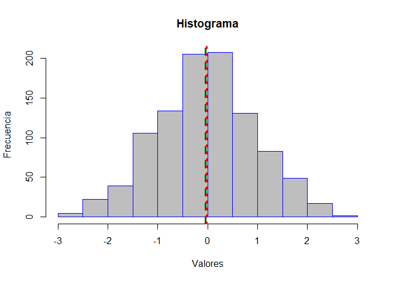

``` r
set.seed(123)
a <- sample(1:100, 10, replace = F)
b <- sample(1:100, 10, replace = F)

plot(a,b, main = "A ~ B", las = 1)
points(a,b, col = "red")
lines(a,b, col = "darkblue")
abline(h=mean(b), lty = 3, lwd = 3, col = "forestgreen")
abline(v=mean(a), lty = 3, lwd = 3, col = "forestgreen")
```

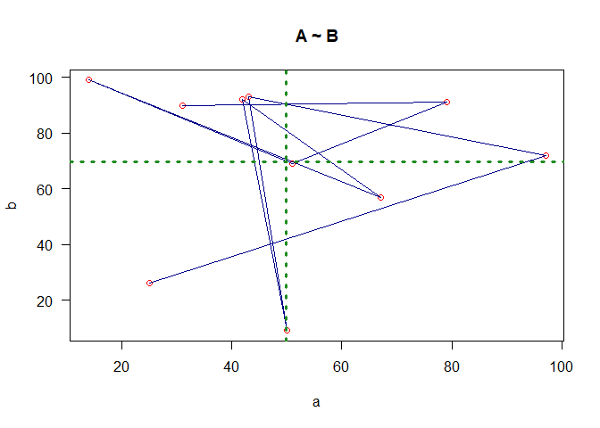
