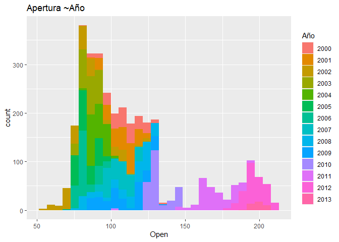
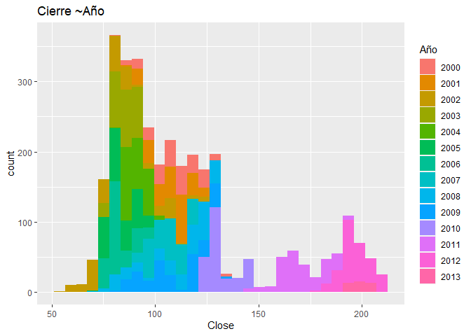
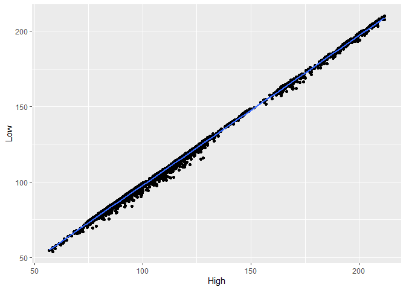
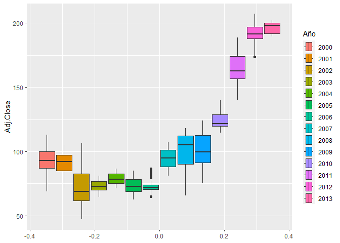
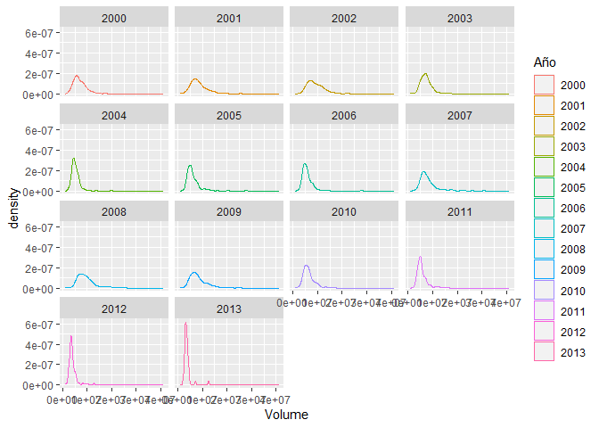

Toma el dataset IBM.csv y realiza el siguiente análisis exploratorio:

-   Carga el dataset como dataframe (el valor 999 es nulo) y muestra sus
    primeras filas, su resúmen estadístico y la estructura de sus
    columnas.
-   Reemplaza todos los valores nulos de la columna “Open”, por su
    mediana
-   Divide la columna “Date” en “Dia”, “Mes” y “Año”.
-   Cambia la columna Año a factor.
-   Devuelve el precio más alto de cada año.
-   Muestra una tabla de frecuencias para cada año.
-   Obtén una nueva columna que se llame “Diferencias” y que se el
    resultado de restar al precio más alto el precio más bajo.
-   Ordena el dataset de forma ascendente por la columna “Diferencias”.
-   Muestra un resúmen estadístico del dataset en función de los
    siguientes valores por cada año:
    -   Precio más alto de apertura.
    -   Precio más bajo de cierre.
    -   Media de la columna “Diferencia”.
    -   Número de elementos para cada año.
-   Muestra el sumatorio de la variable Volumen para todos los años.
-   Obtén dos histogramas para las variables de precio de apertura y
    cierre, rellena los histogramas en función del año.
-   Muestra un diagrama de dispersión entre los precios más altos y más
    bajos, además muestra su recta de ajuste.
-   Obtén un diagrama de caja y bigotes de la variable Adj.Close por
    año.
-   Muestra para cada año un diagrama de densidad para la variable
    “Volume”.

``` r
library(dplyr)
```

    ## 
    ## Attaching package: 'dplyr'

    ## The following objects are masked from 'package:stats':
    ## 
    ##     filter, lag

    ## The following objects are masked from 'package:base':
    ## 
    ##     intersect, setdiff, setequal, union

``` r
library(tidyr)
library(ggplot2)
```

-   Carga el dataset como dataframe (el valor 999 es nulo) y muestra sus
    primeras filas, su resúmen estadístico y la estructura de sus
    columnas.

``` r
df <- read.csv("IBM.csv", header = T, na.strings = 999)
```

``` r
head(df)
```

    ##         Date   Open   High    Low  Close   Volume Adj.Close
    ## 1 01/03/2000 102.00 105.50 100.06 100.25 10807800     84.48
    ## 2 02/03/2000 100.50 105.44  99.50 103.12 11192900     86.90
    ## 3 03/03/2000 107.25 110.00 106.06 108.00 10162800     91.01
    ## 4 06/03/2000 109.94 111.00 101.00 103.06 10747400     86.85
    ## 5 07/03/2000 106.00 107.00 101.69 103.00 10035100     86.80
    ## 6 08/03/2000 103.00 106.87 102.75 106.25  8376400     89.53

``` r
summary(df)
```

    ##      Date                Open             High             Low        
    ##  Length:3270        Min.   : 54.65   Min.   : 56.70   Min.   : 54.01  
    ##  Class :character   1st Qu.: 86.56   1st Qu.: 87.56   1st Qu.: 85.75  
    ##  Mode  :character   Median :103.95   Median :105.50   Median :102.50  
    ##                     Mean   :113.95   Mean   :115.15   Mean   :112.93  
    ##                     3rd Qu.:126.38   3rd Qu.:127.56   3rd Qu.:125.39  
    ##                     Max.   :211.15   Max.   :211.79   Max.   :210.06  
    ##                     NA's   :14                                        
    ##      Close            Volume           Adj.Close     
    ##  Min.   : 55.07   Min.   : 1027500   Min.   : 47.06  
    ##  1st Qu.: 86.56   1st Qu.: 4772625   1st Qu.: 75.25  
    ##  Median :103.98   Median : 6201000   Median : 90.75  
    ##  Mean   :114.07   Mean   : 6998023   Mean   :103.72  
    ##  3rd Qu.:126.59   3rd Qu.: 8337500   3rd Qu.:117.58  
    ##  Max.   :211.00   Max.   :41207300   Max.   :207.19  
    ## 

``` r
str(df)
```

    ## 'data.frame':    3270 obs. of  7 variables:
    ##  $ Date     : chr  "01/03/2000" "02/03/2000" "03/03/2000" "06/03/2000" ...
    ##  $ Open     : num  102 100 107 110 106 ...
    ##  $ High     : num  106 105 110 111 107 ...
    ##  $ Low      : num  100.1 99.5 106.1 101 101.7 ...
    ##  $ Close    : num  100 103 108 103 103 ...
    ##  $ Volume   : int  10807800 11192900 10162800 10747400 10035100 8376400 6334100 7093200 7871000 7973700 ...
    ##  $ Adj.Close: num  84.5 86.9 91 86.8 86.8 ...

-   Reemplaza todos los valores nulos de la columna “Open”, por su
    mediana

``` r
df$Open[which(is.na(df$Open))] <- median(df$Open, na.rm = T)
summary(df)
```

    ##      Date                Open             High             Low        
    ##  Length:3270        Min.   : 54.65   Min.   : 56.70   Min.   : 54.01  
    ##  Class :character   1st Qu.: 86.70   1st Qu.: 87.56   1st Qu.: 85.75  
    ##  Mode  :character   Median :103.95   Median :105.50   Median :102.50  
    ##                     Mean   :113.91   Mean   :115.15   Mean   :112.93  
    ##                     3rd Qu.:126.28   3rd Qu.:127.56   3rd Qu.:125.39  
    ##                     Max.   :211.15   Max.   :211.79   Max.   :210.06  
    ##      Close            Volume           Adj.Close     
    ##  Min.   : 55.07   Min.   : 1027500   Min.   : 47.06  
    ##  1st Qu.: 86.56   1st Qu.: 4772625   1st Qu.: 75.25  
    ##  Median :103.98   Median : 6201000   Median : 90.75  
    ##  Mean   :114.07   Mean   : 6998023   Mean   :103.72  
    ##  3rd Qu.:126.59   3rd Qu.: 8337500   3rd Qu.:117.58  
    ##  Max.   :211.00   Max.   :41207300   Max.   :207.19

-   Divide la columna “Date” en “Dia”, “Mes” y “Año”.

``` r
df <- separate(df, Date, into = c("Dia", "Mes", "Año"), sep = "/")
head(df)
```

    ##   Dia Mes  Año   Open   High    Low  Close   Volume Adj.Close
    ## 1  01  03 2000 102.00 105.50 100.06 100.25 10807800     84.48
    ## 2  02  03 2000 100.50 105.44  99.50 103.12 11192900     86.90
    ## 3  03  03 2000 107.25 110.00 106.06 108.00 10162800     91.01
    ## 4  06  03 2000 109.94 111.00 101.00 103.06 10747400     86.85
    ## 5  07  03 2000 106.00 107.00 101.69 103.00 10035100     86.80
    ## 6  08  03 2000 103.00 106.87 102.75 106.25  8376400     89.53

``` r
colnames(df)
```

    ## [1] "Dia"       "Mes"       "Año"       "Open"      "High"      "Low"      
    ## [7] "Close"     "Volume"    "Adj.Close"

-   Cambia la columna Año a factor.

``` r
df$Año <- as.factor(df$Año)
str(df)
```

    ## 'data.frame':    3270 obs. of  9 variables:
    ##  $ Dia      : chr  "01" "02" "03" "06" ...
    ##  $ Mes      : chr  "03" "03" "03" "03" ...
    ##  $ Año      : Factor w/ 14 levels "2000","2001",..: 1 1 1 1 1 1 1 1 1 1 ...
    ##  $ Open     : num  102 100 107 110 106 ...
    ##  $ High     : num  106 105 110 111 107 ...
    ##  $ Low      : num  100.1 99.5 106.1 101 101.7 ...
    ##  $ Close    : num  100 103 108 103 103 ...
    ##  $ Volume   : int  10807800 11192900 10162800 10747400 10035100 8376400 6334100 7093200 7871000 7973700 ...
    ##  $ Adj.Close: num  84.5 86.9 91 86.8 86.8 ...

-   Devuelve el precio más alto de cada año.

``` r
df %>% select(Año, High) %>% group_by(Año) %>% summarise(max_año = max(High))
```

    ## # A tibble: 14 × 2
    ##    Año   max_año
    ##    <fct>   <dbl>
    ##  1 2000    135. 
    ##  2 2001    125. 
    ##  3 2002    126. 
    ##  4 2003     94.5
    ##  5 2004    100. 
    ##  6 2005     99.1
    ##  7 2006     97.9
    ##  8 2007    121. 
    ##  9 2008    131. 
    ## 10 2009    133. 
    ## 11 2010    148. 
    ## 12 2011    195. 
    ## 13 2012    212. 
    ## 14 2013    209.

-   Muestra una tabla de frecuencias para cada año.

``` r
table(df$Año)
```

    ## 
    ## 2000 2001 2002 2003 2004 2005 2006 2007 2008 2009 2010 2011 2012 2013 
    ##  212  248  252  252  252  252  251  251  253  252  252  252  250   41

-   Obtén una nueva columna que se llame “Diferencias” y que se el
    resultado de restar al precio más alto el precio más bajo.

``` r
df$Diferencias <- df$High - df$Low
summary(df)
```

    ##      Dia                Mes                 Año            Open       
    ##  Length:3270        Length:3270        2008   : 253   Min.   : 54.65  
    ##  Class :character   Class :character   2002   : 252   1st Qu.: 86.70  
    ##  Mode  :character   Mode  :character   2003   : 252   Median :103.95  
    ##                                        2004   : 252   Mean   :113.91  
    ##                                        2005   : 252   3rd Qu.:126.28  
    ##                                        2009   : 252   Max.   :211.15  
    ##                                        (Other):1757                   
    ##       High             Low             Close            Volume        
    ##  Min.   : 56.70   Min.   : 54.01   Min.   : 55.07   Min.   : 1027500  
    ##  1st Qu.: 87.56   1st Qu.: 85.75   1st Qu.: 86.56   1st Qu.: 4772625  
    ##  Median :105.50   Median :102.50   Median :103.98   Median : 6201000  
    ##  Mean   :115.15   Mean   :112.93   Mean   :114.07   Mean   : 6998023  
    ##  3rd Qu.:127.56   3rd Qu.:125.39   3rd Qu.:126.59   3rd Qu.: 8337500  
    ##  Max.   :211.79   Max.   :210.06   Max.   :211.00   Max.   :41207300  
    ##                                                                       
    ##    Adj.Close       Diferencias    
    ##  Min.   : 47.06   Min.   : 0.350  
    ##  1st Qu.: 75.25   1st Qu.: 1.270  
    ##  Median : 90.75   Median : 1.860  
    ##  Mean   :103.72   Mean   : 2.228  
    ##  3rd Qu.:117.58   3rd Qu.: 2.780  
    ##  Max.   :207.19   Max.   :11.930  
    ## 

-   Ordena el dataset de forma ascendente por la columna “Diferencias”.

``` r
df <- arrange(df,Diferencias)
head(df)
```

    ##   Dia Mes  Año   Open   High    Low  Close  Volume Adj.Close Diferencias
    ## 1  26  08 2004  85.00  85.04  84.69  84.69 3134400     73.48        0.35
    ## 2  28  02 2005  92.53  92.76  92.41  92.58 4949800     80.63        0.35
    ## 3  27  08 2004  84.65  84.95  84.59  84.94 2444800     73.70        0.36
    ## 4  14  12 2009 129.65 129.98 129.60 129.93 5201300    121.60        0.38
    ## 5  31  12 2004  98.60  98.91  98.49  98.58 2793200     85.70        0.42
    ## 6  27  09 2004  84.10  84.44  83.98  84.16 4650300     73.02        0.46

-   Muestra un resúmen estadístico del dataset en función de los
    siguientes valores por cada año:
    -   Precio más alto de apertura.
    -   Precio más bajo de cierre.
    -   Media de la columna “Diferencia”.
    -   Número de elementos para cada año.

``` r
df %>% select(Open, Close, Diferencias, Año) %>% group_by(Año) %>% summarise(
  max_apertura = max(Open),
  min_cierre = min(Close),
  media_diferencia = mean(Diferencias),
  elementos_año = n()
)
```

    ## # A tibble: 14 × 5
    ##    Año   max_apertura min_cierre media_diferencia elementos_año
    ##    <fct>        <dbl>      <dbl>            <dbl>         <int>
    ##  1 2000         133.        81.6             4.14           212
    ##  2 2001         124.        84.8             3.11           248
    ##  3 2002         125         55.1             2.51           252
    ##  4 2003          93.9       75.2             1.56           252
    ##  5 2004         104.        82.2             1.21           252
    ##  6 2005          99.0       72.0             1.19           252
    ##  7 2006         104.        73.6             1.12           251
    ##  8 2007         119.        90.9             1.85           251
    ##  9 2008         130.        71.7             3.32           253
    ## 10 2009         132.        82.0             2.17           252
    ## 11 2010         147.       122.              1.88           252
    ## 12 2011         194.       147.              2.77           252
    ## 13 2012         211.       179.              2.46           250
    ## 14 2013         205.       192.              2.07            41

-   Muestra el sumatorio de la variable Volumen para todos los años.

``` r
tapply(df$Volume, df$Año, sum)
```

    ##       2000       2001       2002       2003       2004       2005       2006 
    ## 1524122700 2125060300 2347246300 1853423000 1316247600 1539128900 1455782200 
    ##       2007       2008       2009       2010       2011       2012       2013 
    ## 2019185700 2377449700 2084230400 1618549600 1446186500 1021834200  155089000

-   Obtén dos histogramas para las variables de precio de apertura y
    cierre, rellena los histogramas en función del año.

``` r
ggplot(df) +
  geom_histogram(mapping = aes(Open, fill = Año)) + 
  ggtitle("Apertura ~Año")
```

    ## `stat_bin()` using `bins = 30`. Pick better value with `binwidth`.



``` r
ggplot(df) +
  geom_histogram(mapping = aes(Close, fill = Año)) + 
  ggtitle("Cierre ~Año")
```

    ## `stat_bin()` using `bins = 30`. Pick better value with `binwidth`.


\* Muestra un diagrama de dispersión entre los precios más altos y más
bajos, además muestra su recta de ajuste.

``` r
ggplot(df) + 
  geom_point(mapping = aes(x = High, y = Low)) +
  geom_smooth(aes(x =High, y = Low), method = lm)
```

    ## `geom_smooth()` using formula = 'y ~ x'


\* Obtén un diagrama de caja y bigotes de la variable Adj.Close por año.

``` r
ggplot(df) + 
  geom_boxplot(mapping = aes(x = Adj.Close, fill = Año)) + coord_flip()
```


\* Muestra para cada año un diagrama de densidad para la variable
“Volume”.

``` r
ggplot(df) + 
  geom_density(mapping = aes(Volume, colour = Año)) +
  facet_wrap(~Año)
```


