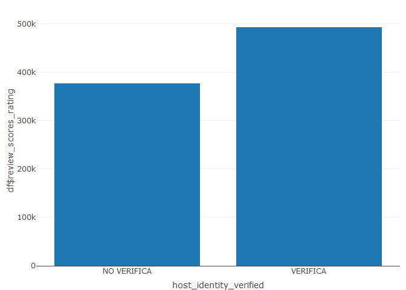
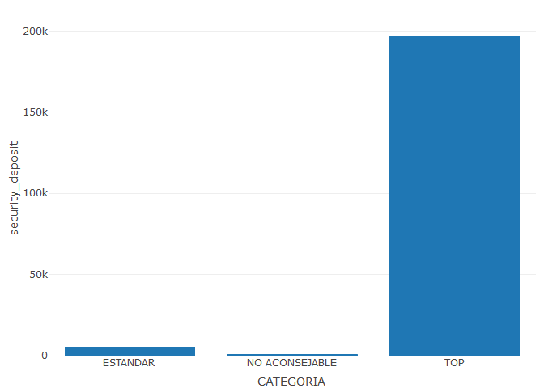

# Ejercicio Final R

Se dispone del siguiente archivo CSV con información sobre los Air Bnb
de la ciudad de Milán en 2019. En el dataset, solamente aparecen
apartamentos completos.

El dataset original y la explicación de todas las columnas está
disponible en el siguiente enlace:
<https://www.kaggle.com/antoniokaggle/milan-airbnb-open-data-only-entire-apartments>

Con esta información, alumno debe realizar los siguientes procesos de
analítica:

1.  Cargar el archivo “Airbnb\_Milan.csv” como dataframe.

2.  Crear un nuevo dataframe que contenga únicamente las siguientes
    columnas:

    -   “host\_is\_superhost”
    -   “host\_identity\_verified”
    -   “bathrooms”
    -   “bedrooms”
    -   “daily\_price”
    -   “security\_deposit”
    -   “minimum\_nights”
    -   “number\_of\_reviews”
    -   “review\_scores\_rating”

3.  Cambiar los factores de la variable “host\_is\_superhost” de 0, 1 a:
    “SI” y, “NO”. (investigar la función recode).

4.  Cambiar los factores de la variable “host\_identity\_verified” de 0,
    1 a: “VERIFICA” y “NO VERIFICA”.

5.  Mostrar un resumen estadístico de los datos.

6.  Filtrar el dataset por apartamentos cuyo mínimo de noches sea igual
    o menor que siete.

7.  ¿Cuál es el precio medio por día de una habitación en función de si
    el anfitrión tiene verificado o no su perfil?

8.  Quién tiene más número de reseñas, ¿un super host o no super host?

9.  Sobre la estadística anterior ¿quién tiene la puntuación media más
    alta?

10. Crea un vector categórico llamado “CATEGORÍA”, en función de que, si
    para la puntuación de las reseñas tiene de 0 a 49, sea “NO
    ACONSEJABLE”; de 50 a 75 sea “ESTÁNDAR”; y de 76 a 100 sea “TOP”.

11. Mostrar las frecuencias de la variable CATEGORÍA.

12. Obtener el histograma del precio por día.

13. Estudiar la relación entre los dormitorios y baños de forma gráfica.

14. Mostrar un histograma del número de reseñas en función de si es un
    usuario verificado o no.

15. Mostrar un histograma por cada valor de “CATEGORÍA” en el que se
    enseñe la cuantía del depósito de seguridad en función de si el
    anfitrión es super host o no.

16. Cargar el archivo “Airbnb\_Milan.csv” como dataframe.

<!-- -->

    milan <- read.csv("Airbnb_Milan.csv", header = T)

    head(milan)

    ##   X     id host_id host_location host_response_time host_response_rate
    ## 1 1  73892  387110             1                  1                 57
    ## 2 2  74169  268127             1                  1                 57
    ## 3 3  77958  387110             1                  1                 57
    ## 4 4  93025  499743             1                  1                 57
    ## 5 5 132705  391011             1                  1                 57
    ## 6 6 141833  689467             1                  0                 29
    ##   host_is_superhost host_total_listings_count host_has_profile_pic
    ## 1                 0                         3                    1
    ## 2                 0                         1                    1
    ## 3                 0                         3                    1
    ## 4                 0                         1                    1
    ## 5                 1                         2                    1
    ## 6                 0                         8                    1
    ##   host_identity_verified neighbourhood_cleansed zipcode latitude longitude
    ## 1                      1                      1   20121 45.47015   9.19134
    ## 2                      0                      1   20121 45.47169   9.18412
    ## 3                      1                      1   20121 45.47117   9.19135
    ## 4                      0                      1   20121 45.47204   9.19640
    ## 5                      0                      1   20135 45.45934   9.20609
    ## 6                      1                      1   20123 45.46022   9.18279
    ##         room_type accommodates bathrooms bedrooms beds bed_type daily_price
    ## 1 Entire home/apt            2         3        1    1        1          94
    ## 2 Entire home/apt            4         3        1    1        1         125
    ## 3 Entire home/apt            2         3        1    1        1         100
    ## 4 Entire home/apt            3         3        1    2        1         120
    ## 5 Entire home/apt            2         3        0    1        3          70
    ## 6 Entire home/apt            2         3        1    1        1         200
    ##   security_deposit cleaning_fee guests_included extra_people minimum_nights
    ## 1                1           45               1            0              2
    ## 2               31           30               1            0              2
    ## 3                1           45               1            0              2
    ## 4               48           57               2           40              2
    ## 5               13           45               1            0             30
    ## 6               48           57               2           20             15
    ##   availability_30 availability_60 availability_90 availability_365
    ## 1              29              59              89              364
    ## 2               0               0               9              284
    ## 3              29              59              89              364
    ## 4              10              40              70              160
    ## 5              27              57              87              362
    ## 6               0               3              33              308
    ##   number_of_reviews review_scores_rating review_scores_accuracy
    ## 1                84                   94                      9
    ## 2                 3                  100                     10
    ## 3                70                   97                      9
    ## 4                57                   97                     10
    ## 5                44                   90                      9
    ## 6                79                   98                     10
    ##   review_scores_cleanliness review_scores_checkin review_scores_communication
    ## 1                         9                    10                          10
    ## 2                        10                    10                          10
    ## 3                        10                    10                          10
    ## 4                        10                    10                          10
    ## 5                         9                    10                          10
    ## 6                        10                    10                          10
    ##   review_scores_location review_scores_value instant_bookable
    ## 1                     10                   9                0
    ## 2                     10                   9                0
    ## 3                     10                   9                0
    ## 4                     10                  10                0
    ## 5                      9                   9                0
    ## 6                     10                  10                0
    ##   cancellation_policy require_guest_profile_picture
    ## 1                   1                             1
    ## 2                   0                             0
    ## 3                   1                             1
    ## 4                   1                             0
    ## 5                   1                             1
    ## 6                   0                             1
    ##   require_guest_phone_verification TV WiFi Air_Condition Wheelchair_accessible
    ## 1                                1  1    1             1                     0
    ## 2                                0  1    1             1                     0
    ## 3                                1  1    1             1                     0
    ## 4                                0  1    1             1                     0
    ## 5                                1  1    1             1                     0
    ## 6                                1  1    1             1                     0
    ##   Kitchen Breakfast Elevator Heating Washer Iron Host_greets_you
    ## 1       1         0        1       1      0    1               0
    ## 2       1         0        1       1      1    1               0
    ## 3       1         0        1       1      0    1               0
    ## 4       1         0        1       1      0    1               0
    ## 5       1         0        1       1      1    1               1
    ## 6       1         0        1       1      1    1               0
    ##   Paid_parking_on_premises Luggage_dropoff_allowed Long_term_stays_allowed
    ## 1                        0                       0                       0
    ## 2                        0                       0                       0
    ## 3                        0                       0                       0
    ## 4                        1                       1                       0
    ## 5                        0                       0                       0
    ## 6                        0                       0                       1
    ##   Doorman Pets_allowed Smoking_allowed Suitable_for_events X24_hour_check_in
    ## 1       0            0               0                   1                 0
    ## 2       0            0               0                   0                 0
    ## 3       0            0               0                   1                 0
    ## 4       0            1               0                   0                 0
    ## 5       0            0               0                   0                 0
    ## 6       1            0               0                   0                 1

1.  Crear un nuevo dataframe que contenga únicamente las siguientes
    columnas:

    -   “host\_is\_superhost”
    -   “host\_identity\_verified”
    -   “bathrooms”
    -   “bedrooms”
    -   “daily\_price”
    -   “security\_deposit”
    -   “minimum\_nights”
    -   “number\_of\_reviews”
    -   “review\_scores\_rating”

    <!-- -->

        library(dplyr)

        ## 
        ## Attaching package: 'dplyr'

        ## The following objects are masked from 'package:stats':
        ## 
        ##     filter, lag

        ## The following objects are masked from 'package:base':
        ## 
        ##     intersect, setdiff, setequal, union

        library(tidyr)

<!-- -->

    df <- milan %>% select(host_is_superhost, host_identity_verified, bathrooms, bedrooms, daily_price, security_deposit, minimum_nights, number_of_reviews, review_scores_rating)
    head(df)

    ##   host_is_superhost host_identity_verified bathrooms bedrooms daily_price
    ## 1                 0                      1         3        1          94
    ## 2                 0                      0         3        1         125
    ## 3                 0                      1         3        1         100
    ## 4                 0                      0         3        1         120
    ## 5                 1                      0         3        0          70
    ## 6                 0                      1         3        1         200
    ##   security_deposit minimum_nights number_of_reviews review_scores_rating
    ## 1                1              2                84                   94
    ## 2               31              2                 3                  100
    ## 3                1              2                70                   97
    ## 4               48              2                57                   97
    ## 5               13             30                44                   90
    ## 6               48             15                79                   98

1.  Cambiar los factores de la variable “host\_is\_superhost” de 0, 1 a:
    “SI” y, “NO”. (investigar la función recode).

<!-- -->

    df <- df %>% mutate(host_is_superhost=recode(host_is_superhost, 
                                                 "0" = "SI", 
                                                 "1" = "NO"))

    # Convertir a factores
    df$host_is_superhost <- as.factor(df$host_is_superhost)

    str(df)

    ## 'data.frame':    9322 obs. of  9 variables:
    ##  $ host_is_superhost     : Factor w/ 2 levels "NO","SI": 2 2 2 2 1 2 1 2 2 2 ...
    ##  $ host_identity_verified: int  1 0 1 0 0 1 0 0 1 0 ...
    ##  $ bathrooms             : int  3 3 3 3 3 3 5 3 3 3 ...
    ##  $ bedrooms              : int  1 1 1 1 0 1 1 1 1 1 ...
    ##  $ daily_price           : int  94 125 100 120 70 200 700 250 100 280 ...
    ##  $ security_deposit      : int  1 31 1 48 13 48 1 73 13 1 ...
    ##  $ minimum_nights        : int  2 2 2 2 30 15 1 1 1 1 ...
    ##  $ number_of_reviews     : int  84 3 70 57 44 79 72 126 377 22 ...
    ##  $ review_scores_rating  : int  94 100 97 97 90 98 96 98 94 95 ...

1.  Cambiar los factores de la variable “host\_identity\_verified” de 0,
    1 a: “VERIFICA” y “NO VERIFICA”.

<!-- -->

    df <- df %>% mutate(host_identity_verified=recode(host_identity_verified, 
                                                 "0" = "VERIFICA", 
                                                 "1" = "NO VERIFICA"))

    # Convertir a factores
    df$host_identity_verified <- as.factor(df$host_identity_verified)

    str(df)

    ## 'data.frame':    9322 obs. of  9 variables:
    ##  $ host_is_superhost     : Factor w/ 2 levels "NO","SI": 2 2 2 2 1 2 1 2 2 2 ...
    ##  $ host_identity_verified: Factor w/ 2 levels "NO VERIFICA",..: 1 2 1 2 2 1 2 2 1 2 ...
    ##  $ bathrooms             : int  3 3 3 3 3 3 5 3 3 3 ...
    ##  $ bedrooms              : int  1 1 1 1 0 1 1 1 1 1 ...
    ##  $ daily_price           : int  94 125 100 120 70 200 700 250 100 280 ...
    ##  $ security_deposit      : int  1 31 1 48 13 48 1 73 13 1 ...
    ##  $ minimum_nights        : int  2 2 2 2 30 15 1 1 1 1 ...
    ##  $ number_of_reviews     : int  84 3 70 57 44 79 72 126 377 22 ...
    ##  $ review_scores_rating  : int  94 100 97 97 90 98 96 98 94 95 ...

1.  Mostrar un resumen estadístico de los datos.

<!-- -->

    summary(df)

    ##  host_is_superhost host_identity_verified   bathrooms         bedrooms     
    ##  NO:2693           NO VERIFICA:4020       Min.   : 1.000   Min.   : 0.000  
    ##  SI:6629           VERIFICA   :5302       1st Qu.: 3.000   1st Qu.: 1.000  
    ##                                           Median : 3.000   Median : 1.000  
    ##                                           Mean   : 3.357   Mean   : 1.218  
    ##                                           3rd Qu.: 3.000   3rd Qu.: 2.000  
    ##                                           Max.   :17.000   Max.   :10.000  
    ##   daily_price     security_deposit minimum_nights    number_of_reviews
    ##  Min.   :  10.0   Min.   :  1.00   Min.   :  1.000   Min.   :  1.00   
    ##  1st Qu.:  59.0   1st Qu.:  1.00   1st Qu.:  1.000   1st Qu.:  4.00   
    ##  Median :  75.0   Median :  1.00   Median :  2.000   Median : 14.00   
    ##  Mean   : 103.7   Mean   : 21.71   Mean   :  3.205   Mean   : 39.64   
    ##  3rd Qu.: 107.0   3rd Qu.: 48.00   3rd Qu.:  2.000   3rd Qu.: 44.00   
    ##  Max.   :3000.0   Max.   :143.00   Max.   :365.000   Max.   :791.00   
    ##  review_scores_rating
    ##  Min.   : 20.00      
    ##  1st Qu.: 90.00      
    ##  Median : 95.00      
    ##  Mean   : 93.15      
    ##  3rd Qu.: 99.00      
    ##  Max.   :100.00

1.  Filtrar el dataset por apartamentos cuyo mínimo de noches sea igual
    o menor que siete.

<!-- -->

    head(filter(df,minimum_nights <= 7))

    ##   host_is_superhost host_identity_verified bathrooms bedrooms daily_price
    ## 1                SI            NO VERIFICA         3        1          94
    ## 2                SI               VERIFICA         3        1         125
    ## 3                SI            NO VERIFICA         3        1         100
    ## 4                SI               VERIFICA         3        1         120
    ## 5                NO               VERIFICA         5        1         700
    ## 6                SI               VERIFICA         3        1         250
    ##   security_deposit minimum_nights number_of_reviews review_scores_rating
    ## 1                1              2                84                   94
    ## 2               31              2                 3                  100
    ## 3                1              2                70                   97
    ## 4               48              2                57                   97
    ## 5                1              1                72                   96
    ## 6               73              1               126                   98

1.  ¿Cuál es el precio medio por día de una habitación en función de si
    el anfitrión tiene verificado o no su perfil?

<!-- -->

    df %>% group_by(host_identity_verified) %>% summarise(precio_medio = mean(daily_price))

    ## # A tibble: 2 × 2
    ##   host_identity_verified precio_medio
    ##   <fct>                         <dbl>
    ## 1 NO VERIFICA                    104.
    ## 2 VERIFICA                       104.

1.  Quién tiene más número de reseñas, ¿un super host o no super host?

<!-- -->

    df %>% group_by(host_is_superhost) %>% summarise(múmero_reseñas = sum(number_of_reviews))

    ## # A tibble: 2 × 2
    ##   host_is_superhost múmero_reseñas
    ##   <fct>                      <int>
    ## 1 NO                        164876
    ## 2 SI                        204655

1.  Sobre la estadística anterior ¿quién tiene la puntuación media más
    alta?

<!-- -->

    df %>% group_by(host_is_superhost) %>% summarise(media_reseñas = mean(number_of_reviews))

    ## # A tibble: 2 × 2
    ##   host_is_superhost media_reseñas
    ##   <fct>                     <dbl>
    ## 1 NO                         61.2
    ## 2 SI                         30.9

1.  Crea un vector categórico llamado “CATEGORÍA”, en función de que, si
    para la puntuación de las reseñas tiene de 0 a 49, sea “NO
    ACONSEJABLE”; de 50 a 75 sea “ESTÁNDAR”; y de 76 a 100 sea “TOP”.

<!-- -->

    df["CATEGORIA"] <- factor(ifelse(df$review_scores_rating <= 49, "NO ACONSEJABLE", ifelse(df$review_scores_rating <= 75, "ESTANDAR", "TOP")))
    head(df)

    ##   host_is_superhost host_identity_verified bathrooms bedrooms daily_price
    ## 1                SI            NO VERIFICA         3        1          94
    ## 2                SI               VERIFICA         3        1         125
    ## 3                SI            NO VERIFICA         3        1         100
    ## 4                SI               VERIFICA         3        1         120
    ## 5                NO               VERIFICA         3        0          70
    ## 6                SI            NO VERIFICA         3        1         200
    ##   security_deposit minimum_nights number_of_reviews review_scores_rating
    ## 1                1              2                84                   94
    ## 2               31              2                 3                  100
    ## 3                1              2                70                   97
    ## 4               48              2                57                   97
    ## 5               13             30                44                   90
    ## 6               48             15                79                   98
    ##   CATEGORIA
    ## 1       TOP
    ## 2       TOP
    ## 3       TOP
    ## 4       TOP
    ## 5       TOP
    ## 6       TOP

1.  Mostrar las frecuencias de la variable CATEGORÍA.

<!-- -->

    table(df$CATEGORIA)

    ## 
    ##       ESTANDAR NO ACONSEJABLE            TOP 
    ##            263             42           9017

1.  Obtener el histograma del precio por día.

<!-- -->

    library(plotly)

    ## Loading required package: ggplot2

    ## 
    ## Attaching package: 'plotly'

    ## The following object is masked from 'package:ggplot2':
    ## 
    ##     last_plot

    ## The following object is masked from 'package:stats':
    ## 
    ##     filter

    ## The following object is masked from 'package:graphics':
    ## 
    ##     layout

    fig <- plot_ly(
      data = df,
      x = ~daily_price,
                   alpha = 0.6,
                   type = "histogram")
    fig

1.  Estudiar la relación entre los dormitorios y baños de forma gráfica.

<!-- -->

    library(ggplot2)

    ggplot(df) +
      geom_point(mapping = aes(bedrooms, bathrooms)) + geom_smooth(aes(bedrooms, bathrooms), method = lm)

    ## `geom_smooth()` using formula = 'y ~ x'

1.  Mostrar un histograma del número de reseñas en función de si es un
    usuario verificado o no.

<!-- -->

    fig.bar <- plot_ly( data = df, x = ~host_identity_verified, y = ~df$review_scores_rating, type = "bar")
    fig.bar

1.  Mostrar un histograma por cada valor de “CATEGORÍA” en el que se
    enseñe la cuantía del depósito de seguridad en función de si el
    anfitrión es super host o no.

<!-- -->

    fig.bar <- plot_ly( data = df, x = ~CATEGORIA, y = ~security_deposit, type = "bar")
    fig.bar

