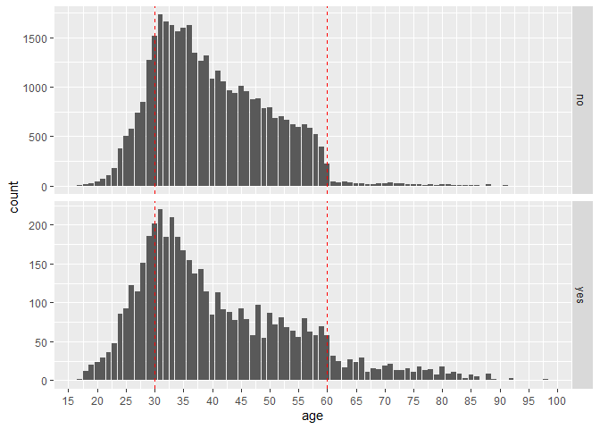
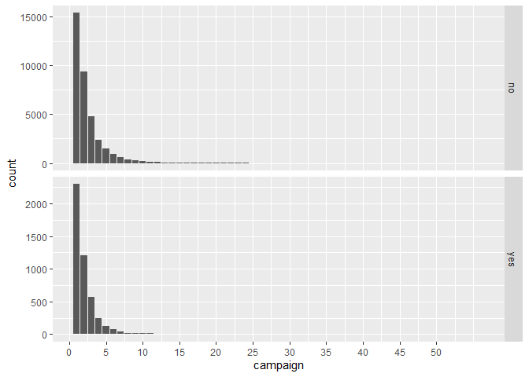
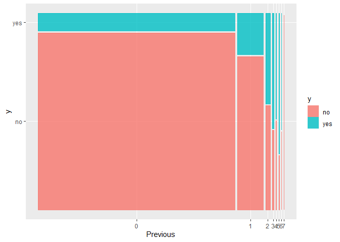
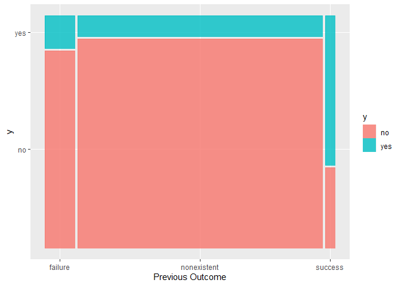
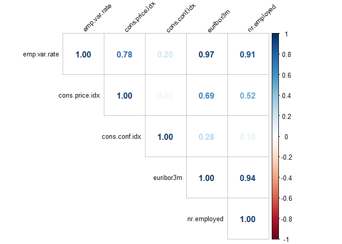

### Contexto del caso practico proyecto

El caso de negocio a usar en este caso practico es el dataset “Bank
Marketing” UCI dataset. Los datos estan relacionados con las campa?as de
marketing directo de una institucion bancaria portuguesa. Las campa?as
de marketing se basaron en llamadas telefonicas. A menudo, se necesito
mas de un contacto para el mismo cliente, para poder vender el deposito
a plazo bancario..

El objetivo realizar un primer analisis exploratorio del dataset y
perfilar a los los clientes que contrataran un deposito a plazo
(variable y).

El dataset que vamos a utilizar está disponible en el campus con el
nombre de bank-additional-full.csv. Este dataset fue descargado de
<http://archive.ics.uci.edu/ml/datasets/Bank+Marketing>) donde ha sido
publicado por el Banco de Portugal
<https://www.bportugal.pt/estatisticasweb>.”

### Solucion

### 1. Exploracion del dataset

En primer lugar cargamos las librerias necesarias:

``` r
library(ggplot2)
library(tidyverse)
```

    ## ── Attaching packages ─────────────────────────────────────── tidyverse 1.3.2 ──
    ## ✔ tibble  3.1.8      ✔ dplyr   1.0.10
    ## ✔ tidyr   1.2.1      ✔ stringr 1.5.0 
    ## ✔ readr   2.1.3      ✔ forcats 0.5.2 
    ## ✔ purrr   1.0.1      
    ## ── Conflicts ────────────────────────────────────────── tidyverse_conflicts() ──
    ## ✖ dplyr::filter() masks stats::filter()
    ## ✖ dplyr::lag()    masks stats::lag()

``` r
library(gmodels)
library(ggmosaic)
library(corrplot)
```

    ## corrplot 0.92 loaded

Leemos el dataset:

``` r
## Loading the dataset
bank <- read.csv("./datos/bank-additional-full.csv", sep=";")
```

Las variables que tenemos en el dataset son las siguientes:

**Variables related to bank client data:**

1.  Age: Client’s age.
2.  Job: Client’s type of job.
3.  Marital: Client’s marital status, divorced means divorced or
    widowed.
4.  Education: Client’s education.
5.  Default: Client has previosly defaulted.
6.  Housing: Client has a housing loan.
7.  Loan: Client has a personal loan.

**Variables related to last contact of the current marketing campaign:**

1.  Contact: Contact communication type (telephone or cellular).
2.  Month: Last contact month of year.
3.  day_of_week: Last contact day of week.
4.  duration: Last contact duration in seconds. If duration is 0s, then
    we never contacted a client to sign up for a term deposit account.
5.  Pdays: number of days that passed by after the client was last
    contacted from a previous campaign (numeric; 999 means client was
    not previously contacted)
6.  Previous: number of contacts performed before this campaign and for
    this client (numeric)
7.  Poutcome: outcome of the previous marketing campaign (categorical:
    ‘failure’,‘nonexistent’,‘success’)

**Social and economic context attributes:**

1.  Emp.var.rate: employment variation rate - quarterly indicator
    (numeric)
2.  Cons.price.idx: consumer price index - monthly indicator (numeric)
3.  Cons.conf.idx: consumer confidence index - monthly indicator
    (numeric)
4.  Euribor3m: euribor 3 month rate - daily indicator (numeric)
5.  Nr.employed: number of employees - quarterly indicator (numeric)

**Output variable (desired target):**

20: y - has the client subscribed a term deposit? (binary: ‘yes’, ‘no’)

#### Realizamos una exploracion inicial:

Revisamos los primeros casos para hacernos una idea de los datos:

``` r
ncol(bank)
```

    ## [1] 21

``` r
nrow(bank)
```

    ## [1] 41188

``` r
head(bank,10)
```

    ##    age         job marital           education default housing loan   contact
    ## 1   56   housemaid married            basic.4y      no      no   no telephone
    ## 2   57    services married         high.school unknown      no   no telephone
    ## 3   37    services married         high.school      no     yes   no telephone
    ## 4   40      admin. married            basic.6y      no      no   no telephone
    ## 5   56    services married         high.school      no      no  yes telephone
    ## 6   45    services married            basic.9y unknown      no   no telephone
    ## 7   59      admin. married professional.course      no      no   no telephone
    ## 8   41 blue-collar married             unknown unknown      no   no telephone
    ## 9   24  technician  single professional.course      no     yes   no telephone
    ## 10  25    services  single         high.school      no     yes   no telephone
    ##    month day_of_week duration campaign pdays previous    poutcome emp.var.rate
    ## 1    may         mon      261        1   999        0 nonexistent          1.1
    ## 2    may         mon      149        1   999        0 nonexistent          1.1
    ## 3    may         mon      226        1   999        0 nonexistent          1.1
    ## 4    may         mon      151        1   999        0 nonexistent          1.1
    ## 5    may         mon      307        1   999        0 nonexistent          1.1
    ## 6    may         mon      198        1   999        0 nonexistent          1.1
    ## 7    may         mon      139        1   999        0 nonexistent          1.1
    ## 8    may         mon      217        1   999        0 nonexistent          1.1
    ## 9    may         mon      380        1   999        0 nonexistent          1.1
    ## 10   may         mon       50        1   999        0 nonexistent          1.1
    ##    cons.price.idx cons.conf.idx euribor3m nr.employed  y
    ## 1          93.994         -36.4     4.857        5191 no
    ## 2          93.994         -36.4     4.857        5191 no
    ## 3          93.994         -36.4     4.857        5191 no
    ## 4          93.994         -36.4     4.857        5191 no
    ## 5          93.994         -36.4     4.857        5191 no
    ## 6          93.994         -36.4     4.857        5191 no
    ## 7          93.994         -36.4     4.857        5191 no
    ## 8          93.994         -36.4     4.857        5191 no
    ## 9          93.994         -36.4     4.857        5191 no
    ## 10         93.994         -36.4     4.857        5191 no

Revisamos los tipos de las variables y hacemos un estudio univariable de
los datos con los estadisticos de sumarizacion:

``` r
str(bank)
```

    ## 'data.frame':    41188 obs. of  21 variables:
    ##  $ age           : int  56 57 37 40 56 45 59 41 24 25 ...
    ##  $ job           : chr  "housemaid" "services" "services" "admin." ...
    ##  $ marital       : chr  "married" "married" "married" "married" ...
    ##  $ education     : chr  "basic.4y" "high.school" "high.school" "basic.6y" ...
    ##  $ default       : chr  "no" "unknown" "no" "no" ...
    ##  $ housing       : chr  "no" "no" "yes" "no" ...
    ##  $ loan          : chr  "no" "no" "no" "no" ...
    ##  $ contact       : chr  "telephone" "telephone" "telephone" "telephone" ...
    ##  $ month         : chr  "may" "may" "may" "may" ...
    ##  $ day_of_week   : chr  "mon" "mon" "mon" "mon" ...
    ##  $ duration      : int  261 149 226 151 307 198 139 217 380 50 ...
    ##  $ campaign      : int  1 1 1 1 1 1 1 1 1 1 ...
    ##  $ pdays         : int  999 999 999 999 999 999 999 999 999 999 ...
    ##  $ previous      : int  0 0 0 0 0 0 0 0 0 0 ...
    ##  $ poutcome      : chr  "nonexistent" "nonexistent" "nonexistent" "nonexistent" ...
    ##  $ emp.var.rate  : num  1.1 1.1 1.1 1.1 1.1 1.1 1.1 1.1 1.1 1.1 ...
    ##  $ cons.price.idx: num  94 94 94 94 94 ...
    ##  $ cons.conf.idx : num  -36.4 -36.4 -36.4 -36.4 -36.4 -36.4 -36.4 -36.4 -36.4 -36.4 ...
    ##  $ euribor3m     : num  4.86 4.86 4.86 4.86 4.86 ...
    ##  $ nr.employed   : num  5191 5191 5191 5191 5191 ...
    ##  $ y             : chr  "no" "no" "no" "no" ...

``` r
summary(bank)
```

    ##       age            job              marital           education        
    ##  Min.   :17.00   Length:41188       Length:41188       Length:41188      
    ##  1st Qu.:32.00   Class :character   Class :character   Class :character  
    ##  Median :38.00   Mode  :character   Mode  :character   Mode  :character  
    ##  Mean   :40.02                                                           
    ##  3rd Qu.:47.00                                                           
    ##  Max.   :98.00                                                           
    ##    default            housing              loan             contact         
    ##  Length:41188       Length:41188       Length:41188       Length:41188      
    ##  Class :character   Class :character   Class :character   Class :character  
    ##  Mode  :character   Mode  :character   Mode  :character   Mode  :character  
    ##                                                                             
    ##                                                                             
    ##                                                                             
    ##     month           day_of_week           duration         campaign     
    ##  Length:41188       Length:41188       Min.   :   0.0   Min.   : 1.000  
    ##  Class :character   Class :character   1st Qu.: 102.0   1st Qu.: 1.000  
    ##  Mode  :character   Mode  :character   Median : 180.0   Median : 2.000  
    ##                                        Mean   : 258.3   Mean   : 2.568  
    ##                                        3rd Qu.: 319.0   3rd Qu.: 3.000  
    ##                                        Max.   :4918.0   Max.   :56.000  
    ##      pdays          previous       poutcome          emp.var.rate     
    ##  Min.   :  0.0   Min.   :0.000   Length:41188       Min.   :-3.40000  
    ##  1st Qu.:999.0   1st Qu.:0.000   Class :character   1st Qu.:-1.80000  
    ##  Median :999.0   Median :0.000   Mode  :character   Median : 1.10000  
    ##  Mean   :962.5   Mean   :0.173                      Mean   : 0.08189  
    ##  3rd Qu.:999.0   3rd Qu.:0.000                      3rd Qu.: 1.40000  
    ##  Max.   :999.0   Max.   :7.000                      Max.   : 1.40000  
    ##  cons.price.idx  cons.conf.idx     euribor3m      nr.employed  
    ##  Min.   :92.20   Min.   :-50.8   Min.   :0.634   Min.   :4964  
    ##  1st Qu.:93.08   1st Qu.:-42.7   1st Qu.:1.344   1st Qu.:5099  
    ##  Median :93.75   Median :-41.8   Median :4.857   Median :5191  
    ##  Mean   :93.58   Mean   :-40.5   Mean   :3.621   Mean   :5167  
    ##  3rd Qu.:93.99   3rd Qu.:-36.4   3rd Qu.:4.961   3rd Qu.:5228  
    ##  Max.   :94.77   Max.   :-26.9   Max.   :5.045   Max.   :5228  
    ##       y            
    ##  Length:41188      
    ##  Class :character  
    ##  Mode  :character  
    ##                    
    ##                    
    ## 

Comprobamos la estructura de la vairable objeto del estudio.

``` r
summary(bank$y)
```

    ##    Length     Class      Mode 
    ##     41188 character character

``` r
CrossTable(bank$y)
```

    ## 
    ##  
    ##    Cell Contents
    ## |-------------------------|
    ## |                       N |
    ## |         N / Table Total |
    ## |-------------------------|
    ## 
    ##  
    ## Total Observations in Table:  41188 
    ## 
    ##  
    ##           |        no |       yes | 
    ##           |-----------|-----------|
    ##           |     36548 |      4640 | 
    ##           |     0.887 |     0.113 | 
    ##           |-----------|-----------|
    ## 
    ## 
    ## 
    ## 

Creamos una variables dependiente binaria:

``` r
bank <- bank %>%
  mutate(y_binary = ifelse(y == "no",0,1))
```

Revisamos la distribucion de la variable dependiente

``` r
hist(bank$y_binary)
```


``` r
summary(bank$y_binary)
```

    ##    Min. 1st Qu.  Median    Mean 3rd Qu.    Max. 
    ##  0.0000  0.0000  0.0000  0.1127  0.0000  1.0000

Nos hacemos una idea inicial de los missing de las variables:

``` r
colSums(is.na(bank))
```

    ##            age            job        marital      education        default 
    ##              0              0              0              0              0 
    ##        housing           loan        contact          month    day_of_week 
    ##              0              0              0              0              0 
    ##       duration       campaign          pdays       previous       poutcome 
    ##              0              0              0              0              0 
    ##   emp.var.rate cons.price.idx  cons.conf.idx      euribor3m    nr.employed 
    ##              0              0              0              0              0 
    ##              y       y_binary 
    ##              0              0

``` r
colSums(bank == "")
```

    ##            age            job        marital      education        default 
    ##              0              0              0              0              0 
    ##        housing           loan        contact          month    day_of_week 
    ##              0              0              0              0              0 
    ##       duration       campaign          pdays       previous       poutcome 
    ##              0              0              0              0              0 
    ##   emp.var.rate cons.price.idx  cons.conf.idx      euribor3m    nr.employed 
    ##              0              0              0              0              0 
    ##              y       y_binary 
    ##              0              0

``` r
colSums(bank == "unknown")
```

    ##            age            job        marital      education        default 
    ##              0            330             80           1731           8597 
    ##        housing           loan        contact          month    day_of_week 
    ##            990            990              0              0              0 
    ##       duration       campaign          pdays       previous       poutcome 
    ##              0              0              0              0              0 
    ##   emp.var.rate cons.price.idx  cons.conf.idx      euribor3m    nr.employed 
    ##              0              0              0              0              0 
    ##              y       y_binary 
    ##              0              0

``` r
sum(bank == "unknown")
```

    ## [1] 12718

Vemos que los valores misingg estan codificados como “desconocidos”.

?Que variables tienen missing?.

``` r
bank %>% 
  summarise_all(list(~sum(. == "unknown"))) %>% 
  gather(key = "variable", value = "nr_unknown") %>% 
  arrange(-nr_unknown)
```

    ##          variable nr_unknown
    ## 1         default       8597
    ## 2       education       1731
    ## 3         housing        990
    ## 4            loan        990
    ## 5             job        330
    ## 6         marital         80
    ## 7             age          0
    ## 8         contact          0
    ## 9           month          0
    ## 10    day_of_week          0
    ## 11       duration          0
    ## 12       campaign          0
    ## 13          pdays          0
    ## 14       previous          0
    ## 15       poutcome          0
    ## 16   emp.var.rate          0
    ## 17 cons.price.idx          0
    ## 18  cons.conf.idx          0
    ## 19      euribor3m          0
    ## 20    nr.employed          0
    ## 21              y          0
    ## 22       y_binary          0

6 variables tienen al menos 1 valor desconocido.

Antes de decidir como imputar esos valores faltantes. Estudiaremos cada
variable y tomaremos una decision despues de las visualizaciones.

### 2. ANaLISIS UNIVARIABLE

#### Age

?Que tipo de personas fueron contactadas durante esta campa?a de
marketing?

``` r
summary(bank$age)
```

    ##    Min. 1st Qu.  Median    Mean 3rd Qu.    Max. 
    ##   17.00   32.00   38.00   40.02   47.00   98.00

``` r
bank %>% 
  ggplot() +
  aes(x = age) +
  geom_bar() +
  geom_vline(xintercept = c(30, 60), 
             col = "red",
             linetype = "dashed") +
  facet_grid(y ~ .,
             scales = "free_y") +
  scale_x_continuous(breaks = seq(0, 100, 5))
```



En primer lugar, en el grafico anterior apreciamos que los bancos no
estan muy interesados en contactar a la poblacion de mas edad.

Aunque, despues del umbral de 60 a?os, la frecuencia relativa es mayor
cuando y = 1. En otras palabras, podemos decir que las personas mayores
tienen mas probabilidades de suscribirse a un deposito a plazo.

Tambien podemos dividir la funcion de edad a los 30 a?os para hacer tres
clases facilmente interpretables: \[0, 30 \[, \[30, 60 \[y \[60, + Inf
\[.

Los valores minimo y maximo son 17 y 98, pero podemos esperar nuevas
observaciones fuera de este rango.

Estamos reemplazando la variable continua “edad” por una nueva variable
categorica. Podriamos perder algo de informacion de esta transformacion
continua a discreta pero no existe un patron en esta variable continua.

Recofificar esta variable facilitara la interpretacion mas adelante.

``` r
bank = bank %>% 
  mutate(age_discrete = if_else(age > 60, "high", if_else(age > 30, "mid", "low")))
```

Realizamos una tabla de contigencia con la variable dependiente:

``` r
CrossTable(bank$age_discrete, bank$y)
```

    ## 
    ##  
    ##    Cell Contents
    ## |-------------------------|
    ## |                       N |
    ## | Chi-square contribution |
    ## |           N / Row Total |
    ## |           N / Col Total |
    ## |         N / Table Total |
    ## |-------------------------|
    ## 
    ##  
    ## Total Observations in Table:  41188 
    ## 
    ##  
    ##                   | bank$y 
    ## bank$age_discrete |        no |       yes | Row Total | 
    ## ------------------|-----------|-----------|-----------|
    ##              high |       496 |       414 |       910 | 
    ##                   |   120.154 |   946.422 |           | 
    ##                   |     0.545 |     0.455 |     0.022 | 
    ##                   |     0.014 |     0.089 |           | 
    ##                   |     0.012 |     0.010 |           | 
    ## ------------------|-----------|-----------|-----------|
    ##               low |      6259 |      1124 |      7383 | 
    ##                   |    13.039 |   102.707 |           | 
    ##                   |     0.848 |     0.152 |     0.179 | 
    ##                   |     0.171 |     0.242 |           | 
    ##                   |     0.152 |     0.027 |           | 
    ## ------------------|-----------|-----------|-----------|
    ##               mid |     29793 |      3102 |     32895 | 
    ##                   |    12.488 |    98.367 |           | 
    ##                   |     0.906 |     0.094 |     0.799 | 
    ##                   |     0.815 |     0.669 |           | 
    ##                   |     0.723 |     0.075 |           | 
    ## ------------------|-----------|-----------|-----------|
    ##      Column Total |     36548 |      4640 |     41188 | 
    ##                   |     0.887 |     0.113 |           | 
    ## ------------------|-----------|-----------|-----------|
    ## 
    ## 

El 45,5% de las personas mayores de 60 a?os contrato un deposito a plazo
frete al 12,2% de adultos jovenes (menores de 30 a?os) y solo el 9.4%
entre los clientes entre 30 y 60 a?os.

#### Jobs

?Cuales son los tipos de trabajos representados en nuestros datos?

``` r
table(bank$job)
```

    ## 
    ##        admin.   blue-collar  entrepreneur     housemaid    management 
    ##         10422          9254          1456          1060          2924 
    ##       retired self-employed      services       student    technician 
    ##          1720          1421          3969           875          6743 
    ##    unemployed       unknown 
    ##          1014           330

Tenemos 330 missing:

Tabla de contigencia con nuestra variable respuesta:

``` r
CrossTable(bank$job, bank$y)
```

    ## 
    ##  
    ##    Cell Contents
    ## |-------------------------|
    ## |                       N |
    ## | Chi-square contribution |
    ## |           N / Row Total |
    ## |           N / Col Total |
    ## |         N / Table Total |
    ## |-------------------------|
    ## 
    ##  
    ## Total Observations in Table:  41188 
    ## 
    ##  
    ##               | bank$y 
    ##      bank$job |        no |       yes | Row Total | 
    ## --------------|-----------|-----------|-----------|
    ##        admin. |      9070 |      1352 |     10422 | 
    ##               |     3.423 |    26.961 |           | 
    ##               |     0.870 |     0.130 |     0.253 | 
    ##               |     0.248 |     0.291 |           | 
    ##               |     0.220 |     0.033 |           | 
    ## --------------|-----------|-----------|-----------|
    ##   blue-collar |      8616 |       638 |      9254 | 
    ##               |    19.926 |   156.951 |           | 
    ##               |     0.931 |     0.069 |     0.225 | 
    ##               |     0.236 |     0.138 |           | 
    ##               |     0.209 |     0.015 |           | 
    ## --------------|-----------|-----------|-----------|
    ##  entrepreneur |      1332 |       124 |      1456 | 
    ##               |     1.240 |     9.767 |           | 
    ##               |     0.915 |     0.085 |     0.035 | 
    ##               |     0.036 |     0.027 |           | 
    ##               |     0.032 |     0.003 |           | 
    ## --------------|-----------|-----------|-----------|
    ##     housemaid |       954 |       106 |      1060 | 
    ##               |     0.191 |     1.507 |           | 
    ##               |     0.900 |     0.100 |     0.026 | 
    ##               |     0.026 |     0.023 |           | 
    ##               |     0.023 |     0.003 |           | 
    ## --------------|-----------|-----------|-----------|
    ##    management |      2596 |       328 |      2924 | 
    ##               |     0.001 |     0.006 |           | 
    ##               |     0.888 |     0.112 |     0.071 | 
    ##               |     0.071 |     0.071 |           | 
    ##               |     0.063 |     0.008 |           | 
    ## --------------|-----------|-----------|-----------|
    ##       retired |      1286 |       434 |      1720 | 
    ##               |    37.814 |   297.849 |           | 
    ##               |     0.748 |     0.252 |     0.042 | 
    ##               |     0.035 |     0.094 |           | 
    ##               |     0.031 |     0.011 |           | 
    ## --------------|-----------|-----------|-----------|
    ## self-employed |      1272 |       149 |      1421 | 
    ##               |     0.097 |     0.767 |           | 
    ##               |     0.895 |     0.105 |     0.035 | 
    ##               |     0.035 |     0.032 |           | 
    ##               |     0.031 |     0.004 |           | 
    ## --------------|-----------|-----------|-----------|
    ##      services |      3646 |       323 |      3969 | 
    ##               |     4.375 |    34.458 |           | 
    ##               |     0.919 |     0.081 |     0.096 | 
    ##               |     0.100 |     0.070 |           | 
    ##               |     0.089 |     0.008 |           | 
    ## --------------|-----------|-----------|-----------|
    ##       student |       600 |       275 |       875 | 
    ##               |    40.090 |   315.775 |           | 
    ##               |     0.686 |     0.314 |     0.021 | 
    ##               |     0.016 |     0.059 |           | 
    ##               |     0.015 |     0.007 |           | 
    ## --------------|-----------|-----------|-----------|
    ##    technician |      6013 |       730 |      6743 | 
    ##               |     0.147 |     1.156 |           | 
    ##               |     0.892 |     0.108 |     0.164 | 
    ##               |     0.165 |     0.157 |           | 
    ##               |     0.146 |     0.018 |           | 
    ## --------------|-----------|-----------|-----------|
    ##    unemployed |       870 |       144 |      1014 | 
    ##               |     0.985 |     7.758 |           | 
    ##               |     0.858 |     0.142 |     0.025 | 
    ##               |     0.024 |     0.031 |           | 
    ##               |     0.021 |     0.003 |           | 
    ## --------------|-----------|-----------|-----------|
    ##       unknown |       293 |        37 |       330 | 
    ##               |     0.000 |     0.001 |           | 
    ##               |     0.888 |     0.112 |     0.008 | 
    ##               |     0.008 |     0.008 |           | 
    ##               |     0.007 |     0.001 |           | 
    ## --------------|-----------|-----------|-----------|
    ##  Column Total |     36548 |      4640 |     41188 | 
    ##               |     0.887 |     0.113 |           | 
    ## --------------|-----------|-----------|-----------|
    ## 
    ## 

``` r
bank %>% 
  ggplot() +
  geom_bar(aes(x =job, fill = y)) +
  xlab("Job") +
  ylab(NULL)
```


Mayor respuesta entre estudiantes (31.4%) y jubilados (25.2%).

Otras clases oscilan entre 6.9% (obreros) y 14.2 (desempleados).

Tambien vemos que podemos ignorar “desconocido”. No se ve un gran efecto
aqui.

#### Maritial status

?Como esta afectando el estado civil el comportamiento del cliente?

``` r
table(bank$marital)
```

    ## 
    ## divorced  married   single  unknown 
    ##     4612    24928    11568       80

Tenemos 80 missing.

Realizamos una tabla de contigencia con la variable dependiente:

``` r
CrossTable(bank$marital, bank$y)
```

    ## 
    ##  
    ##    Cell Contents
    ## |-------------------------|
    ## |                       N |
    ## | Chi-square contribution |
    ## |           N / Row Total |
    ## |           N / Col Total |
    ## |         N / Table Total |
    ## |-------------------------|
    ## 
    ##  
    ## Total Observations in Table:  41188 
    ## 
    ##  
    ##              | bank$y 
    ## bank$marital |        no |       yes | Row Total | 
    ## -------------|-----------|-----------|-----------|
    ##     divorced |      4136 |       476 |      4612 | 
    ##              |     0.464 |     3.652 |           | 
    ##              |     0.897 |     0.103 |     0.112 | 
    ##              |     0.113 |     0.103 |           | 
    ##              |     0.100 |     0.012 |           | 
    ## -------------|-----------|-----------|-----------|
    ##      married |     22396 |      2532 |     24928 | 
    ##              |     3.450 |    27.174 |           | 
    ##              |     0.898 |     0.102 |     0.605 | 
    ##              |     0.613 |     0.546 |           | 
    ##              |     0.544 |     0.061 |           | 
    ## -------------|-----------|-----------|-----------|
    ##       single |      9948 |      1620 |     11568 | 
    ##              |     9.778 |    77.021 |           | 
    ##              |     0.860 |     0.140 |     0.281 | 
    ##              |     0.272 |     0.349 |           | 
    ##              |     0.242 |     0.039 |           | 
    ## -------------|-----------|-----------|-----------|
    ##      unknown |        68 |        12 |        80 | 
    ##              |     0.126 |     0.990 |           | 
    ##              |     0.850 |     0.150 |     0.002 | 
    ##              |     0.002 |     0.003 |           | 
    ##              |     0.002 |     0.000 |           | 
    ## -------------|-----------|-----------|-----------|
    ## Column Total |     36548 |      4640 |     41188 | 
    ##              |     0.887 |     0.113 |           | 
    ## -------------|-----------|-----------|-----------|
    ## 
    ## 

``` r
bank %>% 
  ggplot() +
    geom_bar(aes(x =marital, fill = y)) +
  xlab("Marital status") +
  ylab(NULL)
```


No hay gran efecto del matrimonio. A los solteros (14.0%) les gusta un
poco mas decir “si” que a los clientes divorciados (10.3%) o casados
(10.2%).

``` r
marriage_table <- table(bank$marital, bank$y)
marriage_tab <- as.data.frame(prop.table(marriage_table, 2))
colnames(marriage_tab) <-  c("marital", "y", "perc")

ggplot(data = marriage_tab, aes(x = marital, y = perc, fill = y)) + 
  geom_bar(stat = 'identity', position = 'dodge', alpha = 2/3) + 
  xlab("Marital")+
  ylab("Percent")
```


#### Education

?Como afecta el nivel de estudios de los clientes a su eleccion?

``` r
table(bank$education)
```

    ## 
    ##            basic.4y            basic.6y            basic.9y         high.school 
    ##                4176                2292                6045                9515 
    ##          illiterate professional.course   university.degree             unknown 
    ##                  18                5243               12168                1731

Tenemos 1731 missing en esta variable.

Tabla de contigencia con nuestra variable respuesta:

``` r
CrossTable(bank$education, bank$y)
```

    ## 
    ##  
    ##    Cell Contents
    ## |-------------------------|
    ## |                       N |
    ## | Chi-square contribution |
    ## |           N / Row Total |
    ## |           N / Col Total |
    ## |         N / Table Total |
    ## |-------------------------|
    ## 
    ##  
    ## Total Observations in Table:  41188 
    ## 
    ##  
    ##                     | bank$y 
    ##      bank$education |        no |       yes | Row Total | 
    ## --------------------|-----------|-----------|-----------|
    ##            basic.4y |      3748 |       428 |      4176 | 
    ##                     |     0.486 |     3.829 |           | 
    ##                     |     0.898 |     0.102 |     0.101 | 
    ##                     |     0.103 |     0.092 |           | 
    ##                     |     0.091 |     0.010 |           | 
    ## --------------------|-----------|-----------|-----------|
    ##            basic.6y |      2104 |       188 |      2292 | 
    ##                     |     2.423 |    19.088 |           | 
    ##                     |     0.918 |     0.082 |     0.056 | 
    ##                     |     0.058 |     0.041 |           | 
    ##                     |     0.051 |     0.005 |           | 
    ## --------------------|-----------|-----------|-----------|
    ##            basic.9y |      5572 |       473 |      6045 | 
    ##                     |     8.065 |    63.527 |           | 
    ##                     |     0.922 |     0.078 |     0.147 | 
    ##                     |     0.152 |     0.102 |           | 
    ##                     |     0.135 |     0.011 |           | 
    ## --------------------|-----------|-----------|-----------|
    ##         high.school |      8484 |      1031 |      9515 | 
    ##                     |     0.198 |     1.561 |           | 
    ##                     |     0.892 |     0.108 |     0.231 | 
    ##                     |     0.232 |     0.222 |           | 
    ##                     |     0.206 |     0.025 |           | 
    ## --------------------|-----------|-----------|-----------|
    ##          illiterate |        14 |         4 |        18 | 
    ##                     |     0.244 |     1.918 |           | 
    ##                     |     0.778 |     0.222 |     0.000 | 
    ##                     |     0.000 |     0.001 |           | 
    ##                     |     0.000 |     0.000 |           | 
    ## --------------------|-----------|-----------|-----------|
    ## professional.course |      4648 |       595 |      5243 | 
    ##                     |     0.004 |     0.032 |           | 
    ##                     |     0.887 |     0.113 |     0.127 | 
    ##                     |     0.127 |     0.128 |           | 
    ##                     |     0.113 |     0.014 |           | 
    ## --------------------|-----------|-----------|-----------|
    ##   university.degree |     10498 |      1670 |     12168 | 
    ##                     |     8.292 |    65.317 |           | 
    ##                     |     0.863 |     0.137 |     0.295 | 
    ##                     |     0.287 |     0.360 |           | 
    ##                     |     0.255 |     0.041 |           | 
    ## --------------------|-----------|-----------|-----------|
    ##             unknown |      1480 |       251 |      1731 | 
    ##                     |     2.041 |    16.079 |           | 
    ##                     |     0.855 |     0.145 |     0.042 | 
    ##                     |     0.040 |     0.054 |           | 
    ##                     |     0.036 |     0.006 |           | 
    ## --------------------|-----------|-----------|-----------|
    ##        Column Total |     36548 |      4640 |     41188 | 
    ##                     |     0.887 |     0.113 |           | 
    ## --------------------|-----------|-----------|-----------|
    ## 
    ## 

``` r
bank %>% 
  ggplot() +
  geom_bar(aes(x =education, fill = y)) +
  xlab("Education Level") +
  ylab(NULL)
```


Parece que existe una correlacion positiva entre la educacion y la
contratacion de un deposito a plazo.

Como nos enfrentamos a una situacion de variable dependiente muy
desequilibrada, no podemos permitirnos descartar los missing. Esta
categoria tiene la frecuencia relativa mas alta de “y = 1” (14.7%)

Podria tener sentido recodificar los missing como “titulares de titulos
universitarios”, ya que son los mas similares (13,7%) en contratacion.

#### Default

?Cuantas de nuestras clientes estan en default?

``` r
table(bank$default)
```

    ## 
    ##      no unknown     yes 
    ##   32588    8597       3

Tenemos 8597 missing en esta variable.

Tabla de contigencia con nuestra variable respuesta:

``` r
CrossTable(bank$default, bank$y)
```

    ## 
    ##  
    ##    Cell Contents
    ## |-------------------------|
    ## |                       N |
    ## | Chi-square contribution |
    ## |           N / Row Total |
    ## |           N / Col Total |
    ## |         N / Table Total |
    ## |-------------------------|
    ## 
    ##  
    ## Total Observations in Table:  41188 
    ## 
    ##  
    ##              | bank$y 
    ## bank$default |        no |       yes | Row Total | 
    ## -------------|-----------|-----------|-----------|
    ##           no |     28391 |      4197 |     32588 | 
    ##              |     9.562 |    75.315 |           | 
    ##              |     0.871 |     0.129 |     0.791 | 
    ##              |     0.777 |     0.905 |           | 
    ##              |     0.689 |     0.102 |           | 
    ## -------------|-----------|-----------|-----------|
    ##      unknown |      8154 |       443 |      8597 | 
    ##              |    36.198 |   285.122 |           | 
    ##              |     0.948 |     0.052 |     0.209 | 
    ##              |     0.223 |     0.095 |           | 
    ##              |     0.198 |     0.011 |           | 
    ## -------------|-----------|-----------|-----------|
    ##          yes |         3 |         0 |         3 | 
    ##              |     0.043 |     0.338 |           | 
    ##              |     1.000 |     0.000 |     0.000 | 
    ##              |     0.000 |     0.000 |           | 
    ##              |     0.000 |     0.000 |           | 
    ## -------------|-----------|-----------|-----------|
    ## Column Total |     36548 |      4640 |     41188 | 
    ##              |     0.887 |     0.113 |           | 
    ## -------------|-----------|-----------|-----------|
    ## 
    ## 

Esta pregunta, aunque util, nos brinda una caracteristica que no es
utilizable. Solo 3 personas respondieron “si” a la pregunta “?Tiene
credito en incumplimiento?”. La gente respondio “no” (79.3%) o ni
siquiera respondio (20.7%), lo que nos da cero informacion.

#### Housing

?Las clientes tienen hipotecada la vivienda?

``` r
table(bank$housing)
```

    ## 
    ##      no unknown     yes 
    ##   18622     990   21576

Tenemos 990 missing en esta variable.

Tabla de contigencia con nuestra variable respuesta:

``` r
CrossTable(bank$housing, bank$y)
```

    ## 
    ##  
    ##    Cell Contents
    ## |-------------------------|
    ## |                       N |
    ## | Chi-square contribution |
    ## |           N / Row Total |
    ## |           N / Col Total |
    ## |         N / Table Total |
    ## |-------------------------|
    ## 
    ##  
    ## Total Observations in Table:  41188 
    ## 
    ##  
    ##              | bank$y 
    ## bank$housing |        no |       yes | Row Total | 
    ## -------------|-----------|-----------|-----------|
    ##           no |     16596 |      2026 |     18622 | 
    ##              |     0.312 |     2.461 |           | 
    ##              |     0.891 |     0.109 |     0.452 | 
    ##              |     0.454 |     0.437 |           | 
    ##              |     0.403 |     0.049 |           | 
    ## -------------|-----------|-----------|-----------|
    ##      unknown |       883 |       107 |       990 | 
    ##              |     0.023 |     0.184 |           | 
    ##              |     0.892 |     0.108 |     0.024 | 
    ##              |     0.024 |     0.023 |           | 
    ##              |     0.021 |     0.003 |           | 
    ## -------------|-----------|-----------|-----------|
    ##          yes |     19069 |      2507 |     21576 | 
    ##              |     0.305 |     2.400 |           | 
    ##              |     0.884 |     0.116 |     0.524 | 
    ##              |     0.522 |     0.540 |           | 
    ##              |     0.463 |     0.061 |           | 
    ## -------------|-----------|-----------|-----------|
    ## Column Total |     36548 |      4640 |     41188 | 
    ##              |     0.887 |     0.113 |           | 
    ## -------------|-----------|-----------|-----------|
    ## 
    ## 

``` r
bank %>% 
  ggplot() +
  geom_bar(aes(x =housing, fill = y)) +
  xlab("Housing") +
  ylab(NULL)
```


No hay mucha variacion observable entre aquellos que tienen prestamos
para vivienda (11.6%) y aquellos que no (10.6%). Desconocido en 10.8%.

``` r
chisq.test(bank$housing, bank$y)
```

    ## 
    ##  Pearson's Chi-squared test
    ## 
    ## data:  bank$housing and bank$y
    ## X-squared = 5.6845, df = 2, p-value = 0.05829

El valor P sugiere que puede estar bien ignorar esta variable en el
analisis final por presentar diferencias significativas.

#### Loan

?Los clientes ya tienen un prestamo personal? ?Como afecta eso a la
contratacion?

``` r
table(bank$loan)
```

    ## 
    ##      no unknown     yes 
    ##   33950     990    6248

Tenemos 990 missing en esta variable.

Tabla de contigencia con nuestra variable respuesta:

``` r
CrossTable(bank$loan, bank$y)
```

    ## 
    ##  
    ##    Cell Contents
    ## |-------------------------|
    ## |                       N |
    ## | Chi-square contribution |
    ## |           N / Row Total |
    ## |           N / Col Total |
    ## |         N / Table Total |
    ## |-------------------------|
    ## 
    ##  
    ## Total Observations in Table:  41188 
    ## 
    ##  
    ##              | bank$y 
    ##    bank$loan |        no |       yes | Row Total | 
    ## -------------|-----------|-----------|-----------|
    ##           no |     30100 |      3850 |     33950 | 
    ##              |     0.021 |     0.169 |           | 
    ##              |     0.887 |     0.113 |     0.824 | 
    ##              |     0.824 |     0.830 |           | 
    ##              |     0.731 |     0.093 |           | 
    ## -------------|-----------|-----------|-----------|
    ##      unknown |       883 |       107 |       990 | 
    ##              |     0.023 |     0.184 |           | 
    ##              |     0.892 |     0.108 |     0.024 | 
    ##              |     0.024 |     0.023 |           | 
    ##              |     0.021 |     0.003 |           | 
    ## -------------|-----------|-----------|-----------|
    ##          yes |      5565 |       683 |      6248 | 
    ##              |     0.079 |     0.618 |           | 
    ##              |     0.891 |     0.109 |     0.152 | 
    ##              |     0.152 |     0.147 |           | 
    ##              |     0.135 |     0.017 |           | 
    ## -------------|-----------|-----------|-----------|
    ## Column Total |     36548 |      4640 |     41188 | 
    ##              |     0.887 |     0.113 |           | 
    ## -------------|-----------|-----------|-----------|
    ## 
    ## 

``` r
loan_table <- table(bank$loan, bank$y)
loan_tab <- as.data.frame(prop.table(loan_table, 2))
colnames(loan_tab) <-  c("loan", "y", "perc")

ggplot(data = loan_tab, aes(x = loan, y = perc, fill = y)) + 
  geom_bar(stat = 'identity', position = 'dodge', alpha = 2/3) + 
  xlab("loan")+
  ylab("Percent")
```


No hay mucha variacion entre 11.3% (para no) y 10.9% (para si).

Comprobando esto matematicamente con una prueba de Chi-cuadrado:

``` r
chisq.test(bank$loan, bank$y)
```

    ## 
    ##  Pearson's Chi-squared test
    ## 
    ## data:  bank$loan and bank$y
    ## X-squared = 1.094, df = 2, p-value = 0.5787

El valor P sugiere que esto no es significativo en absoluto.

#### Contact

?Como se contacto a los clientes y hace alguna diferencia?

``` r
table(bank$contact)
```

    ## 
    ##  cellular telephone 
    ##     26144     15044

``` r
CrossTable(bank$contact, bank$y)
```

    ## 
    ##  
    ##    Cell Contents
    ## |-------------------------|
    ## |                       N |
    ## | Chi-square contribution |
    ## |           N / Row Total |
    ## |           N / Col Total |
    ## |         N / Table Total |
    ## |-------------------------|
    ## 
    ##  
    ## Total Observations in Table:  41188 
    ## 
    ##  
    ##              | bank$y 
    ## bank$contact |        no |       yes | Row Total | 
    ## -------------|-----------|-----------|-----------|
    ##     cellular |     22291 |      3853 |     26144 | 
    ##              |    35.521 |   279.790 |           | 
    ##              |     0.853 |     0.147 |     0.635 | 
    ##              |     0.610 |     0.830 |           | 
    ##              |     0.541 |     0.094 |           | 
    ## -------------|-----------|-----------|-----------|
    ##    telephone |     14257 |       787 |     15044 | 
    ##              |    61.730 |   486.229 |           | 
    ##              |     0.948 |     0.052 |     0.365 | 
    ##              |     0.390 |     0.170 |           | 
    ##              |     0.346 |     0.019 |           | 
    ## -------------|-----------|-----------|-----------|
    ## Column Total |     36548 |      4640 |     41188 | 
    ##              |     0.887 |     0.113 |           | 
    ## -------------|-----------|-----------|-----------|
    ## 
    ## 

``` r
bank %>% 
  ggplot() +
  geom_bar(aes(x =contact, fill = y)) +
  xlab("Contact") +
  ylab(NULL)
```


Esta variable es realmente interesante; El 14.7% de los respondedores
celulares se suscribio a un deposito a plazo, mientras que solo el 5.2%
de los respondedores telefonicos lo hicieron.

#### Month

?El mes hace la diferencia?

``` r
CrossTable(bank$month, bank$y)
```

    ## 
    ##  
    ##    Cell Contents
    ## |-------------------------|
    ## |                       N |
    ## | Chi-square contribution |
    ## |           N / Row Total |
    ## |           N / Col Total |
    ## |         N / Table Total |
    ## |-------------------------|
    ## 
    ##  
    ## Total Observations in Table:  41188 
    ## 
    ##  
    ##              | bank$y 
    ##   bank$month |        no |       yes | Row Total | 
    ## -------------|-----------|-----------|-----------|
    ##          apr |      2093 |       539 |      2632 | 
    ##              |    25.178 |   198.321 |           | 
    ##              |     0.795 |     0.205 |     0.064 | 
    ##              |     0.057 |     0.116 |           | 
    ##              |     0.051 |     0.013 |           | 
    ## -------------|-----------|-----------|-----------|
    ##          aug |      5523 |       655 |      6178 | 
    ##              |     0.306 |     2.413 |           | 
    ##              |     0.894 |     0.106 |     0.150 | 
    ##              |     0.151 |     0.141 |           | 
    ##              |     0.134 |     0.016 |           | 
    ## -------------|-----------|-----------|-----------|
    ##          dec |        93 |        89 |       182 | 
    ##              |    29.052 |   228.836 |           | 
    ##              |     0.511 |     0.489 |     0.004 | 
    ##              |     0.003 |     0.019 |           | 
    ##              |     0.002 |     0.002 |           | 
    ## -------------|-----------|-----------|-----------|
    ##          jul |      6525 |       649 |      7174 | 
    ##              |     3.980 |    31.353 |           | 
    ##              |     0.910 |     0.090 |     0.174 | 
    ##              |     0.179 |     0.140 |           | 
    ##              |     0.158 |     0.016 |           | 
    ## -------------|-----------|-----------|-----------|
    ##          jun |      4759 |       559 |      5318 | 
    ##              |     0.341 |     2.683 |           | 
    ##              |     0.895 |     0.105 |     0.129 | 
    ##              |     0.130 |     0.120 |           | 
    ##              |     0.116 |     0.014 |           | 
    ## -------------|-----------|-----------|-----------|
    ##          mar |       270 |       276 |       546 | 
    ##              |    94.958 |   747.959 |           | 
    ##              |     0.495 |     0.505 |     0.013 | 
    ##              |     0.007 |     0.059 |           | 
    ##              |     0.007 |     0.007 |           | 
    ## -------------|-----------|-----------|-----------|
    ##          may |     12883 |       886 |     13769 | 
    ##              |    36.210 |   285.214 |           | 
    ##              |     0.936 |     0.064 |     0.334 | 
    ##              |     0.352 |     0.191 |           | 
    ##              |     0.313 |     0.022 |           | 
    ## -------------|-----------|-----------|-----------|
    ##          nov |      3685 |       416 |      4101 | 
    ##              |     0.581 |     4.579 |           | 
    ##              |     0.899 |     0.101 |     0.100 | 
    ##              |     0.101 |     0.090 |           | 
    ##              |     0.089 |     0.010 |           | 
    ## -------------|-----------|-----------|-----------|
    ##          oct |       403 |       315 |       718 | 
    ##              |    86.028 |   677.617 |           | 
    ##              |     0.561 |     0.439 |     0.017 | 
    ##              |     0.011 |     0.068 |           | 
    ##              |     0.010 |     0.008 |           | 
    ## -------------|-----------|-----------|-----------|
    ##          sep |       314 |       256 |       570 | 
    ##              |    72.723 |   572.818 |           | 
    ##              |     0.551 |     0.449 |     0.014 | 
    ##              |     0.009 |     0.055 |           | 
    ##              |     0.008 |     0.006 |           | 
    ## -------------|-----------|-----------|-----------|
    ## Column Total |     36548 |      4640 |     41188 | 
    ##              |     0.887 |     0.113 |           | 
    ## -------------|-----------|-----------|-----------|
    ## 
    ## 

``` r
bank %>% 
  ggplot() +
  aes(x = month, y = ..count../nrow(bank), fill = y) +
  geom_bar() +
  ylab("relative frequency")
```

    ## Warning: The dot-dot notation (`..count..`) was deprecated in ggplot2 3.4.0.
    ## ℹ Please use `after_stat(count)` instead.


``` r
month_table <- table(bank$month, bank$y)
month_tab <- as.data.frame(prop.table(month_table, 2))
colnames(month_tab) <-  c("month", "y", "perc")

ggplot(data = month_tab, aes(x = month, y = perc, fill = y)) + 
  geom_bar(stat = 'identity', position = 'dodge', alpha = 2/3) + 
  xlab("Month")+
  ylab("Percent")
```


La mayoria de las llamadas fueron en mayo, pero hay una mayor cobertura
en marzo, septiembre, octubre y diciembre.

Tambien notamos que no se ha hecho ningun contacto durante enero y
febrero.

El pico mas alto ocurre durante mayo, con el 33.4% del total de
contactos, pero tiene la peor proporcion de contrataciones sobre las
personas contactadas (6.5%).

#### Day of the week

?Importa el dia de la semana?

``` r
CrossTable(bank$day_of_week, bank$y)
```

    ## 
    ##  
    ##    Cell Contents
    ## |-------------------------|
    ## |                       N |
    ## | Chi-square contribution |
    ## |           N / Row Total |
    ## |           N / Col Total |
    ## |         N / Table Total |
    ## |-------------------------|
    ## 
    ##  
    ## Total Observations in Table:  41188 
    ## 
    ##  
    ##                  | bank$y 
    ## bank$day_of_week |        no |       yes | Row Total | 
    ## -----------------|-----------|-----------|-----------|
    ##              fri |      6981 |       846 |      7827 | 
    ##                  |     0.184 |     1.449 |           | 
    ##                  |     0.892 |     0.108 |     0.190 | 
    ##                  |     0.191 |     0.182 |           | 
    ##                  |     0.169 |     0.021 |           | 
    ## -----------------|-----------|-----------|-----------|
    ##              mon |      7667 |       847 |      8514 | 
    ##                  |     1.664 |    13.111 |           | 
    ##                  |     0.901 |     0.099 |     0.207 | 
    ##                  |     0.210 |     0.183 |           | 
    ##                  |     0.186 |     0.021 |           | 
    ## -----------------|-----------|-----------|-----------|
    ##              thu |      7578 |      1045 |      8623 | 
    ##                  |     0.708 |     5.574 |           | 
    ##                  |     0.879 |     0.121 |     0.209 | 
    ##                  |     0.207 |     0.225 |           | 
    ##                  |     0.184 |     0.025 |           | 
    ## -----------------|-----------|-----------|-----------|
    ##              tue |      7137 |       953 |      8090 | 
    ##                  |     0.241 |     1.901 |           | 
    ##                  |     0.882 |     0.118 |     0.196 | 
    ##                  |     0.195 |     0.205 |           | 
    ##                  |     0.173 |     0.023 |           | 
    ## -----------------|-----------|-----------|-----------|
    ##              wed |      7185 |       949 |      8134 | 
    ##                  |     0.148 |     1.165 |           | 
    ##                  |     0.883 |     0.117 |     0.197 | 
    ##                  |     0.197 |     0.205 |           | 
    ##                  |     0.174 |     0.023 |           | 
    ## -----------------|-----------|-----------|-----------|
    ##     Column Total |     36548 |      4640 |     41188 | 
    ##                  |     0.887 |     0.113 |           | 
    ## -----------------|-----------|-----------|-----------|
    ## 
    ## 

``` r
bank %>% 
  ggplot() +
  aes(x = day_of_week, y = ..count../nrow(bank), fill = y) +
  geom_bar() +
  ylab("relative frequency")
```


Las llamadas no se realizan durante los dias de fin de semana. Si
suponemos que las llamadas se distribuyen de manera uniforme entre los
diferentes dias de la semana, los jueves tienden a mostrar mejores
resultados (12.1% de los suscriptores entre las llamadas realizadas este
dia) a diferencia de los lunes con solo el 9.9% de las llamadas
exitosas.

Sin embargo, esas diferencias son peque?as, lo que hace que esta
caracteristica no sea tan importante.

#### Duration

Dado que el objetivo es buscar los mejores candidatos que tengan las
mejores probabilidades de contratar un deposito a plazo, la duracion de
la llamada no se puede conocer antes. Por lo tanto, recomendamos que se
elimine esta caracteristica.

``` r
mean(bank$duration[bank$y == "no"])
```

    ## [1] 220.8448

``` r
mean(bank$duration[bank$y == "yes"])
```

    ## [1] 553.1912

``` r
max(bank$duration[bank$y == "no"])
```

    ## [1] 4918

``` r
min(bank$duration[bank$y == "yes"])
```

    ## [1] 37

#### Campaign

Miramos la frecuencia de contacto con los clientes:

``` r
bank %>% 
  ggplot() +
  aes(x = campaign) +
  geom_bar() +
  facet_grid(y ~ .,
             scales = "free_y") +
  scale_x_continuous(breaks = seq(0, 50, 5))
```



Llamar a la misma persona mas de diez veces durante una sola campa?a de
marketing parece excesivo. Los consideraremos como valores atipicos,
incluso si el acoso de marketing es algo real. Sin embargo, podemos ver
que en el cuadro anterior el acoso no funciona en absoluto.

Quitamos outlier:

``` r
bank <- bank %>%   
    filter(campaign <= 10) 

bank %>% 
  ggplot() +
  aes(x = campaign) +
  geom_bar() +
  facet_grid(y ~ .,
             scales = "free_y") +
  scale_x_continuous(breaks = seq(0, 10, 1))
```


Truncated Cross-tab with our dependent variable:

``` r
CrossTable(bank$campaign, bank$y)
```

    ## 
    ##  
    ##    Cell Contents
    ## |-------------------------|
    ## |                       N |
    ## | Chi-square contribution |
    ## |           N / Row Total |
    ## |           N / Col Total |
    ## |         N / Table Total |
    ## |-------------------------|
    ## 
    ##  
    ## Total Observations in Table:  40319 
    ## 
    ##  
    ##               | bank$y 
    ## bank$campaign |        no |       yes | Row Total | 
    ## --------------|-----------|-----------|-----------|
    ##             1 |     15342 |      2300 |     17642 | 
    ##               |     5.073 |    39.268 |           | 
    ##               |     0.870 |     0.130 |     0.438 | 
    ##               |     0.430 |     0.499 |           | 
    ##               |     0.381 |     0.057 |           | 
    ## --------------|-----------|-----------|-----------|
    ##             2 |      9359 |      1211 |     10570 | 
    ##               |     0.000 |     0.002 |           | 
    ##               |     0.885 |     0.115 |     0.262 | 
    ##               |     0.262 |     0.263 |           | 
    ##               |     0.232 |     0.030 |           | 
    ## --------------|-----------|-----------|-----------|
    ##             3 |      4767 |       574 |      5341 | 
    ##               |     0.291 |     2.250 |           | 
    ##               |     0.893 |     0.107 |     0.132 | 
    ##               |     0.134 |     0.124 |           | 
    ##               |     0.118 |     0.014 |           | 
    ## --------------|-----------|-----------|-----------|
    ##             4 |      2402 |       249 |      2651 | 
    ##               |     1.256 |     9.724 |           | 
    ##               |     0.906 |     0.094 |     0.066 | 
    ##               |     0.067 |     0.054 |           | 
    ##               |     0.060 |     0.006 |           | 
    ## --------------|-----------|-----------|-----------|
    ##             5 |      1479 |       120 |      1599 | 
    ##               |     2.798 |    21.658 |           | 
    ##               |     0.925 |     0.075 |     0.040 | 
    ##               |     0.041 |     0.026 |           | 
    ##               |     0.037 |     0.003 |           | 
    ## --------------|-----------|-----------|-----------|
    ##             6 |       904 |        75 |       979 | 
    ##               |     1.580 |    12.229 |           | 
    ##               |     0.923 |     0.077 |     0.024 | 
    ##               |     0.025 |     0.016 |           | 
    ##               |     0.022 |     0.002 |           | 
    ## --------------|-----------|-----------|-----------|
    ##             7 |       591 |        38 |       629 | 
    ##               |     2.071 |    16.031 |           | 
    ##               |     0.940 |     0.060 |     0.016 | 
    ##               |     0.017 |     0.008 |           | 
    ##               |     0.015 |     0.001 |           | 
    ## --------------|-----------|-----------|-----------|
    ##             8 |       383 |        17 |       400 | 
    ##               |     2.336 |    18.080 |           | 
    ##               |     0.958 |     0.042 |     0.010 | 
    ##               |     0.011 |     0.004 |           | 
    ##               |     0.009 |     0.000 |           | 
    ## --------------|-----------|-----------|-----------|
    ##             9 |       266 |        17 |       283 | 
    ##               |     0.944 |     7.304 |           | 
    ##               |     0.940 |     0.060 |     0.007 | 
    ##               |     0.007 |     0.004 |           | 
    ##               |     0.007 |     0.000 |           | 
    ## --------------|-----------|-----------|-----------|
    ##            10 |       213 |        12 |       225 | 
    ##               |     0.948 |     7.337 |           | 
    ##               |     0.947 |     0.053 |     0.006 | 
    ##               |     0.006 |     0.003 |           | 
    ##               |     0.005 |     0.000 |           | 
    ## --------------|-----------|-----------|-----------|
    ##  Column Total |     35706 |      4613 |     40319 | 
    ##               |     0.886 |     0.114 |           | 
    ## --------------|-----------|-----------|-----------|
    ## 
    ## 

``` r
bank %>% 
  ggplot() +
  geom_mosaic(aes(x = product(y, campaign), fill = y)) 
```

    ## Warning: `unite_()` was deprecated in tidyr 1.2.0.
    ## ℹ Please use `unite()` instead.
    ## ℹ The deprecated feature was likely used in the ggmosaic package.
    ##   Please report the issue at <]8;;https://github.com/haleyjeppson/ggmosaichttps://github.com/haleyjeppson/ggmosaic]8;;>.


``` r
  xlab("Campaign") 
```

    ## $x
    ## [1] "Campaign"
    ## 
    ## attr(,"class")
    ## [1] "labels"

Hay un patron lineal observable que depende de los diferentes valores de
Campaign.

#### Pdays

?Con que frecuencia se contacta a los clientes? ?Eso hace una
diferencia?

``` r
table(bank$pdays)
```

    ## 
    ##     0     1     2     3     4     5     6     7     8     9    10    11    12 
    ##    15    26    61   439   118    46   412    60    18    63    52    28    58 
    ##    13    14    15    16    17    18    19    20    21    22    25    26    27 
    ##    36    19    24    11     8     7     3     1     2     3     1     1     1 
    ##   999 
    ## 38806

``` r
mean(bank$pdays[bank$y == "no"])
```

    ## [1] 983.8182

``` r
mean(bank$pdays[bank$y == "yes"])
```

    ## [1] 790.8242

``` r
max(bank$pdays[bank$y == "no"])
```

    ## [1] 999

``` r
min(bank$pdays[bank$y == "yes"])
```

    ## [1] 0

``` r
min(bank$pdays[bank$y == "no"])
```

    ## [1] 0

``` r
max(bank$pdays[bank$y == "yes"])
```

    ## [1] 999

La idea de contacto con los clientes, en general, parece mas importante
que los dias pasados.

El valor 999 significa que el cliente no fue contactado previamente. V

Los clientes que no hayan sido contactados en una campa?a anterior seran
etiquetados “0” en la variable pdays_dummy

``` r
bank <- bank %>% 
  mutate(pdays_dummy = if_else(pdays == 999, "0", "1"))

CrossTable(bank$pdays_dummy, bank$y)
```

    ## 
    ##  
    ##    Cell Contents
    ## |-------------------------|
    ## |                       N |
    ## | Chi-square contribution |
    ## |           N / Row Total |
    ## |           N / Col Total |
    ## |         N / Table Total |
    ## |-------------------------|
    ## 
    ##  
    ## Total Observations in Table:  40319 
    ## 
    ##  
    ##                  | bank$y 
    ## bank$pdays_dummy |        no |       yes | Row Total | 
    ## -----------------|-----------|-----------|-----------|
    ##                0 |     35160 |      3646 |     38806 | 
    ##                  |    18.340 |   141.956 |           | 
    ##                  |     0.906 |     0.094 |     0.962 | 
    ##                  |     0.985 |     0.790 |           | 
    ##                  |     0.872 |     0.090 |           | 
    ## -----------------|-----------|-----------|-----------|
    ##                1 |       546 |       967 |      1513 | 
    ##                  |   470.386 |  3640.929 |           | 
    ##                  |     0.361 |     0.639 |     0.038 | 
    ##                  |     0.015 |     0.210 |           | 
    ##                  |     0.014 |     0.024 |           | 
    ## -----------------|-----------|-----------|-----------|
    ##     Column Total |     35706 |      4613 |     40319 | 
    ##                  |     0.886 |     0.114 |           | 
    ## -----------------|-----------|-----------|-----------|
    ## 
    ## 

``` r
bank %>% 
  ggplot() +
  geom_mosaic(aes(x = product(y, pdays_dummy), fill = y)) +
  xlab("pdays")
```


Volver a conectar a un cliente despues de una campa?a anterior parece
aumentar las probabilidades de contratacion

#### Previous

?Cual es el numero de contactos realizados antes de esta campa?a y para
cada cliente?

``` r
table(bank$previous)
```

    ## 
    ##     0     1     2     3     4     5     6     7 
    ## 34703  4554   752   216    70    18     5     1

``` r
CrossTable(bank$previous, bank$y)
```

    ## 
    ##  
    ##    Cell Contents
    ## |-------------------------|
    ## |                       N |
    ## | Chi-square contribution |
    ## |           N / Row Total |
    ## |           N / Col Total |
    ## |         N / Table Total |
    ## |-------------------------|
    ## 
    ##  
    ## Total Observations in Table:  40319 
    ## 
    ##  
    ##               | bank$y 
    ## bank$previous |        no |       yes | Row Total | 
    ## --------------|-----------|-----------|-----------|
    ##             0 |     31589 |      3114 |     34703 | 
    ##               |    23.868 |   184.745 |           | 
    ##               |     0.910 |     0.090 |     0.861 | 
    ##               |     0.885 |     0.675 |           | 
    ##               |     0.783 |     0.077 |           | 
    ## --------------|-----------|-----------|-----------|
    ##             1 |      3587 |       967 |      4554 | 
    ##               |    49.315 |   381.711 |           | 
    ##               |     0.788 |     0.212 |     0.113 | 
    ##               |     0.100 |     0.210 |           | 
    ##               |     0.089 |     0.024 |           | 
    ## --------------|-----------|-----------|-----------|
    ##             2 |       402 |       350 |       752 | 
    ##               |   104.624 |   809.824 |           | 
    ##               |     0.535 |     0.465 |     0.019 | 
    ##               |     0.011 |     0.076 |           | 
    ##               |     0.010 |     0.009 |           | 
    ## --------------|-----------|-----------|-----------|
    ##             3 |        88 |       128 |       216 | 
    ##               |    55.771 |   431.681 |           | 
    ##               |     0.407 |     0.593 |     0.005 | 
    ##               |     0.002 |     0.028 |           | 
    ##               |     0.002 |     0.003 |           | 
    ## --------------|-----------|-----------|-----------|
    ##             4 |        32 |        38 |        70 | 
    ##               |    14.510 |   112.309 |           | 
    ##               |     0.457 |     0.543 |     0.002 | 
    ##               |     0.001 |     0.008 |           | 
    ##               |     0.001 |     0.001 |           | 
    ## --------------|-----------|-----------|-----------|
    ##             5 |         5 |        13 |        18 | 
    ##               |     7.509 |    58.121 |           | 
    ##               |     0.278 |     0.722 |     0.000 | 
    ##               |     0.000 |     0.003 |           | 
    ##               |     0.000 |     0.000 |           | 
    ## --------------|-----------|-----------|-----------|
    ##             6 |         2 |         3 |         5 | 
    ##               |     1.331 |    10.305 |           | 
    ##               |     0.400 |     0.600 |     0.000 | 
    ##               |     0.000 |     0.001 |           | 
    ##               |     0.000 |     0.000 |           | 
    ## --------------|-----------|-----------|-----------|
    ##             7 |         1 |         0 |         1 | 
    ##               |     0.015 |     0.114 |           | 
    ##               |     1.000 |     0.000 |     0.000 | 
    ##               |     0.000 |     0.000 |           | 
    ##               |     0.000 |     0.000 |           | 
    ## --------------|-----------|-----------|-----------|
    ##  Column Total |     35706 |      4613 |     40319 | 
    ##               |     0.886 |     0.114 |           | 
    ## --------------|-----------|-----------|-----------|
    ## 
    ## 

``` r
bank %>% 
  ggplot() +
  geom_mosaic(aes(x = product(previous), fill = y)) +
  xlab("Previous") 
```



Incluso un contacto mejora la probabilidad de “si” (de 8.8% a 21.2%)..

Optamos por dummificar esta variable:

``` r
bank <- bank %>% 
  mutate(previous_binned = if_else(previous >=  2, "2+", if_else(previous == 1, "1", "0")))

CrossTable(bank$previous_binned, bank$y)
```

    ## 
    ##  
    ##    Cell Contents
    ## |-------------------------|
    ## |                       N |
    ## | Chi-square contribution |
    ## |           N / Row Total |
    ## |           N / Col Total |
    ## |         N / Table Total |
    ## |-------------------------|
    ## 
    ##  
    ## Total Observations in Table:  40319 
    ## 
    ##  
    ##                      | bank$y 
    ## bank$previous_binned |        no |       yes | Row Total | 
    ## ---------------------|-----------|-----------|-----------|
    ##                    0 |     31589 |      3114 |     34703 | 
    ##                      |    23.868 |   184.745 |           | 
    ##                      |     0.910 |     0.090 |     0.861 | 
    ##                      |     0.885 |     0.675 |           | 
    ##                      |     0.783 |     0.077 |           | 
    ## ---------------------|-----------|-----------|-----------|
    ##                    1 |      3587 |       967 |      4554 | 
    ##                      |    49.315 |   381.711 |           | 
    ##                      |     0.788 |     0.212 |     0.113 | 
    ##                      |     0.100 |     0.210 |           | 
    ##                      |     0.089 |     0.024 |           | 
    ## ---------------------|-----------|-----------|-----------|
    ##                   2+ |       530 |       532 |      1062 | 
    ##                      |   179.167 |  1386.804 |           | 
    ##                      |     0.499 |     0.501 |     0.026 | 
    ##                      |     0.015 |     0.115 |           | 
    ##                      |     0.013 |     0.013 |           | 
    ## ---------------------|-----------|-----------|-----------|
    ##         Column Total |     35706 |      4613 |     40319 | 
    ##                      |     0.886 |     0.114 |           | 
    ## ---------------------|-----------|-----------|-----------|
    ## 
    ## 

Parece que 2+ contactos aumentan la probabilidad al 50%

Como ha demostrado el analisis de la variable pdays_dummy, volver a
contactar a alguien aumentara las posibilidades de contratar.

?Podemos decir que el acoso a largo plazo funciona a diferencia del
acoso a corto plazo?

#### Poutcome

``` r
table(bank$poutcome)
```

    ## 
    ##     failure nonexistent     success 
    ##        4243       34703        1373

``` r
CrossTable(bank$poutcome, bank$y)
```

    ## 
    ##  
    ##    Cell Contents
    ## |-------------------------|
    ## |                       N |
    ## | Chi-square contribution |
    ## |           N / Row Total |
    ## |           N / Col Total |
    ## |         N / Table Total |
    ## |-------------------------|
    ## 
    ##  
    ## Total Observations in Table:  40319 
    ## 
    ##  
    ##               | bank$y 
    ## bank$poutcome |        no |       yes | Row Total | 
    ## --------------|-----------|-----------|-----------|
    ##       failure |      3638 |       605 |      4243 | 
    ##               |     3.803 |    29.440 |           | 
    ##               |     0.857 |     0.143 |     0.105 | 
    ##               |     0.102 |     0.131 |           | 
    ##               |     0.090 |     0.015 |           | 
    ## --------------|-----------|-----------|-----------|
    ##   nonexistent |     31589 |      3114 |     34703 | 
    ##               |    23.868 |   184.745 |           | 
    ##               |     0.910 |     0.090 |     0.861 | 
    ##               |     0.885 |     0.675 |           | 
    ##               |     0.783 |     0.077 |           | 
    ## --------------|-----------|-----------|-----------|
    ##       success |       479 |       894 |      1373 | 
    ##               |   446.610 |  3456.897 |           | 
    ##               |     0.349 |     0.651 |     0.034 | 
    ##               |     0.013 |     0.194 |           | 
    ##               |     0.012 |     0.022 |           | 
    ## --------------|-----------|-----------|-----------|
    ##  Column Total |     35706 |      4613 |     40319 | 
    ##               |     0.886 |     0.114 |           | 
    ## --------------|-----------|-----------|-----------|
    ## 
    ## 

``` r
bank %>% 
  ggplot() +
  geom_mosaic(aes(x = product(poutcome), fill = y)) +
  xlab("Previous Outcome")
```



El 65,1% de las personas que ya contrataron un deposito a plazo despues
de un contacto anterior han aceptado hacerlo nuevamente.

Incluso si se les nego antes, todavia estan mas entusiasmados de
aceptarlo (14.2%) que las personas que no han sido contactadas antes
(8.8%).

Entonces, incluso si la campa?a anterior fue un fracaso, volver a
contactar a las personas parece importante.

### 2. ANaLISIS BIDIMENSIONAL

#### Tasa de empleo, IPC, indice de confianza del consumidor, tasa Euribor a 3 meses, numero de empleados en el banco

Estas cinco variables continuas son indicadores sociales y economicos.
Se supone que estan altamente correlacionados. Calculemos la matriz de
correlacion.

``` r
bank %>% 
  select(emp.var.rate, cons.price.idx, cons.conf.idx, euribor3m, nr.employed) %>% 
  cor() %>% 
  corrplot(method = "number",
           type = "upper",
           tl.cex = 0.8,
           tl.srt = 45,
           tl.col = "black")
```



Tres variables muestran un coeficiente de correlacion superior a 0,90.
Vamos a averiguar que variables deben eliminarse para aligerar esta
matriz de correlacion.

emp.var.rate no tiene sentido. No tendria sentido para los bancos variar
los empleados antes de cada campa?a. Lo eliminaremos para suavizar las
correlaciones entre nuestras 5 variables.

euribor3m y nr.employed estan altamente correlacionados (0.95),
mantenemos ambas caracteristicas. Esta es probablemente una correlacion
espuria, el tama?o del banco (numero de empleados) no es reactivo a la
tasa euribor.

## 3.CONCLUSIoN

Hasta ahora, hemos:

1.  Se eliminaron cuatro variables: default (lack of variability),
    housing (lack of information), loan (lack of information), and
    emp.var.rate (lack of significance),
2.  Dummificamos dos variables: pdays (into pdays_dummy), and previous
    (into previous_binned).
3.  Reenmarcado una variable: campaign because it had outliers.
4.  Detected but kept two correlation issues: nr.employed with
    euribor3m, and poutcome with pdays_dummy.

La exploracion de datos termina aqui, preparemos el dataset para
realizar analisis mas sofisticados:

``` r
bank_data <- bank
```

Eliminar y transformar missing:

``` r
bank_data <- bank_data %>% 
  filter(job != "unknown")

bank_data <- bank_data %>% 
  filter(marital != "unknown")

bank_data = bank_data %>% 
  mutate(education = recode(education, "unknown" = "university.degree"))
```

Convertir nuestras variables en factores con niveles ordenados
(variables ordinales)

``` r
bank_data$contact <- factor(bank_data$contact, order = TRUE, levels =c('telephone', 'cellular'))
bank_data$education <- factor(bank_data$education, order = TRUE, levels =c('illiterate','basic.4y', 'basic.6y','basic.9y', 'high.school','professional.course','university.degree'))
bank_data$age_discrete <- factor(bank_data$age_discrete, order = TRUE, levels =c('low', 'mid','high'))
bank_data$job <- factor(bank_data$job, order = TRUE, levels =c('blue-collar', 'services','entrepreneur', 'housemaid', 'self-employed','technician', 'management','admin.','unemployed', 'retired','student'))
bank_data$marital <- factor(bank_data$marital, order = TRUE, levels =c('married', 'divorced', 'single'))
bank_data$month <- factor(bank_data$month, order = TRUE, levels =c('mar', 'apr','may', 'jun','jul', 'aug', 'sep','oct', 'nov','dec'))
bank_data$previous_binned <- factor(bank_data$previous_binned, order = TRUE, levels =c('0', '1','2+'))
bank_data$poutcome <- factor(bank_data$poutcome, order = TRUE, levels =c('nonexistent', 'failure','success'))
```
