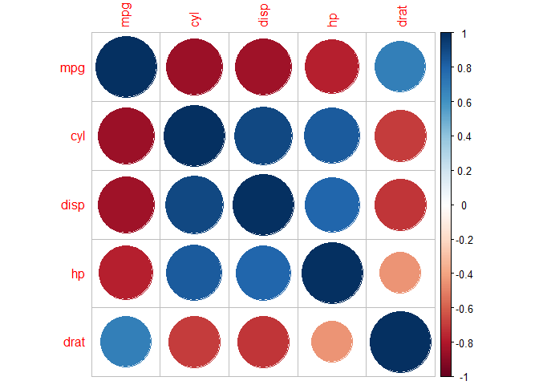
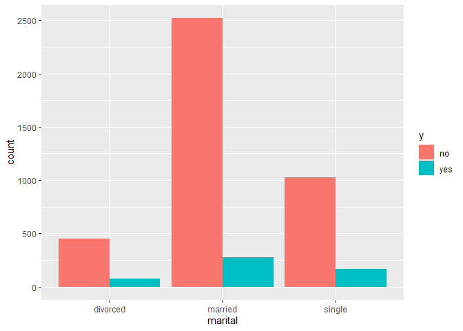

# Resumen Introducción a la estadística.

``` r
banco <- read.csv(file = "./datos/bank.csv", sep = ";")
```

### Descripción de los datos del ejemplo

``` r
head(banco)
```

    ##   age         job marital education default balance housing loan  contact day
    ## 1  30  unemployed married   primary      no    1787      no   no cellular  19
    ## 2  33    services married secondary      no    4789     yes  yes cellular  11
    ## 3  35  management  single  tertiary      no    1350     yes   no cellular  16
    ## 4  30  management married  tertiary      no    1476     yes  yes  unknown   3
    ## 5  59 blue-collar married secondary      no       0     yes   no  unknown   5
    ## 6  35  management  single  tertiary      no     747      no   no cellular  23
    ##   month duration campaign pdays previous poutcome  y
    ## 1   oct       79        1    -1        0  unknown no
    ## 2   may      220        1   339        4  failure no
    ## 3   apr      185        1   330        1  failure no
    ## 4   jun      199        4    -1        0  unknown no
    ## 5   may      226        1    -1        0  unknown no
    ## 6   feb      141        2   176        3  failure no

### Dimensiones de la base de datos

``` r
dim(banco)
```

    ## [1] 4521   17

La base de datos tiene 4 521 observaciones y 17 variables.

Una primera forma de resumir la información es mediante la tabulación de
los datos, o dicho de otro modo: **recoger la información de la muestra
resumida en una tabla** en la que a cada valor de la variable se le
asocian determinados números que representan el número de veces que ha
aparecido, su proporción con respecto a otros valores de la variable,
etc. 

``` r
library(summarytools)

freq(banco$contact, style = "rmarkdown")
```

    ## setting plain.ascii to FALSE

    ## ### Frequencies  
    ## #### banco$contact  
    ## **Type:** Character  
    ## 
    ## |        &nbsp; | Freq | % Valid | % Valid Cum. | % Total | % Total Cum. |
    ## |--------------:|-----:|--------:|-------------:|--------:|-------------:|
    ## |  **cellular** | 2896 |   64.06 |        64.06 |   64.06 |        64.06 |
    ## | **telephone** |  301 |    6.66 |        70.71 |    6.66 |        70.71 |
    ## |   **unknown** | 1324 |   29.29 |       100.00 |   29.29 |       100.00 |
    ## |    **\<NA\>** |    0 |         |              |    0.00 |       100.00 |
    ## |     **Total** | 4521 |  100.00 |       100.00 |  100.00 |       100.00 |

## Medidas centrales

Son medidas centrales que, una vez organizados los datos en su
correspondiente distribución de frecuencias, se procede a dar una serie
de medidas que resuman todas esa información y que,, “de alguna manera”,
representen la distribución.

### Media, mediana y moda

``` r
mean(banco$duration)
```

    ## [1] 263.9613

``` r
median(banco$duration)
```

    ## [1] 185

-   **Media**: deben utilizarse todas las observaciones. Debe sr un
    valor comprendido entre el menor y el mayor de los valores de la
    distribución. Misma unidad que los datos.

-   **Mediana**: deja la mitad de las observaciones de la recta real a
    la izq y la otra mitad a la derecha.

-   **Moda**: es el valor que más veces se repite (absoluta), los que
    tengan mayor frecuencia que los adyacentes (relativa).

La media es la mejor de las medidas pues la moda es bastante inestable y
un pequeño cambio en las observaciones puede afectarle mucho, mientras
que la mediana es insensible al tamaño de los datos, permaneciendo
constante si, por ejemplo se altera arbitrariamente y en cierto sentido
las observaciones extremas. Por otra parte, si se dispone de las modas y
medianas de dos distribuciones hay que conocer cada uno de los datos de
éstas para calcular la moda y mediana de la distribución cnjunta. La
media por el contrario es sensible a las alteraciones de los datos, al
tamaño de éstos y si se conocen las medias de dos conjuntos de datos,
basta con saber los tamaños de ambos grupos para calcular la media
global.

# Distribuciones de frecuencia, Medidas de posición y dispersión.

## Medidas de posición

Son medidas de posición a aquellas que dividen la distribución en k
partes, de tal forma que en cada una de esas partes haya el mismo número
de elementos. siendo los cuartiles 2, el quinto decil y el 50 percentil
las medianas de las distribuciones.

### Todos los percentiles

``` r
quantile(banco$duration,seq(0,1,0.01))
```

    ##     0%     1%     2%     3%     4%     5%     6%     7%     8%     9%    10% 
    ##    4.0   10.2   16.0   21.0   26.0   31.0   38.0   42.4   48.0   54.0   58.0 
    ##    11%    12%    13%    14%    15%    16%    17%    18%    19%    20%    21% 
    ##   61.0   65.0   68.6   71.0   74.0   77.0   80.0   83.0   86.0   89.0   92.0 
    ##    22%    23%    24%    25%    26%    27%    28%    29%    30%    31%    32% 
    ##   95.0   98.0  101.0  104.0  107.0  109.4  113.0  116.0  119.0  122.0  124.0 
    ##    33%    34%    35%    36%    37%    38%    39%    40%    41%    42%    43% 
    ##  127.0  130.0  134.0  137.0  140.0  143.0  146.0  149.0  152.0  155.4  159.0 
    ##    44%    45%    46%    47%    48%    49%    50%    51%    52%    53%    54% 
    ##  161.0  166.0  169.0  172.4  176.0  181.0  185.0  190.0  194.0  198.0  201.8 
    ##    55%    56%    57%    58%    59%    60%    61%    62%    63%    64%    65% 
    ##  206.0  210.0  214.0  218.0  222.0  226.0  231.0  238.0  242.0  247.0  252.0 
    ##    66%    67%    68%    69%    70%    71%    72%    73%    74%    75%    76% 
    ##  257.2  264.0  270.0  277.0  285.0  293.0  299.4  311.0  320.8  329.0  338.0 
    ##    77%    78%    79%    80%    81%    82%    83%    84%    85%    86%    87% 
    ##  345.4  356.6  370.8  383.0  394.2  407.4  420.0  435.0  458.0  479.0  502.0 
    ##    88%    89%    90%    91%    92%    93%    94%    95%    96%    97%    98% 
    ##  526.0  549.8  579.0  610.2  643.4  673.6  720.8  763.0  821.8  935.4 1030.6 
    ##    99%   100% 
    ## 1259.0 3025.0

### El mínimo, los tres cuartiles y el máximo

``` r
quantile(banco$duration,seq(0,1,0.25))
```

    ##   0%  25%  50%  75% 100% 
    ##    4  104  185  329 3025

### Rango Intercuartílico

``` r
IQR(banco$duration)
```

    ## [1] 225

### Resumen de variable cuantitativa

``` r
summary(banco$duration)
```

    ##    Min. 1st Qu.  Median    Mean 3rd Qu.    Max. 
    ##       4     104     185     264     329    3025

## Medidas de dispersión.

Son las medidas que indican el nivel de concentración de los datos que
se están analizando y a su vez informarán sobre la bondad de los
promedios calculados como representantes del conjunto de datos.

### Varianza y desviación estándar (típica)

-   Varianza y desv típica están íntimamente ligados a la media.

``` r
var(banco$duration)
```

    ## [1] 67525.47

``` r
sd(banco$duration)
```

    ## [1] 259.8566

### Coeficiente de variación

Es el cociente entre la desv típica y el valor absoluto de la media.
Adimensional y permite comparar la dispersión de varias distribuciones.
Da información sobre la representitividad de la media; y aunque no hay
valores fijos de comparación, pues depende de circunstancias tales como
el número de observaciones, se puede considerar, a efectos prácticos,
una cota del 50% como límite para admitir que la media representa
aceptablemente al conjunto de la distribución.

``` r
mediaDuration <- mean(banco$duration)
desDuration <- sd(banco$duration)

CVDuration = desDuration/mediaDuration*100
CVDuration
```

    ## [1] 98.44498

El coeficiente de variación es del 98,45 %, por lo que la dispersión de
los datos es muy alta. Para darlo por bueno, se suele aceptar menos de
un 50%.

## Transformaciones

A veces se tiene el inconveniente de que la distribución que se estudia
presenta muchas irregularidades, como asimetrías acentuadas, valores
extremos, etc…, en otras ocasiones se debe comparar la posición de dos
elementos que pertenecen a poblaciones con características distintas o
del mismo elemento en situaciones distintas. En estos casos es
recomendable efectuar una transformación que haga más regular la
distribución y, por tanto, con mejores condiciones para su estudio.

### Tipificación o normalización

Se llama tipificación al proceso de restar la media y dividir entre su
desviación típica a una variable.

A la nueva variable Z se le llama variable normalizada o tipificada y
tiene **media 0** y **desviación típica 1**. Haciendo un símil, la media
y la desv típica de una variable pueden considerarse como el centro de
gravedad de la distribución y su escala respectivamente, por lo que al
tipificar distintas variables las centramos en el mismo punto y las
dotamos de la misma escala; además los valores tipificados pierden la
unidad de la variable: Por lo anterior, la tipificación tiene la
propiedad de hacer comparables individuos semejantes de poblaciones
diferentes, aún en el caso de que éstas vinieran expresadas en
diferentes unidades.

``` r
banco$duration_z <- scale(banco$duration, center = T, scale = T)
#almacenar nueva variable duration_z
```

## Representaciones gráficas

### Variables categóricas (o cualitativas)

#### Diagrama de sectores

Es un círculo en el que a cada categoría de la variable se le asigna un
sector de área proporcional a su frecuencia absoluta o relativa.

``` r
pie(table(banco$education))
```


#### Diagrama de barras

Es un gráfico en el que las categorías de la variable se representan
sobre el eje horizontal y sus freq absolutas o relativas sobre eleje
vertical.

``` r
barplot(table(banco$education))
```


### Variables cuantitativas (o numéricas)

#### Histograma

Se utilizan para representar datos de la variable cuantitativa agrupados
en intervalos. Consiste en colocar sobre un eje horizontal los
diferentes intervalos. Sobre cada uno de ellos, se construye un
rectángulo de superficie igual a la frecuencia que se esté
representando. Así, las alturas de los rectángulos deben ser las
densidades de los intervalos. Su forma es similar a la del diagrama de
barras, con la diferencia de que no hay espacio entre las barras.

``` r
hist(banco$age)
```


El histograma proporciona información sobre la distribución de la
variable. Las tres formas más comunes que puede presentar la
distribución de una variable cuantitativa son:


-   Si la distribución de datos es **simétrica**, la media, mediana y
    moda son iguales.

<!-- -->

-   Si la distribución es **asimétrica a la derecha**, la media es mayor
    que la mediana.

<!-- -->

-   Si la distribución es **asimétrica a la izquierda**, la media es
    menor que la mediana.

#### Diagrama de cajas

Se representa en el gráfico la mediana, el primer y el tercer cuartil.
También los valores extremos o atípicos.

Si la distribución de la variable es simétrica, la distancia entre el
percentil 25 y la mediana será similar a la distancia entre el percentil
75 y la mediana, y la distancia entre el bigote superior y la mediana
será similar a la distancia entre el bigote inferior y la mediana. Se
consideran valores extremos aquellas que están situadas a una distancia
de la media mayor que tres desviaciones estándar, es decir: o mucho
mayores que la media o mucho menores.

``` r
boxplot(banco$age)
```


``` r
#Al añadir la opción stat al diagrama de cajas, devuelve los estadísticos representados.

boxplot.stats(banco$age)
```

    ## $stats
    ## [1] 19 33 39 49 73
    ## 
    ## $n
    ## [1] 4521
    ## 
    ## $conf
    ## [1] 38.62402 39.37598
    ## 
    ## $out
    ##  [1] 78 77 78 75 75 77 81 83 80 77 75 80 83 75 79 77 86 78 77 74 80 74 80 80 75
    ## [26] 76 79 77 87 79 76 80 79 74 75 84 83 83

Esta función contiene:

-   El extremo del bigote inferior, la “bisagra”inferior, la mediana, la
    “bisagra” superior y el extremo del bigote superior.

-   El número de observaciones no missing de la muestra.

-   Los extremos superior e inferior de la “muesca”.

-   Los valores de los puntos de datos que se encuentran más allá de los
    extremos de los bigotes.

Si la variable tiene una distribución simétrica, los estadísticos
descriptivos de tendencia central y dispersión que deben ser utilizados
son la media y la desviación estándar. Si, por el contrario, la
distribución es asimétrica, se deben describir utilizando la mediana y
el rango intercuartílico.

# La vinculación entre variables estadísticas.

Cuando se analiza la relación entre dos caracteres se pueden presentar
dos casos extremos: El primero de ellos será aquel en que conocido el
valor de un carácter se pueda obtener el valor del otro, el segundo se
presenta cuando la información sobre un carácter no arroja ninguna
información sobre el otro. Entre estas situaciones extremas se dan una
infinidad de casos intermedios, por ello será necesario analizar el
nivel de influencia existente entre los caracteres. este análisis no
establecerá cuál es la causa y cuál el efecto entre ambos, sólo la
intensidad de la relación.

## Tablas de frecuencias bidimensionales

Cuando se trabaja con variables bidimensionales, en vez de enumerarlos,
se recurre a una tabla de frecuencias de doble entrada en la que cada
celda contiene el número de veces que se observa cada pareja de valores
(x,y).

### Distribuciones conjuntas

Es el conjunto de pares de valores de dos variables estadísticas
unidimensionales X e Y sobre una misma población. En este caso, se
tendrá una tabla de doble entrada donde cada dimensión corresponderá a
una variable y cada celda de la tabla tendrá el número de individuos que
tengan los correspondientes valores según la fila y la columna en que se
encuentren. Dicho valor recibe el nombre de frecuencia conjunta
(absoluta o relativa).

-   Si la distribución es de **atributos**, se llama tabla de
    *contingencia*.

-   Si la distribución es de **variables numéricas**, se denomina de
    *correlación*.

``` r
#Tabla frecuencia absoluta

banco$campaign[banco$campaign >=5] <- 5
tabla<- table(banco$campaign, banco$marital)
addmargins(tabla)
```

    ##      
    ##       divorced married single  Sum
    ##   1        222    1033    479 1734
    ##   2        139     790    335 1264
    ##   3         61     363    134  558
    ##   4         34     209     82  325
    ##   5         72     402    166  640
    ##   Sum      528    2797   1196 4521

``` r
#Tabla frecuencia relativa

tabla<- prop.table(table(banco$campaign, banco$marital))
addmargins(tabla)
```

    ##      
    ##         divorced    married     single        Sum
    ##   1   0.04910418 0.22848927 0.10595001 0.38354346
    ##   2   0.03074541 0.17474010 0.07409865 0.27958416
    ##   3   0.01349259 0.08029197 0.02963946 0.12342402
    ##   4   0.00752046 0.04622871 0.01813758 0.07188675
    ##   5   0.01592568 0.08891838 0.03671754 0.14156160
    ##   Sum 0.11678832 0.61866844 0.26454324 1.00000000

### Distribuciones marginales

En las tablas de doble entrada interesa estudiar aisladamente cada una
de las variables. De esta manera se obtienen dos distribuciones
unidimensionales, que serían correspondientes a cada una de las
variables X e Y. Considerar la distribución marginal de una variable
equivale a considerar la distribución de ésta independientemente de la
otra.

``` r
#Frecuencia condicional por variable estado civil
addmargins(prop.table(table(banco$marital)))
```

    ## 
    ##  divorced   married    single       Sum 
    ## 0.1167883 0.6186684 0.2645432 1.0000000

### Distribuciones condicionadas

Cuando se posee información previa de una de las variables en estudio,
ésta puede modificar la información disponible de la otra. En
particular, cuando se considera la distribución de una variable para un
valor fijo de la otra se obtiene la *distribución condicionada.*

``` r
#Frecuencia condicional por columnas
addmargins(prop.table(x=tabla, margin=2))
```

    ##      
    ##         divorced    married     single        Sum
    ##   1   0.42045455 0.36932428 0.40050167 1.19028049
    ##   2   0.26325758 0.28244548 0.28010033 0.82580339
    ##   3   0.11553030 0.12978191 0.11204013 0.35735235
    ##   4   0.06439394 0.07472292 0.06856187 0.20767873
    ##   5   0.13636364 0.14372542 0.13879599 0.41888504
    ##   Sum 1.00000000 1.00000000 1.00000000 3.00000000

``` r
#Frecuencia condicional por filas
addmargins(prop.table(x=tabla, margin=1))
```

    ##      
    ##        divorced   married    single       Sum
    ##   1   0.1280277 0.5957324 0.2762399 1.0000000
    ##   2   0.1099684 0.6250000 0.2650316 1.0000000
    ##   3   0.1093190 0.6505376 0.2401434 1.0000000
    ##   4   0.1046154 0.6430769 0.2523077 1.0000000
    ##   5   0.1125000 0.6281250 0.2593750 1.0000000
    ##   Sum 0.5644304 3.1424720 1.2930976 5.0000000

## Tablas de contingencia

También llamadas tablas dinámicas o cruzadas son la técnica estadística
más utilizada en análisis de datos.

Es una de las formas más comunes de resumir datos categóricos o una
variable cuantitativa y otra cualitativa. Se centra en estudiar si
existe alguna asociación entre una variable denominada fila y otra
columna calculándose la intensidad de dicha asociación.

Es una Tabla de doble entrada en la que en las filas se ubican las
modalidades de una de las variables (atributos) y en las columnas la del
otro; en las celdas resultantes del cruce de las filas y columnas se
incluye el número de elementos de la distribución que presentan ambas
modalidades.

Las tablas de contingencia se leen fila por fila y de derecha a
izquierda y se interpretan los porcentajes. Hay que distinguir entre:

-   **Variable explicativa:** Variable independiente que irá en filas.

-   **Variable de respuesta:** Variable dependiente que irá en columnas.

A más diferencia de porcentajes en cada fila (entre las categorías de la
variable en columnas), más fuerte es la relación entre las variables.

-   Si no hay diferencias de respuestas, es decir, si los porcentajes en
    una misma fila son muy similares es que no hay relación entre las
    variables.
-   Si hay diferencias entre los porcentajes es que hay relación entre
    las variables. Las variables se relacionan entre sí, es decir, una
    explica a la otra, si hay diferencias de respuestas entre las
    categorías que componen una variable.

``` r
library(summarytools)
ctable(banco$education, banco$y)
```

    ## Cross-Tabulation, Row Proportions  
    ## education * y  
    ## Data Frame: banco  
    ## 
    ## ----------- --- -------------- ------------- ---------------
    ##               y             no           yes           Total
    ##   education                                                 
    ##     primary        614 (90.6%)    64 ( 9.4%)    678 (100.0%)
    ##   secondary       2061 (89.4%)   245 (10.6%)   2306 (100.0%)
    ##    tertiary       1157 (85.7%)   193 (14.3%)   1350 (100.0%)
    ##     unknown        168 (89.8%)    19 (10.2%)    187 (100.0%)
    ##       Total       4000 (88.5%)   521 (11.5%)   4521 (100.0%)
    ## ----------- --- -------------- ------------- ---------------

En la tabla anterior, se observa que, a mayor nivel de estudios, mayor
probabilidad de contratar un depósito, por lo que se puede deducir que
parece que existe una correlación positiva entre educación y las
probabilidades de contratar un depósito a plazo.

## Coeficiente de correlación lineal. Matriz de correlación

### Coeficiente de correlación lineal de Pearson

Es un índice que mide el grado de relación entre distintas variables
cuantitativas relacionadas linealmente. Es importante recalcar que puede
haber variables fuertemente relacionadas, pero no de forma lineal, en
cuyo caso no debe aplicarse la correlación de Pearson.

Sus valores absolutos oscilan entre 0 y 1. Esto es, si hay dos variables
X e y, y se define el coeficiente de correlación de Pearson entre estas
dos variables como “rr”:

-   Correlación despreciable: rr \< \|0,1\|
-   Correlación baja: \|0.1\| \< rr \<= \|0,3\|
-   Correlación mediana: \|0.3\| \< rr \<= \|0,5\|
-   Correlación fuerte o alta: rr \> \|0,5\|

Se han especificado los términos en valor absoluto ya que, en realidad
el coeficiente varía entre -1 y +1. El signo indica la dirección,
perfectamente positiva y perfecta negativa respectivamente.

### Matriz de correlación

Una matriz de correlación es una **matriz de muchas correlaciones**.

``` r
library(dplyr) # Cargar la librería de manipulación de dataframes "dplyr"
```

    ## 
    ## Attaching package: 'dplyr'

    ## The following objects are masked from 'package:stats':
    ## 
    ##     filter, lag

    ## The following objects are masked from 'package:base':
    ## 
    ##     intersect, setdiff, setequal, union

``` r
# Eliminamos las variables que no analizaremos

mtcars2<-select(mtcars, -(wt:carb))
M<-cor(mtcars2)
M
```

    ##             mpg        cyl       disp         hp       drat
    ## mpg   1.0000000 -0.8521620 -0.8475514 -0.7761684  0.6811719
    ## cyl  -0.8521620  1.0000000  0.9020329  0.8324475 -0.6999381
    ## disp -0.8475514  0.9020329  1.0000000  0.7909486 -0.7102139
    ## hp   -0.7761684  0.8324475  0.7909486  1.0000000 -0.4487591
    ## drat  0.6811719 -0.6999381 -0.7102139 -0.4487591  1.0000000

``` r
library(corrplot)
```

    ## corrplot 0.92 loaded

``` r
corrplot(M)
```



En la diagonal de la figura están las variables y por encima unos
círculos de colores. Cuanto más intenso sea el color, ya sea azul o
rojo, mayor es la correlación; colores tenues significan correlación
baja. Por otro lado, el tamaño de los círculos está asociado al valor
absoluto de correlación.

## Dependencia e independencia estadística

La independencia-dependencia viene a medir la información que arroja
sobre una de las variables el conocimiento que se tiene de la otra
variable. Así una información total implica *dependencia funcional*, la
nula información *independencia*, y una información parcial,
*dependencia estadística.*

### Independencia

Cuando no se da **ningún tipo de relación** entre dos variables, es
decir, cuando una de ellas no influye en la distribución de la otra
condicionada por el valor que adopte la primera.

Dadas dos variables estadísticas X e Y, la condición necesaria y
suficiente para que sean independientes son:

-   Si X es independiente de Y, las distribuciones condicionadas de X/Yj
    son idénticas a la distribución marginal de X.
-   Si X es independiente de Y, Y es independiente de X.
-   Si X e Y son dos variables estadísticamente independientes, su
    covarianza es cero.

**Ejemplo:** Peso corporal y sueldo mensual de los trabajadores de un
banco.

### Dependencia funcional

Cuando existe **una relación matemática exacta entre ambas variables**,
estas son dependientes funcionalmente.

El carácter X depende del carácter Y si a cada modalidad Yj de Y
corresponde una única modalidad posible de X. Por lo tanto, cualquiera
que sea j, la frecuencia absoluta nij vale cero salvo para un valor de i
correspondiente a una columna j tal que nij = n.j.

Cada columna de la tabla de frecuencias tendrá, por consiguiente, un
único término distinto de cero. Si a cada modalidad Xi de X corresponde
una única modalidad posible de Y, Y será dependiente de X. La
dependencia de X respecto de Y no implica que Y dependa de X.

**Ejemplo:** Ejemplo de variables con dependencia funcional: minutos de
llamadas y factura mensual de un número de teléfono.

### Dependencia estadística

Existen caracteres que ni son independientes, ni se da entre ellos una
relación de dependencia funcional, pero sí **existe una cierta relación
de dependencia** entre ambos: dependencia estadística.

Cuando los caracteres son de tipo **cuantitativo**, el estudio de la
dependencia estadística se conoce como el problema de regresión, y el
análisis del grado de dependencia que existe entre las variables se
conoce como el problema de correlación.

**Ejemplo:** Peso y altura de un grupo de hombres de una misma
población.

## Representaciones gráficas de relaciones entre variables

### Representación de la relación entre dos variables contínuas

#### Diagrama de dispersión bivariado

Diagrama de dispersión o nube de puntos, donde cada caso aparece
representado como un punto en el plano definido por las variables X e Y.

``` r
# Duración del último contacto con el cliente y el número de días que han pasado desde ese último contacto. No existe patrón.

library(ggplot2)

ggplot(data = banco, aes(x = duration, y = pdays)) + geom_point(alpha = 0.5)
```


#### Diagrama de barras

Para representar las variables categóricas, se puede utilizar el
diagrama de barras o el de sectores, donde se observa la frecuencia
(absoluta o relativa) de cada categoría en forma de barras o en un
diagrama circular, respectivamente.

*Ejemplo en R:* en los siguientes gráficos se trata de contestar a la
siguiente pregunta: “¿el estado civil influye a la hora de contratar un
depósito?”.

``` r
#Diagrama de barras

ggplot(banco, aes(marital,fill=y)) +  geom_bar(position = "dodge")
```



``` r
#Barras apiladas
ggplot(banco, aes(marital,fill=y)) +  geom_bar(position = "fill")
```


De los gráficos anteriores se puede concluir que los casados son menos
propensos a contratar un depósito, ya que tienen menor porcentaje de
contratación.

### Representación de la relación entre una variable continua y otra categórica

#### Diagrama de dispersión

El diagrama de dispersión también puede ser aplicado en la
representación conjunta de la distribución de frecuencias absolutas de
una variable categórica y una variable cuantitativa. Es habitual que
aparezca representada la variable categórica en el eje de abscisas y la
variable cuantitativa en el eje de ordenadas.

``` r
# Relación entre los ingresos y el estado civil. 

ggplot(data = banco, aes(x = marital, y = balance, col = marital)) + geom_point()
```


Los clientes que están divorciados tienen menos poder adquisitivo.

#### Diagrama de cajas y bigotes

``` r
# ¿influye la edad en la decisión de contratación de un depósito?

boxplot(banco$age ~ banco$y, col = "lightblue",
        main = "Contratación del depósito en función de la edad de los clientes")
```


Se puede ver que los clientes que contratan los depósitos tienen una
edad ligeramente superior a los que los que no lo hacen.

## Complementos en el estudio de una variable

### Análisis e outliers

Los **Datos atípicos** son aquellas observaciones cuyos valores son muy
diferentes a las otras observaciones del mismo grupo de datos. El
principal problema de la presencia de *outliers* es que pueden ser
elementos no representativos de la población, lo que puede llegar a
distorsionar los resultados delos modelos estadísticos. Por otra parte,
aunque diferentes a la mayor parte de la muestra, pueden ser indicativos
de las características de un segmento válido de la población y, por
consiguiente, una señal de la falta de representatividad de la muestra.

Se pueden clasificar en dos tipos:

-   **Valores erróneos:** Que surgen de un error de procedimiento, tales
    como la entrada de datos o un error de codificación. Deberían
    subsanarse en el filtrado de los datos, y si no se puede, eliminarse
    del análisis o recodificarse como nulos.

-   **Valores atípicos:** Ocurren como consecuencia de un acontecimiento
    extraordinario o por valores extremos pero reales. En este caso los
    *outliers* representan información válida de la muestra y no deben
    ser eliminados. Sin embardo, es necesario evaluar la influencia que
    tienen estas observaciones en los modelos estadísticos. Para ello es
    necesario replicar el análisis con y sin dichas observaciones con el
    fin de analizar su influencia sobre los resultados. Si dichas
    observaciones son influyentes, el analista debería reportarlo en sus
    conclusiones y debería averiguar el porqué de dichar observaciones.

Para identificar los *outliers*, se debe examinar la distribución de las
observaciones para cada variable y seleccionar como casos atípicos
aquellos casos cuyos valores caigan fuera de los rangos de la
distribución.

#### Identificación a partir de gráficos

``` r
#Diagrama de caja

boxplot.stats(banco$age)
```

    ## $stats
    ## [1] 19 33 39 49 73
    ## 
    ## $n
    ## [1] 4521
    ## 
    ## $conf
    ## [1] 38.62402 39.37598
    ## 
    ## $out
    ##  [1] 78 77 78 75 75 77 81 83 80 77 75 80 83 75 79 77 86 78 77 74 80 74 80 80 75
    ## [26] 76 79 77 87 79 76 80 79 74 75 84 83 83

#### Identificación a partir de estadísticos descriptivos

``` r
# Máximo y mínimo

min(banco$duration)
```

    ## [1] 4

``` r
max(banco$duration)
```

    ## [1] 3025

#### Identificación a partir de valores tipificados (si son mayores que tres, que suele ser el valor utilizado por convenio)

``` r
which(abs(banco$duration_z)>3)
```

    ##  [1]   52  126  204  260  299  329  355  370  416  430  495  510  527  569  646
    ## [16]  703  705  795  805  935  981 1048 1176 1301 1320 1334 1412 1432 1441 1450
    ## [31] 1455 1460 1505 1593 1707 1847 1856 1900 1904 1913 1915 1960 1992 2014 2203
    ## [46] 2275 2371 2376 2407 2482 2592 2654 2675 2732 2828 2838 2876 2969 2973 3075
    ## [61] 3092 3142 3153 3334 3398 3432 3454 3615 3643 3645 3654 3674 3731 3735 3814
    ## [76] 3854 3969 4102 4124 4210 4233 4266 4343 4404 4448 4496 4506 4512

### Análisis de valores faltantes

So nobservaciones que se pretendían recoger pero por alguna razón no
fueron registradas. No existe una regla universal para indicar el número
o la proporción de datos faltantes que darían lugar a sesgos o
resultados no válidos.

Está determinado por:

-   La pregunta.

-   La información en los datos observados.

-   La razón por la cual el valor se ha perdido.

Se buscan tres objetivos: **minimizar el sesgo, maximizar el uso de la
información disponible y obtener buenas estimaciones de incertidumbre**.
Antes de decidir la técnica, es esencial considerar los mecanismos o
patrones de datos faltantes. Es decir el éxito dependerá de los motivos
por los que faltan datos.

Little y Rubin clasificaron diferentes mecanismos:

-   **Missing completly at random (MCAR):** La probabilidad de que una
    observación contenga un dato perdido no depende ni de los datos
    observados, ni de los datos perdidos. Por ejemplo, cierta página de
    un cuestionario se ha perdido de forma accidental. Cuando los datos
    perdidos en una muestra son MCAR, se considera que es un “mecanismo
    ignorable”, ya que los sujetos con información completa pueden
    considerarse como una submuestra aleatoria de la base de datos
    total. Por tanto, si se realiza el análisis estadístico eliminando
    los sujetos perdidos con observaciones, podría darse una pérdida de
    tamaño muestral, pero los resultados no estarían sesgados.
-   **Missing at random (MAR):** La probabilidad de que una observación
    contenga un dato perdido no depende de los datos no observados pero
    si de los observados. Por ejemplo, los individuos de mayor edad son
    menos conscientes de su peso que los más jóvenes, y cuando se les
    pregunta por su peso no saben responder (en este caso, la no
    observación del peso no depende de los valores perdidos del propio
    peso, pero sí de los observados para la variable edad). Por tanto,
    los sujetos con información completa no pueden considerarse como una
    submuestra aleatoria, por lo que realizar un análisis estadístico
    incluyendo solo a aquellos con información completa produciría
    resultados sesgados. Sin embargo, es considerado como un “mecanismo
    ignorable” si se controla adecuadamente por las variables que
    predicen los datos perdidos.
-   **Missing not at random (MNAR):** La probabilidad de que una
    observación contenga un dato perdido depende de los datos no
    observados (además, también puede depender de los datos observados).
    Por ejemplo, los valores perdidos para el salario dependen del
    propio salario, pero no se cuenta con ninguna información que
    permita saberlo. Es la peor de las situaciones, ya que es
    considerado como un “mecanismo no ignorable”. Para realizar un
    análisis estadístico válido es necesario especificar un modelo para
    el mecanismo de datos perdidos, que normalmente es desconocido.

### Exploración de presencia de datos perdidos

El primer paso consiste en evaluar la magnitud del problema. Para ello
se comienza analizando el porcentaje de datos ausentes por variables y
casos. Se representan po NA.

Se puede crear un vector de valores que contenga algunos valores
perdidos:

``` r
y<-c(26, 32, 42, 25, 54, NA, 65, NA)
```

Aunque en este ejemplo resulte sencillo identificar los datos perdidos,
en la mayoría de las ocasiones analizaremos una base de datos con un
mayor volumen de variables y observaciones. En R se dispone de varias
herramientas para la identificación y el tratamiento de datos perdidos.

La función “is.na” permite obtener un vector lógico con true en los
casos de valores perdidos. Al anidar la función any con la función
“is.na”, se verifica si un vector determinado tiene algún valor perdido;
la función which permite identificar la posición de estos valores, mean
el porcentaje de NA y sum la cantidad de NA:

``` r
# Vector lógico con T==NA
is.na(y)
```

    ## [1] FALSE FALSE FALSE FALSE FALSE  TRUE FALSE  TRUE

``` r
# TRUE = hay al menos un valor NA
any(is.na(y))
```

    ## [1] TRUE

``` r
# Alternativa a lo anterior
anyNA(y)
```

    ## [1] TRUE

``` r
# Indica las coordenadas donde están los NA
which(is.na(y))
```

    ## [1] 6 8

``` r
 # Porcentaje de valores NA
mean(is.na(y))
```

    ## [1] 0.25

``` r
# Cantidad de valores perdidos en el vector
sum(is.na(y))  
```

    ## [1] 2

Algunas funciones de R disponen de argumentos para trabajar con datos
que contienen valores perdidos. Por ejemplo, la mayoría de funciones
estadísticas del tipo mean, var, sum, min, max, etc. tienen un argumento
“na.rm” que se puede poner a true para que suprima los valores perdidos
del cálculo.

También algunas funciones de modelización estadística, como lm, glm,
etc., disponen de un argumento “na.action” al que se puede pasar la
acción a realizar para los valores perdidos. Lo más común es especificar
“na.action=na.omit”, con lo que prescindirá de dichos valores en su
procedimiento.

``` r
# NA en funciones y operaciones
# Media
mean(y)
```

    ## [1] NA

``` r
mean(na.omit(y))
```

    ## [1] 40.66667

``` r
mean(y, na.rm = TRUE)
```

    ## [1] 40.66667
