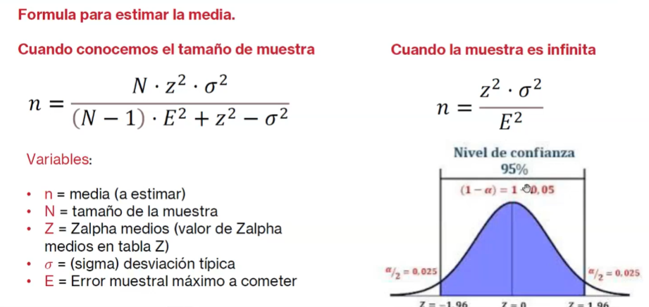
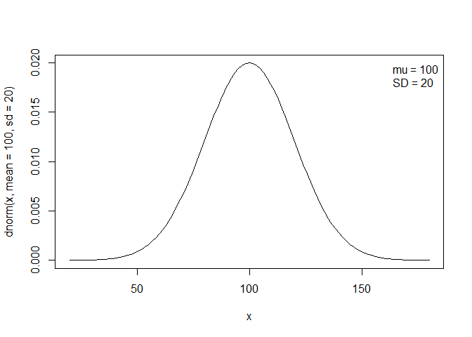
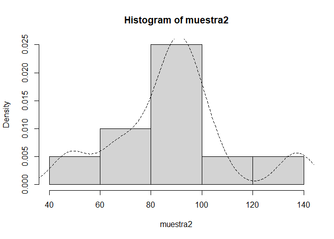
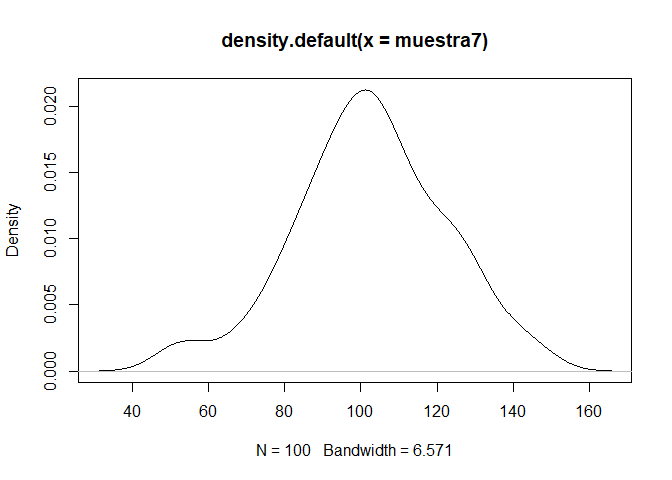

# I. PROBLEMA MUESTREO

5 000 restaurantes han comprado fruta de temporada en el último mes a
unos grandes almacenes. Se desea tomar una muestra para estimar la
compra media. Se quiere que dicha estimación tenga un error máximo de
dos kilos y se busca un nivel de confianza del 90 %. Con una muestra
piloto de 40 restaurantes, se ha obtenido una media de 168,5 kilos con
una desviación típica de 20,5 kilos. ¿Qué tamaño de muestra se debe
escoger?

``` r
#Datos
N=5000
B=2 
NS=0.10
NC=1-NS
k=qnorm(1-NS/2)
s2=(20.5)^2
D=B^2/k^2
#formula para el tamano de muestra (cuando se estima la media)
n=(N*s2)/((N-1)*D+s2)
#El tamano de muestra es :
round(n)
```

    ## [1] 269



``` r
# Error máximo
Emax <- 2
# Intervalo de confianza (nivel de confianza)
IC <- 0.9
# Desviacion típica
sigma <- 20.5
# Tamaño población
N <- 5000
#Valor Z alpha medio
z.student <- 1-(1-IC)/2
z.student
```

    ## [1] 0.95

``` r
z.alfa.medios <- qnorm(z.student)
z.alfa.medios
```

    ## [1] 1.644854

``` r
#Fórmula muestreo (estimando la media)
n <- (N*z.alfa.medios^2*sigma^2)/((N-1)*Emax^2+z.alfa.medios^2*sigma^2)
round(n)
```

    ## [1] 269

# II. PROBLEMA MUESTREO

De 3 675 clientes registrados en una entidad financiera se escogen
aleatoriamente a 147 y se les consulta si fueron a la entidad por
consejo de alguien. De los 147 encuestados, 48 contestan que sí. Se
pide:

-   Hacer una estimación de la proporción de las 3 675 personas que
    fueron por consejo de alguien.

``` r
#datos
N=3675
n=147
a=48
NS=0.05;NC=1-NS # Se toma un nivel de confianza del 95%
k=qnorm(1-NS/2);round(k,3)#k=f(z)
```

    ## [1] 1.96

``` r
## [1] 1.96
#inciso a
#la proporcion de personas que vinieron por consejo de alguien.
p=a/n
p
```

    ## [1] 0.3265306

``` r
#la proporcion de personas que no vinieron por consejo de alguien.
q=1-p
q
```

    ## [1] 0.6734694

-   Determinar el error en la estimación asumiendo un nivel de confianza
    adecuado.

``` r
#varianza de la proporcion
vp=((p*q)/n)*((N-n)/N)
vp
```

    ## [1] 0.001436136

``` r
#error de la estimacion (desv estandar= K*raiz cuadrada de la varianza)
B=k*sqrt(vp)
B
```

    ## [1] 0.07427556

-   ¿Qué opinión tiene sobre el valor obtenido para dicho error?

``` r
#Error relativo=B/p
ER=(B/p)
ER
```

    ## [1] 0.2274689

``` r
if ((B/p)>0.10) ("La estimacion no es confiable, se sugiere aumentar n") else ("La estimacion es confiable")
```

    ## [1] "La estimacion no es confiable, se sugiere aumentar n"

# 3. Investiga las funciones y paquetes más relevantes utilizadas en muestreo

Propuesta solución:

<https://cran.r-project.org/web/packages/survey/survey.pdf>

Selección de muestras simples con dplyr:

Una forma mós sencilla de obtener una muestra es con el paquete
dplyr.Este paquete es sumamente útil para el tratamiento de datos,
adicionalmente contiene una función para obtener muestras simples de un
data frame:

``` r
# library(dplyr)
# # #Muestra sin reemplazo
# # 
# flightsmuestra2<- flights %>%
#    sample_n(size=n,replace=FALSE)
#  head(flightsmuestra2)
```

Muestra con peso:

``` r
#flightsmuestra3<- flights %>%
#  sample_n(size=n,weight=Freq)
#head(flightsmuestra3)
```

Muestra con una proporción de casos:

``` r
#flightsmuestra4<- flights %>%
#  sample_frac(0.05)
#head(flightsmuestra4)
#dim(flightsmuestra4)
```

Selección de muestras sistemáticas:

Para el ejemplo del muestreo sistemático utilizaremos la función
sys.sample del paquete SamplingUtil.

``` r
#flightsmuestra5<- sys.sample(N=nrow(flights),n=300)
#flightsmuestra5
```

# 4. Problema probabilidad

-   1.  Casi todas las distribuciones admiten parámetros adicionales.
        Por ejemplo, la media y la desviación estándar para la
        distribución normal. Consulta la ayuda de dnorm para ver cómo
        muestrear una variable aleatoria normal con media 100 y
        desviación estándar 20.

-   1.  Obtengamos 10 valores aleatorios que vienen de esa población (mu
        = 100, SD = 20)

-   1.  Una vez obtenida la muestra (muestra), veamos el valor de la
        media y la desviación estándar.

-   1.  Siguiendo con rnorm tomemos una muestra más y dibujemos el
        histograma y la curva de densidad.

-   e)?Qué sucede si incrementamos la muestra?

-   Solución a:

``` r
help(Distributions)
```

    ## starting httpd help server ... done

``` r
help(dnorm)
curve(dnorm(x, mean = 100, sd = 20),
      xlim = c(20, 180))
 
legend("topright",
       c(paste("mu =", 100), paste("SD =", 20)),
       bty = "n")
```



-   Solución b:

``` r
# n es el número de valores a obtener.
muestra <- rnorm(10, 100, 20)
muestra
```

    ##  [1] 119.63838  76.90524  91.24771  65.95780  86.35717  77.91491  83.75340
    ##  [8] 130.22581  70.38237  64.20837

-   Solución c:

``` r
# mu y SD son la media y la desviación estándar
# de la población.
mean(muestra)
```

    ## [1] 86.65912

``` r
sd(muestra)
```

    ## [1] 22.07157

-   Solución d:

``` r
muestra2 <- rnorm(10, 100, 20)
hist(muestra2, freq = F)
lines(density(muestra2), lty = 2)
```



-   Solución e: Si incrementamos el tamaño de la muestra nos acercaremos
    más a la realidad (la población). Sin, embargo, y como veremos más
    adelante, no siempre es necesario tener un tamaño “grande” de la
    muestra para tener una buena descripción de la población.

El punto de esta entrada es que conozcas que se pueden obtener valores
aleatorios que vienen de una población con una distribución específica,
en esta caso, una distribución normal.

``` r
muestra7 <- rnorm(100, 100, 20)
plot(density(muestra7))
```



# 5. Problema probabilidad

    a)  La probabilidad de venta de un producto en una tienda es 0.52. En los próximos mil clientes que entren en la tienda, vamos a calcular la probabilidad de que haya más de 540 ventas

    b)  ¿Y si queremos pensar en las 300 de la marca? ¿En qué fracción de esas tiendas se supera la cifra de 540 ventas?

-   Solución a:

Por un lado podríamos usar la distribución binomial, con n=1000,p=0.52
para calcular ese valor. Pero lo que vamos a hacer aquí es simular esas
1000 entradas a la tienda en y ver cuantas ventas obtenemos.

``` r
rbinom(1, 1000, 0.52)
```

    ## [1] 498

-   Solución b:

``` r
#Usando replicate.
numventas = 300
(ventas = replicate(n = numventas, {
  rbinom(n = 1, size = 1000, prob = 0.52)
}))
```

    ##   [1] 523 510 523 520 514 511 508 518 534 509 514 506 520 515 481 505 524 505
    ##  [19] 531 545 517 508 531 528 515 523 505 505 522 514 524 498 529 522 544 512
    ##  [37] 550 524 532 508 525 494 512 526 507 537 521 501 527 514 499 509 547 513
    ##  [55] 509 516 519 530 532 538 545 511 510 523 490 498 528 511 548 520 551 513
    ##  [73] 545 530 534 506 531 543 521 534 526 549 506 548 528 520 526 521 522 501
    ##  [91] 528 509 537 534 505 500 516 500 531 514 518 560 502 520 522 538 535 494
    ## [109] 537 526 506 473 505 533 535 552 549 537 526 516 544 521 542 532 518 511
    ## [127] 494 506 551 533 530 531 516 542 520 522 511 548 522 484 512 530 525 537
    ## [145] 520 495 536 506 509 539 531 524 524 539 546 509 503 531 523 539 522 546
    ## [163] 528 523 523 506 544 523 512 533 526 531 508 508 517 527 501 549 510 546
    ## [181] 509 514 511 522 516 541 516 524 542 516 518 554 498 553 548 482 510 495
    ## [199] 515 494 514 508 529 487 518 514 514 499 531 514 520 523 508 535 503 528
    ## [217] 512 509 513 533 515 519 526 530 528 493 516 502 533 525 525 523 505 527
    ## [235] 526 547 548 515 501 518 514 536 509 526 533 510 524 528 519 510 505 535
    ## [253] 508 508 510 552 538 507 526 526 517 549 522 506 513 508 526 529 526 533
    ## [271] 528 546 520 525 499 492 551 504 534 530 508 519 504 510 524 518 536 523
    ## [289] 545 518 524 534 531 508 521 527 522 502 501 507

``` r
# Nota: Se podría hacer una simulación mucho más "básica" usando rbinom
# ventas<-rbinom(300,1000,0.52)
#Proporción
sum(ventas > 540) / numventas
```

    ## [1] 0.12

``` r
#La probabilidad calculada con la binomial es:
1-pbinom(540, size = 1000, prob = 0.52)
```

    ## [1] 0.09715473

Nota: Se podría hacer una simulación mucho más “básica” usando rbinom
