# Probabilidad

## Definición de probabilidad. Asignación de probabilidades

Según la regla de Laplace, la probabilidad de A se calcularía como el
cociente entre el número de casos favorables a A, y el de todos los
posibles resultados del experimento:

**P(A) = número de casos favorables de A / número de casos posibles**

### Experimentos y sucesos aleatorios

-   **Experimento aleatorio:** Un experimento aleatorio es aquel en el
    que se conoce cuál es el conjunto de resultados posibles antes de su
    realización, pero se desconoce cuál será el resultado concreto del
    mismo.

-   **Espacio muestral:** Al conjunto E de todos los posibles resultados
    de un experimento aleatorio se le llama espacio muestral.

-   **Suceso aleatorio:** Un suceso aleatorio es cualquier subconjunto
    del espacio muestral E de un experimento aleatorio.

### Operaciones entre sucesos

-   **Unión de sucesos:** Dados dos sucesos A,B ∈ P(E), donde P(E) es la
    probabilidad del espacio muestral E, se llama suceso unión de A y B,
    y se denota A ∪ B, al suceso formado por los elementos de A junto a
    los elementos de B. El suceso unión A ∪ B ocurre siempre que ocurre
    A o B.
-   **Intersección de sucesos:** Dados dos sucesos A,B ∈ P(E), se llama
    suceso intersección de A y B, y se denota A ∩ B, al suceso formado
    por los elementos comunes de A y B. El suceso intersección A ∩ B
    ocurre siempre que ocurren A y B.
-   **Contrario de un suceso:** Un conjunto A ∈ P(E), se llama suceso
    contrario o complementario de A, y se denota Ā, al suceso formado
    por los elementos de P(E) que no pertenecen a A.

### Axiomas de probabilidad

La probabilidad de los sucesos debe seguir los axiomas de la teoría de
la probabilidad:

-   La probabilidad de un suceso cualquiera es positiva o nula: **P(A) ≥
    0**.
-   La probabilidad de la unión de dos sucesos incompatibles es igual a
    la suma de las probabilidades de cada uno de ellos: **P(A ∪ B) =
    P(A) + P(B)**.
-   La probabilidad de todo espacio muestral es igual a la unidad:
    **P(E) = 1**.

#### Consecuencias de los axiomas de probabilidad

A partir de los axiomas de la definición de probabilidad se pueden
deducir numerosos resultados interesantes. Se destacarán dos:

-   **P(Ā)=1-P(A) - P(A ∪ B)=P(A) + P(B) - P(A ∩ B)**

## Definición de probabilidad condicionada. Sucesos dependientes e independientes.

### Definición de probabilidad condicionada

En algunas ocasiones puede que haya que **calcular la probabilidad de
algún suceso A sabiendo que ha ocurrido otro B**. En tal caso, se dice
que **el suceso B es un condicionante**, y la probabilidad del suceso
condicionado suele escribirse como: **P(A/B)**.

Dados dos sucesos A y B de un mismo espacio de sucesos de un experimento
aleatorio, la probabilidad de A condicionada por B es:

**P(A/B) = P(A ∩ B) / P(B)**

Esta definición permite calcular probabilidades sin tener que alterar el
espacio muestral original del experimento.

De esta definición se deduce que la probabilidad de la intersección es:

**P(A ∩ B) = P(A)P(B/A) = P(B)P(A/B).**

### Diagramas de árbol

Una buena forma de mostrar y calcular probabilidades condicionales
simples es mediante el uso de un árbol de probabilidad. Los diferentes
resultados están representados por las diferentes ramas del árbol.

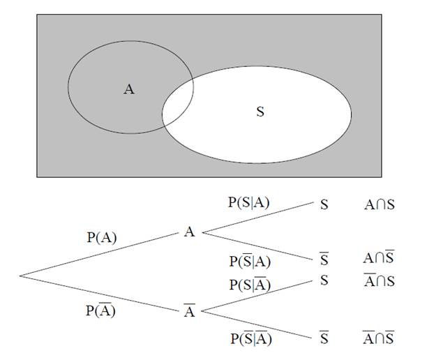

Para calcular la probabilidad de tomar un camino particular a través del
árbol, se multiplican las probabilidades de las ramas correspondientes.
Esto es correcto por la fórmula de probabilidad condicionada que se vio
en el apartado anterior.

#### Ejemplo:

Suponiendo que se está diseñando un modelo de riesgo para el cálculo de
la tarifa de un seguro de vida, se sabe que en la población, la
frecuencia de asma es del 8 % entre los adultos en general y que fuman
el 22 % de los que padecen asma y fuman el 18 % de los que no padecen
asma. Si S es fumador y A padece asma, se puede representar en un árbol
de probabilidad. Ya se conoce P(A),P(S/A) y P (S/Ā), por lo que la
primera rama del árbol es para el estado de asma y la segunda rama es el
estado de fumar condicional al estado de asma.

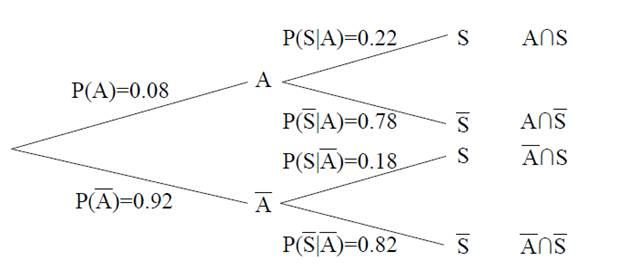

La probabilidad de cualquier intersección de asma y fumar se puede
obtener multiplicando las probabilidades a lo largo de las ramas del
árbol que conducen al extremo que corresponde a la deseada.

P(A∩S)=P(S)P(A/S) = 0.08 x 0.22 = 0.018

Es decir, menos del 2 % de la población padecen asma y son fumadores.

### Sucesos dependientes e independientes

-   **Probabilidad de la intersección de dos sucesos:** Es la
    probabilidad de uno cualquiera de ellos, multiplicada por la
    probabilidad del segundo sabiendo que ha ocurrido el primero.

Si entre dos sucesos no existe ninguna relación, cabe esperar que la
expresión “sabiendo que no” no aporte ninguna información (es decir, la
ocurrencia de A no proporciona información sobre la ocurrencia B).

#### Independencia de dos sucesos

De este modo, se introduce el concepto de independencia de dos sucesos A
y B como:

**A es independiente de B↔P(A∩B)=P(A)P(B)**

Esta relación puede ser escrita de modo equivalente: dados dos sucesos
de probabilidad no nula (de manera que P(A)≠0≠P(B)) se dirá que **A es
independiente de B si y solo si P(B)=P(B/A) o equivalentemente
P(A)P(A/B).**

Así, se dice que **dos experimentos son independientes si los resultados
de uno son independientes de los del otro para cualquier par de
resultados que se escoja**.

## Fórmula de la probabilidad total

Sea A<sub>1</sub>, A<sub>2</sub>, …, A<sub>n</sub> ⊂ E un sistema
exhaustivo y mutuamente excluyente de sucesos.

La fórmula de la probabilidad total permite calcular la probabilidad de
un suceso a partir de probabilidades condicionadas.

Entonces, B ⊂ E, se verifica que:

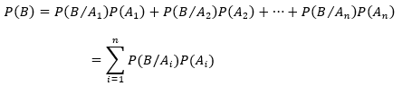

Es decir, **la probabilidad de que ocurra el suceso B es igual a la suma
de multiplicar cada una de las probabilidades condicionadas de este
suceso con los diferentes sucesos A por la probabilidad de cada suceso
A**.

## Teorema de Bayes

El teorema de Bayes es utilizado para calcular la probabilidad de un
suceso, teniendo información *a priori* sobre ese suceso.

Se puede calcular la probabilidad de un suceso A si se sabe, además, que
ese A cumple cierta característica que condiciona su probabilidad.

-   **El Teorema de Bayes:** Entiende la probabilidad de forma inversa a
    la fórmula de la probabilidad total. La probabilidad total hace
    inferencia sobre un suceso B a partir de los resultados de los
    sucesos A. Por su parte, Bayes calcula la probabilidad de A
    condicionado a B.

Dado un sistema completo de sucesos A<sub>1</sub>, …, A<sub>n</sub> y un
suceso B de un mismo espacio de sucesos, se cumple:

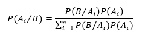

El teorema de Bayes es una consecuencia de la definición de probabilidad
condicionada en términos de la intersección y del teorema de la
probabilidad total que se ha visto en puntos anteriores:

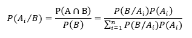

## Distribuciones de probabilidad

Cuando se selecciona una muestra al azar de una población, se está
realizando un **experimento aleatorio** y **cualquier variable**
estadística medida a partir de la muestra **será una variable
aleatoria** porque sus valores dependerán del azar.

-   **Una variable aleatoria X:** Es una función que asocia un número
    real a cada elemento del espacio muestral de un experimento
    aleatorio. Al conjunto de posibles valores que puede tomar la
    variable aleatoria se le llama rango o recorrido de la variable.

    En el fondo, una variable aleatoria es una variable cuyos valores
    provienen de la realización de un experimento aleatorio y, por
    tanto, tendrá asociada una determinada distribución de probabilidad.
    Un ejemplo de variable aleatoria es la que mide el resultado del
    lanzamiento de un dado o, por ejemplo, la altura o el gasto en
    tarjeta de crédito.

La mayoría de los fenómenos de la naturaleza siguen exacta o
aproximadamente una serie de distribuciones de probabilidad teóricas
bien definidas. Se centrará en las siguientes distribuciones:

### Distribución normal

Es la distribución **más importante** en estadística, ya que numerosas
variables asociadas a fenómenos naturales siguen, aproximadamente, una
distribución normal, es decir: una vez calculada su distribución, se
observa que es normal (ejemplo: estatura o peso).  Tiene **forma de
campana** y es **simétrica** respecto a su media. También es conocida
como **campana de Gauss** en honor a su descubridor.

Está determinada por dos parámetros: la **Media (μ)** y la **desviación
estándar (σ)**, tal y como se muestra a continuación:

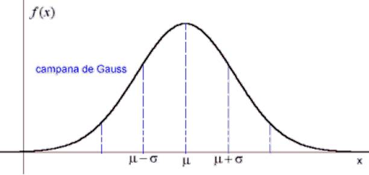

-   **La Media (μ):** Determina la posición relativa de la curva en el
    eje horizontal. En el eje vertical se representa la probabilidad
    asociada a cada valor de X.

-   **Si la media aumenta:** La distribución se desplaza a la derecha;
    si la media disminuye, la distribución se desplaza hacia la
    izquierda.

-   **Si la desviación estándar aumenta:** La altura disminuye y la
    curva se ensancha; si la desviación estándar disminuye, la altura
    aumenta y la curva se estrecha.

##### Ejemplo

Se ha realizado un estudio para medir el gasto mensual en combustible de
un grupo de personas. Se sabe que la distribución del gasto en
combustible es normal con media (μ) 134 € y desviación estándar (σ) 36
€.

Se necesita determinar el porcentaje de individuos de esta población que
tienen un gasto mensual en combustible superior a 160 € (o,
equivalentemente, la probabilidad de que un individuo de esta población
tenga un gasto mensual en combustible superior a 160 €). Para calcular
este porcentaje, basta con determinar el área bajo la curva de una
normal (μ = 134, σ = 36) que está por encima del valor 160, tal y como
se muestra a continuación:

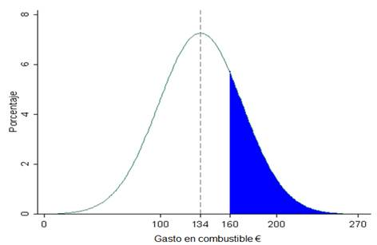

El cálculo de esta área se haría integrando entre 160 e infinito la
función que define la curva de una normal (μ = 134, σ = 36).

Afortunadamente, se puede utilizar un procedimiento alternativo basado
en la distribución normal estándar para llevar a cabo este cálculo. La
distribución normal estándar es una distribución normal con media 0 y
desviación estándar 1.

Los valores de la distribución normal estándar se denominan puntuaciones
z (valores tipificados). Es posible transformar cualquier variable con
distribución normal de media μ y desviación estándar σ en una
distribución normal estándar mediante la siguiente fórmula:

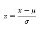

En el ejemplo anterior se quería determinar el porcentaje de individuos
de la población con gasto en combustible superior a 160 €. Para calcular
este porcentaje, basta con determinar el área bajo la curva de una
normal (μ = 134, σ = 36) que está por encima del valor 160. Para
determinar esta área, calculamos la puntuación z correspondiente al
valor 160 de una distribución normal (μ = 134, σ = 36). Para ello, al
valor 160 se le resta la media y se divide entre la desviación estándar:

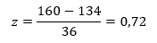

El área bajo la curva de una normal (μ = 134, σ = 36) que está por
encima del valor 160, (a) es exactamente igual que el área bajo la curva
de una normal estándar que está por encima del valor 0,72, (b).

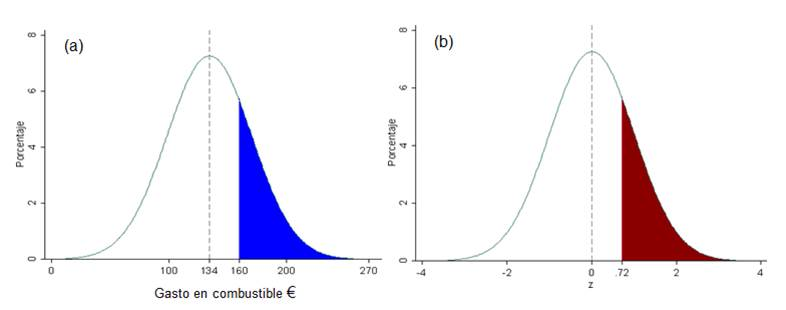

El área bajo la curva de una normal estándar que está por encima del
valor 0,72 puede calcularse utilizando la función de R de la
distribución normal estándar. La función “pnorm(z)”devuelve la
probabilidad acumulada a la izquierda del valor z (es decir, el área
bajo la curva a la izquierda del valor z). Para calcular la probabilidad
a la derecha del valor z se debe calcular el valor complementario “1-
pnorm(z)”.

``` r
# Probabilidad (área bajo la curva) de la Normal estándar
1-pnorm(0.72)    
```

    ## [1] 0.2357625

La probabilidad buscada es 0,2358. En esta población, el 23,58 % de los
individuos tienen un gasto en combustible superior a 160 mg/dl, o
equivalentemente, la probabilidad de que un individuo elegido al azar de
esta población tenga un gasto en combustible superior a 160 mg/dl es
0,2358.

También se puede estar interesado en determinar entre qué dos
puntuaciones z hay una determinada probabilidad. Por ejemplo: para
determinar entre qué dos valores de la distribución normal estándar hay
una probabilidad del 95 % basta con determinar el valor “a” que deja a
su derecha una probabilidad del 2,5 %.

Para calcular esta probabilidad podemos utilizar la función “qnorm”en R:

``` r
# Puntuaciones z que deja a su izquierda 0.025
qnorm(0.025)        
```

    ## [1] -1.959964

La puntuación z que deja a su izquierda una probabilidad de 0,025 es
-1,96. Dado que la distribución normal estándar es simétrica respecto al
0, la puntuación 1,96 deja a su derecha una probabilidad de 0,025. Por
lo tanto, entre -1,96 y +1,96 hay una probabilidad del 95 %.

``` r
# Puntuaciones z que deja a su izquierda 0.025
qnorm(0.05)       
```

    ## [1] -1.644854

``` r
# Puntuaciones z que deja a su izquierda 0.005
qnorm(0.005)
```

    ## [1] -2.575829

Siguiendo el mismo procedimiento, se puede determinar que entre -1,64 y
+1,64 hay una probabilidad del 90 %, y entre -2,58 y +2,58 hay una
probabilidad del 99 %.

### Distribución binomial

La distribución binomial emerge si el interés se centra en determinar el
número (o proporción) de individuos de entre n observados que verifican
una cierta característica dicotómica (ej. vivo o muerto) y existe la
probabilidad de que cada individuo verifique la característica, igual
para todos los individuos.

#### Fórmula general de la distribución binomial

La fórmula general para calcular la probabilidad de observar exactamente
x eventos en una muestra de n individuos. P es la probabilidad de que
cada individuo experimente el evento.

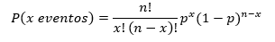

La primera parte de la fórmula representa el número posible de
situaciones en las que pueden ocurrir x eventos entre los n individuos
observados; y la segunda parte de la fórmula representa la probabilidad
de que cada una de las situaciones ocurra. La exclamación (!) denota el
factorial de un número:

n! = n · (n-1) · (n-2) · (n-3) · 1

0! = 1

La media y la desviación estándar es:

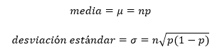

##### Ejemplo

La proporción de personas que comprar un ordenador después de recibir
una llamada telefónica de cierta campaña de publicidad se sabe que es
igual a 0,80. Si 20 personas reciben la llamada telefónica de esta
campaña, ¿cuál es la probabilidad de que compren un ordenador
exactamente 18?

-   n (número de personas) = 20
-   p (probabilidad de comprar el ordenador) = 0.80
-   x (número de personas que compraron el ordenador) = 18

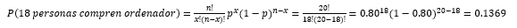

Para calcular la probabilidad de una distribución binomial en R, se
utilizará la función “dbinom(x, n, p)”:

``` r
dbinom(18, 20, 0.8)
```

    ## [1] 0.1369094

La probabilidad de que compren un ordenador exactamente 18 personas de
los 20 que reciben una llamada es 0,1369.

#### Aproximación a la normal de la distribución binomial

Conforme aumenta el tamaño de la muestra n, la distribución binomial se
aproxima a la distribución normal.

-   La aproximación de la distribución binomial a la distribución normal
    es una buena aproximación si tanto np como n-np toman un valor igual
    o superior a 10.
-   La distribución normal tiene la misma media y la misma desviación
    estándar que la distribución binomial.
-   Si la variable X sigue una distribución binomial (n, p) con np ≥ 10
    y n-np ≥ 10, entonces X sigue aproximadamente una distribución
    normal (np, n p (1 – p).

La aproximación de la distribución binomial a la distribución normal
permitirá calcular intervalos de confianza y realizar contrastes de
hipótesis sobre la proporción de una población.

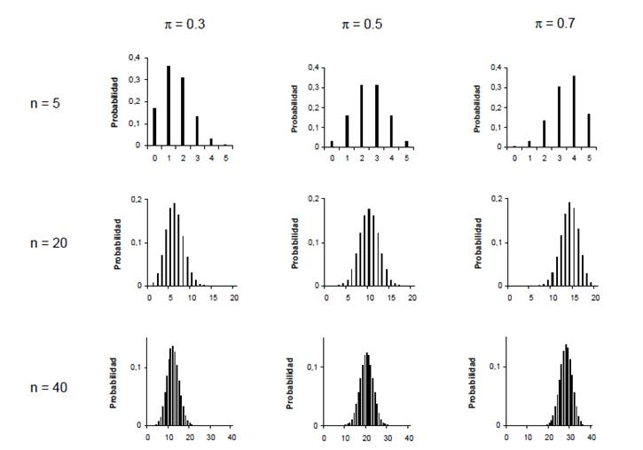

### Distribución de Poisson

La distribución de Poisson es apropiada para describir:

-   El número de ocurrencias de un evento durante un período de tiempo,
    siempre y cuando los eventos ocurran independientemente unos de
    otros y de forma aleatoria.

    **Ejemplo:** número de llamadas que recibe una central telefónica en
    una hora; número de pólizas de seguro vendidas, durante un año, en
    una compañía

-   El número de partículas encontradas en una unidad de espacio,
    siempre y cuando las partículas se distribuyan aleatoria e
    independientemente en el espacio total.

    **Ejemplo:** el número de defectos por metro cuadrado de tela,
    número de estrellas en un determinado volumen de espacio.

#### Fórmula general de la distribución de Poisson

La fórmula general para calcular la probabilidad de observar exactamente
x ocurrencias de un evento durante un período de tiempo (o región de
espacio) es:

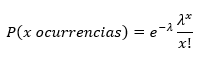

-   **λ:** Es el número medio de ocurrencias de un evento en períodos de
    tiempo de la misma longitud (o en iguales regiones de espacio). Su
    media y desviación estándar:

    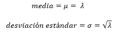

##### Ejemplo

Los camiones llegan a una empresa de transporte con una media de 30
camiones cada hora. ¿Cuál es la probabilidad de que lleguen 20 camiones
durante  
un intervalo de una hora?

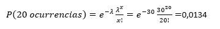

Para calcular la probabilidad de una distribución Poisson en R se
utilizará la función “dpoiss”:

``` r
dpois(20,30)
```

    ## [1] 0.01341115

La probabilidad de que en el intervalo lleguen 20 camiones es 0,0134.

#### Aproximación a la normal de la distribución de Poisson

Conforme aumenta la media de la distribución de Poisson, μ, la
distribución de Poisson se aproxima a la distribución normal.

-   La aproximación de la distribución de Poisson a la distribución
    normal es un buena aproximación para valores de μ = 10 o mayores.
-   La distribución normal tiene la misma media y la misma desviación
    estándar que la distribución de Poisson.

Si la variable X sigue una distribución de Poisson (μ) con μ \> 10,
entonces X sigue aproximadamente una distribución normal (μ, raíz
cuadrada de μ).

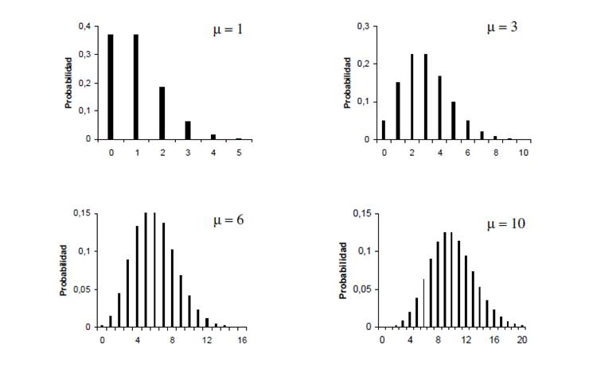
